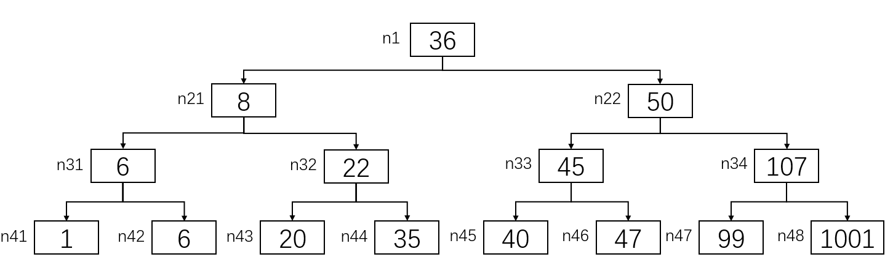

Lab 2: Bomb Lab
===============

0x01. 实验介绍
--------------

``bomblab`` 可以说是CSAPP实验里最为经典的实验。实验的内容是一个二进制炸弹程序。炸弹程序包含多个步骤，每个步骤都要求在 ``stdin`` 输入特定的字符串，字符串正确则此阶段炸弹拆除，进入下一阶段；若字符串错误则炸弹爆炸，程序输出 ``BOOM!!!`` 提示信息后退出。
总而言之， ``bomblab`` 实验的目的就是让程序员理解掌握X86-64的汇编代码，并且能够熟练使用 ``gdb`` 等调试工具调试代码。

实验一共有六个阶段， 个人感受前四个阶段较为简单，阶段五和六比较有挑战。 ``bomb`` 程序会自动忽视空白输入行，如果运行 ``bomb`` 时加上一个文件参数，程序会读取文件里的每一行字符串，直到结束。

.. code-block:: console

    linux > ./bomb answer.txt # 每个阶段的字符串都保存在answer.txt

0x02. 实验环境搭建
------------------
实验环境的搭建同 ``datalab`` 是一致的，这里不再赘述。
实验的源代码可通过以下命令下载解压：

.. code-block:: console

    $ wget http://csapp.cs.cmu.edu/3e/bomb.tar
    $ tar xvf bomb.tar

进入实验目录，可以看到实验包含三个文件：

.. code-block:: console

    $ ls
    README  bomb  bomb.c

``README`` 是实验的简单介绍。 ``bomb`` 就是我们要拆除的二进制炸弹程序。 ``bomb.c`` 包含二进制炸弹程序的部分源代码，但不包含每个阶段的具体实现。

0x03. 拆弹过程及思路说明
------------------------

``preparation``
^^^^^^^^^^^^^^^^^

在进行正式的拆弹前，我们先查看实验中的 ``bomb.c`` ，可以看到其中包含六个阶段，每个阶段都包含三个步骤，分别对应以下三行代码：

.. code-block:: c

    input = read_line();
    phase_x(input);
    phase_defused();

``read_line`` 函数读取我们在每个阶段输入的字符串, ``phase_x`` 函数处理我们输入的字符串，进行相应的处理。如果处理的结果和 ``bomb`` 二进制炸弹设置的预期值不同，炸弹则会爆炸。如果输入字符串符合预期，则进入 ``phase_defused`` 函数，提示此阶段拆弹成功。
我们根据实验文档给的提示，先通过 ``objdump -d | tee disassemble.txt`` 命令对 ``bomb`` 二进制程序进行反汇编，并将反汇编得到的汇编代码保存到 ``disassemble.txt``。
查看 ``disassemble.txt`` ，可以看到对应 ``phase_1 - phase_6`` 对应的汇编代码。接下来就可以根据每个阶段的汇编代码，逐个拆除炸弹。

复习下x86-64函数调用时，参数与寄存器的顺序：

=============== =============== =============== =============== =============== =============== ===============
operand size            1               2               3               4               5               6
=============== =============== =============== =============== =============== =============== ===============
        64            %rdi            %rsi             %rdx            %rcx            %r8             %r9
        32            %edi            %esi             %edx            %ecx            %r8d            %r9d
        16             %di             %si              %dx             %cx            %r8w            %r9w
         8            %dil            %sil              %dl             %cl            %r8b            %r9b
=============== =============== =============== =============== =============== =============== ===============

``phase_1``
^^^^^^^^^^^^^

**汇编代码**：

.. code-block::

    0000000000400ee0 <phase_1>:
        400ee0:       48 83 ec 08             sub    $0x8,%rsp
        400ee4:       be 00 24 40 00          mov    $0x402400,%esi
        400ee9:       e8 4a 04 00 00          callq  401338 <strings_not_equal> ; 调用strings_not_equal函数比较字符串
        400eee:       85 c0                   test   %eax,%eax ; 返回值0表明两字符串相同，1表示不同
        400ef0:       74 05                   je     400ef7 <phase_1+0x17>
        400ef2:       e8 43 05 00 00          callq  40143a <explode_bomb>
        400ef7:       48 83 c4 08             add    $0x8,%rsp
        400efb:       c3                      retq

**拆弹思路**：

用 ``gdb ./bomb`` 运行二进制炸弹程序，并用 ``b phase_1`` 在 ``phase_1`` 函数入口处打上断点。
查看汇编代码，发现在 ``phase_1`` 里调用了 ``strings_not_equal`` 函数，传入的第一个参数是隐式说明的 ``%rdi``，即对应的我们输入的字符串。另一个参数是立即数 ``0x402400``。这时候我们应该有个基本的判断， ``phase_1`` 是通过调用 ``strings_not_equal`` 函数来比较我们输入的字符串与给定的字符串，且如果返回值为0，则指令跳转到 ``0x400ef7`` 位置处，跳过 ``explode_bomb`` 函数，拆弹完成。
那接下来的重点就是弄清楚 ``strings_not_equal`` 里的细节，汇编代码及注释如下所示。可以看到如果两个字符串长度一致且相同， ``strings_not_equal`` 返回0，反之返回1。

.. code-block::

    0000000000401338 <strings_not_equal>:
        401338:       41 54                   push   %r12
        40133a:       55                      push   %rbp
        40133b:       53                      push   %rbx
        40133c:       48 89 fb                mov    %rdi,%rbx
        40133f:       48 89 f5                mov    %rsi,%rbp
        401342:       e8 d4 ff ff ff          callq  40131b <string_length> ; 计算输入的input字符串长度
        401347:       41 89 c4                mov    %eax,%r12d
        40134a:       48 89 ef                mov    %rbp,%rdi
        40134d:       e8 c9 ff ff ff          callq  40131b <string_length> ; 计算给定的字符串（地址0x402400）长度
        401352:       ba 01 00 00 00          mov    $0x1,%edx
        401357:       41 39 c4                cmp    %eax,%r12d
        40135a:       75 3f                   jne    40139b <strings_not_equal+0x63> ; 如果两者长度不同，返回1；相同则继续执行
        40135c:       0f b6 03                movzbl (%rbx),%eax
        40135f:       84 c0                   test   %al,%al
        401361:       74 25                   je     401388 <strings_not_equal+0x50> ; 判断input是否为 '\0' 字符串
        401363:       3a 45 00                cmp    0x0(%rbp),%al # 比较input与给定字符串第一个字符是否相同
        401366:       74 0a                   je     401372 <strings_not_equal+0x3a> ; 相同跳转至0x401372
        401368:       eb 25                   jmp    40138f <strings_not_equal+0x57> ; 不相同，返回1
        40136a:       3a 45 00                cmp    0x0(%rbp),%al
        40136d:       0f 1f 00                nopl   (%rax)
        401370:       75 24                   jne    401396 <strings_not_equal+0x5e>
        401372:       48 83 c3 01             add    $0x1,%rbx
        401376:       48 83 c5 01             add    $0x1,%rbp
        40137a:       0f b6 03                movzbl (%rbx),%eax
        40137d:       84 c0                   test   %al,%al
        40137f:       75 e9                   jne    40136a <strings_not_equal+0x32> ; 循环比较input和给定字符串字符
        401381:       ba 00 00 00 00          mov    $0x0,%edx ; input字符串已遍历完，且与给定字符串相同
        401386:       eb 13                   jmp    40139b <strings_not_equal+0x63>
        401388:       ba 00 00 00 00          mov    $0x0,%edx ; 返回0
        40138d:       eb 0c                   jmp    40139b <strings_not_equal+0x63>
        40138f:       ba 01 00 00 00          mov    $0x1,%edx
        401394:       eb 05                   jmp    40139b <strings_not_equal+0x63>
        401396:       ba 01 00 00 00          mov    $0x1,%edx
        40139b:       89 d0                   mov    %edx,%eax ; 函数返回值
        40139d:       5b                      pop    %rbx
        40139e:       5d                      pop    %rbp
        40139f:       41 5c                   pop    %r12
        4013a1:       c3                      retq
    
    000000000040131b <string_length>:
        40131b:       80 3f 00                cmpb   $0x0,(%rdi) ; 当前字符是否是 '\0'
        40131e:       74 12                   je     401332 <string_length+0x17>
        401320:       48 89 fa                mov    %rdi,%rdx
        401323:       48 83 c2 01             add    $0x1,%rdx ; 不为0，指针移到下一个字符地址
        401327:       89 d0                   mov    %edx,%eax
        401329:       29 f8                   sub    %edi,%eax ; 当前字符的偏移量
        40132b:       80 3a 00                cmpb   $0x0,(%rdx) ; 如果不为 '\0' ，继续循环
        40132e:       75 f3                   jne    401323 <string_length+0x8>
        401330:       f3 c3                   repz retq
        401332:       b8 00 00 00 00          mov    $0x0,%eax ; 字符串长度为0
        401337:       c3                      retq

弄清楚了 ``strings_not_equal`` 的实现，再回到 ``phase_1`` 函数，我们只需要知道给定的字符串的内容，就可以倒推出我们应该输入的字符串：

.. code-block:: console

    (gdb) x/s 0x402400
    0x402400:       "Border relations with Canada have never been better."

``0x402400`` 位置对应的字符串为 ``Border relations with Canada have never been better.`` ，即为我们应该输入的字符串。
再次运行 ``./bomb`` ，输入上述字符串，显示 ``phase_1`` 炸弹已被拆除。

.. code-block:: console

    $ ./bomb
    Welcome to my fiendish little bomb. You have 6 phases with
    which to blow yourself up. Have a nice day!
    Border relations with Canada have never been better.
    Phase 1 defused. How about the next one?

为了后续调试的方便，我们把 ``phase_1`` 的解添加到 ``answer.txt`` 中，这样我们可以省去重复输入字符串的麻烦。

.. code-block:: console

    $ echo "Border relations with Canada have never been better." >> answer.txt
    $ cat answer.txt
    Border relations with Canada have never been better.

``phase_2``
^^^^^^^^^^^^^

**汇编代码**：

.. code-block:: 

    0000000000400efc <phase_2>:
        400efc:       55                      push   %rbp
        400efd:       53                      push   %rbx
        400efe:       48 83 ec 28             sub    $0x28,%rsp ; 为phase_2分配40bytes的栈帧空间
        400f02:       48 89 e6                mov    %rsp,%rsi  ; 把栈顶位置作为参数传给read_six_numbers函数
        400f05:       e8 52 05 00 00          callq  40145c <read_six_numbers> ; 调用read_six_numbers函数读取输入的六个数
        400f0a:       83 3c 24 01             cmpl   $0x1,(%rsp) ; 比较a0与1的大小
        400f0e:       74 20                   je     400f30 <phase_2+0x34> ; 等于1，跳转至0x400f30处
        400f10:       e8 25 05 00 00          callq  40143a <explode_bomb> ; 不相等，Boom!!!
        400f15:       eb 19                   jmp    400f30 <phase_2+0x34>
        400f17:       8b 43 fc                mov    -0x4(%rbx),%eax ; 取前一个数的值
        400f1a:       01 c0                   add    %eax,%eax ; 前一个数乘2
        400f1c:       39 03                   cmp    %eax,(%rbx) ; 计算结果与当前值比较
        400f1e:       74 05                   je     400f25 <phase_2+0x29> ; 相等跳转到0x400f25处
        400f20:       e8 15 05 00 00          callq  40143a <explode_bomb> ; 不相等，Boom!!!
        400f25:       48 83 c3 04             add    $0x4,%rbx ; 取下一个数的地址
        400f29:       48 39 eb                cmp    %rbp,%rbx ; 判断是否到达数组边界
        400f2c:       75 e9                   jne    400f17 <phase_2+0x1b>
        400f2e:       eb 0c                   jmp    400f3c <phase_2+0x40>
        400f30:       48 8d 5c 24 04          lea    0x4(%rsp),%rbx ; 取下一个数的地址
        400f35:       48 8d 6c 24 18          lea    0x18(%rsp),%rbp ; 六个数看作数组的话，取数组的最后边界值
        400f3a:       eb db                   jmp    400f17 <phase_2+0x1b>
        400f3c:       48 83 c4 28             add    $0x28,%rsp
        400f40:       5b                      pop    %rbx
        400f41:       5d                      pop    %rbp
        400f42:       c3                      retq

**拆弹思路**：

用 ``gdb ./bomb`` 运行二进制炸弹程序，并用 ``b phase_2`` 在 ``phase_2`` 函数入口处打上断点。
查看 ``phase_2`` 的汇编代码，发现调用了函数 ``read_six_numbers`` ，并把自己的栈顶的内存位置作为第二个参数参数传给了 ``read_six_numbers`` ，输入的字符串 ``input`` 依旧是隐式地作为第一个参数放到寄存器 ``%rdi`` 中。
看一下 ``read_six_numbers`` 的汇编代码实现：

.. code-block::

    000000000040145c <read_six_numbers>:
        40145c:       48 83 ec 18             sub    $0x18,%rsp ; 为read_six_numbers分配24bytes的栈帧
        401460:       48 89 f2                mov    %rsi,%rdx  ; 传入phase_2的栈顶，对应第一个参数%rdx
        401463:       48 8d 4e 04             lea    0x4(%rsi),%rcx ; 第二个参数%rcx --> 对应phase_2中第二个数
        401467:       48 8d 46 14             lea    0x14(%rsi),%rax
        40146b:       48 89 44 24 08          mov    %rax,0x8(%rsp) ; 第六个参数%rsp + 8 --> 对应phase_2中第六个数
        401470:       48 8d 46 10             lea    0x10(%rsi),%rax
        401474:       48 89 04 24             mov    %rax,(%rsp)    ; 第五个参数%rsp --> 对应phase_2中第五个数
        401478:       4c 8d 4e 0c             lea    0xc(%rsi),%r9 ; 第四个参数%r9 --> 对应phase_2中第四个数
        40147c:       4c 8d 46 08             lea    0x8(%rsi),%r8 ; 第三个参数%r8 --> 对应phase_2中第三个数
        401480:       be c3 25 40 00          mov    $0x4025c3,%esi ; 格式化参数字符串
        401485:       b8 00 00 00 00          mov    $0x0,%eax
        40148a:       e8 61 f7 ff ff          callq  400bf0 <__isoc99_sscanf@plt> ; 调用sscanf读取六个数的值
        40148f:       83 f8 05                cmp    $0x5,%eax ; 返回读取的数字个数
        401492:       7f 05                   jg     401499 <read_six_numbers+0x3d>
        401494:       e8 a1 ff ff ff          callq  40143a <explode_bomb>
        401499:       48 83 c4 18             add    $0x18,%rsp
        40149d:       c3                      retq
   
从 ``read_six_numbers`` 的汇编代码可以看到，其调用了C99标准的 ``sscanf`` 函数来读取我们输入字符串的六个数。查看 `sscanf <https://cplusplus.com/reference/cstdio/sscanf/>`_ ， ``sscanf`` 的API为 ``int sscanf( const char * s, const char * format, ...)`` 。
回到汇编代码中，对应参数 ``s`` 即为我们输入的字符串，作为第一个传参保存在寄存器 ``%rdi`` 中。 对应参数 ``format`` 即为 ``sscanf`` 的格式化参数，我们在 ``gdb`` 可将其打印出来。如下所示，对应的是六个 ``int`` 类型的声明。 最后的省略号是C99可变参函数的缩写，对应我们一共设置了六个变量，其地址分别放在寄存器 ``%rdx, %rcx, %r8, %r9`` 中，剩下的两个参数放在 ``read_six_numbers`` 的 ``%rsp`` 和 ``%rsp + 8`` 处。 六个数的值最终放在 ``phase_2`` 栈顶 ``%rsp ~ %rsp + 24`` 之间，每个值占四字节空间。

.. code-block:: console

    (gdb) x/s 0x4025c3
    0x4025c3:       "%d %d %d %d %d %d"

现在我们理解了 ``read_six_numbers`` 的用途，即读取六个整型数并将其依次放置在 ``phase_2`` 栈顶 ``%rsp`` 到 ``%rsp + 20`` 的内存中。
为了方便理解，我们把六个整型数数组的值分别用 ``a0, a1, a2, a3, a4, a5`` 表示。可以看到 ``phase_2`` 中先把 ``a0`` 的值与1比较，然后取 ``a1`` 的值与 ``2 * a0`` 比较，相等继续循环，直到六个数读取完毕。
这样，我们就知道了六个数每个数都是前一个数的两倍，且 ``a0`` 为1。所以六个数的值应该是 ``1 2 4 8 16 32``。
运行 ``./bomb answer.txt`` ，输入上述字符串，显示 ``phase_2`` 炸弹已拆除。

.. code-block:: console
    
    $ ./bomb answer.txt
    Welcome to my fiendish little bomb. You have 6 phases with
    which to blow yourself up. Have a nice day!
    Phase 1 defused. How about the next one?
    1 2 4 8 16 32
    That's number 2.  Keep going!

同上，我们把 ``phase_2`` 的字符串添加到 ``answer.txt`` 中。

.. code-block:: console

    $ echo "1 2 4 8 16 32" >> answer.txt
    $ cat answer.txt
    Border relations with Canada have never been better.
    1 2 4 8 16 32

``phase_3``
^^^^^^^^^^^^^

**汇编代码**：

.. code-block::

    0000000000400f43 <phase_3>:
        400f43:       48 83 ec 18             sub    $0x18,%rsp
        400f47:       48 8d 4c 24 0c          lea    0xc(%rsp),%rcx ; sscanf的第四个参数
        400f4c:       48 8d 54 24 08          lea    0x8(%rsp),%rdx ; sscanf的第三个参数
        400f51:       be cf 25 40 00          mov    $0x4025cf,%esi ; sscanf的第二个参数，格式化字符串
        400f56:       b8 00 00 00 00          mov    $0x0,%eax
        400f5b:       e8 90 fc ff ff          callq  400bf0 <__isoc99_sscanf@plt>
        400f60:       83 f8 01                cmp    $0x1,%eax ; 返回值是否大于1
        400f63:       7f 05                   jg     400f6a <phase_3+0x27> ; 若大于1，则表示读取参数数量是2
        400f65:       e8 d0 04 00 00          callq  40143a <explode_bomb> ; 若不大于1，Boom!!!
        400f6a:       83 7c 24 08 07          cmpl   $0x7,0x8(%rsp) ; a和7比较
        400f6f:       77 3c                   ja     400fad <phase_3+0x6a> ; 大于7，Boom!!!
        400f71:       8b 44 24 08             mov    0x8(%rsp),%eax
        400f75:       ff 24 c5 70 24 40 00    jmpq   *0x402470(,%rax,8) ; 根据%rax的值作间接跳转
        400f7c:       b8 cf 00 00 00          mov    $0xcf,%eax
        400f81:       eb 3b                   jmp    400fbe <phase_3+0x7b>
        400f83:       b8 c3 02 00 00          mov    $0x2c3,%eax
        400f88:       eb 34                   jmp    400fbe <phase_3+0x7b>
        400f8a:       b8 00 01 00 00          mov    $0x100,%eax
        400f8f:       eb 2d                   jmp    400fbe <phase_3+0x7b>
        400f91:       b8 85 01 00 00          mov    $0x185,%eax
        400f96:       eb 26                   jmp    400fbe <phase_3+0x7b>
        400f98:       b8 ce 00 00 00          mov    $0xce,%eax
        400f9d:       eb 1f                   jmp    400fbe <phase_3+0x7b>
        400f9f:       b8 aa 02 00 00          mov    $0x2aa,%eax
        400fa4:       eb 18                   jmp    400fbe <phase_3+0x7b>
        400fa6:       b8 47 01 00 00          mov    $0x147,%eax
        400fab:       eb 11                   jmp    400fbe <phase_3+0x7b>
        400fad:       e8 88 04 00 00          callq  40143a <explode_bomb>
        400fb2:       b8 00 00 00 00          mov    $0x0,%eax
        400fb7:       eb 05                   jmp    400fbe <phase_3+0x7b>
        400fb9:       b8 37 01 00 00          mov    $0x137,%eax
        400fbe:       3b 44 24 0c             cmp    0xc(%rsp),%eax ; b和%rax比较
        400fc2:       74 05                   je     400fc9 <phase_3+0x86>
        400fc4:       e8 71 04 00 00          callq  40143a <explode_bomb>
        400fc9:       48 83 c4 18             add    $0x18,%rsp
        400fcd:       c3                      retq

**拆弹思路**：

用 ``gdb ./bomb`` 运行二进制炸弹程序，并用 ``b phase_3`` 在 ``phase_3`` 函数入口处打上断点。
同 ``phase_2`` 一样， ``phase_3`` 用 ``sscanf`` 来读入输入的字符串数值。寄存器 ``%rsi`` 作为传参，保存着格式化字符串的地址，如下所示。由此可知， ``sscanf`` 读取两个整型数，并将其分别保存在 ``%rsp + 0x8`` 和 ``%rsp + 0xc`` 的位置上。
为了方便理解，我们把读取的两个数分别用 ``a`` 和 ``b`` 表示， ``a`` 对应位置在 ``%rsp + 0x8`` , ``b`` 对应位置在 ``%rsp + 0xc``。

.. code-block:: console

    (gdb) x/s 0x4025cf
    0x4025cf:       "%d %d"

代码 ``0x400f6a`` 处比较 ``a`` 与7的大小，若 ``a`` 大于7， 则跳转到 ``0x400fad`` 调用 ``explode_bomb`` 函数，炸弹爆炸。当 ``a`` 小于等于7时，代码 ``0x400f75`` 将根据 ``a`` 的值进行跳转。因为用的是 ``ja`` 指令，我们可以判断 ``a`` 为 ``unsigned int`` 类型，所以 ``a`` 的范围应为 ``0 ~ 7`` 。
我们通过以下命令查看间接跳转地址 ``0x402470`` 里对应的跳转地址：

.. code-block:: console

    (gdb) x/8xg 0x402470
    0x402470:       0x0000000000400f7c      0x0000000000400fb9
    0x402480:       0x0000000000400f83      0x0000000000400f8a
    0x402490:       0x0000000000400f91      0x0000000000400f98
    0x4024a0:       0x0000000000400f9f      0x0000000000400fa6

由此，我们可以看到寄存器 ``%rax`` （也就是 ``a`` 的值）映射的跳转地址和对应执行的指令如下表所示。

+------+----------------+--------------------+----------------------+
| %rax |    Jump Addr   |    Jump Target     |    Instruction       |
+======+================+====================+======================+
| 0    |    0x402470    |    0x400f7c        |    mov $0xcf,%eax    |
+------+----------------+--------------------+----------------------+
| 1    |    0x402478    |    0x400fb9        |    mov $0x137,%eax   |
+------+----------------+--------------------+----------------------+
| 2    |    0x402480    |    0x400f83        |    mov $0x2c3,%eax   |
+------+----------------+--------------------+----------------------+
| 3    |    0x402488    |    0x400f8a        |    mov $0x100,%eax   |
+------+----------------+--------------------+----------------------+
| 4    |    0x402490    |    0x400f91        |    mov $0x185,%eax   |
+------+----------------+--------------------+----------------------+
| 5    |    0x402498    |    0x400f98        |    mov $0xce,%eax    |
+------+----------------+--------------------+----------------------+
| 6    |    0x4024a0    |    0x400f9f        |    mov $0x2aa,%eax   |
+------+----------------+--------------------+----------------------+
| 7    |    0x4024a8    |    0x400fa6        |    mov $0x147,%eax   |
+------+----------------+--------------------+----------------------+

代码 ``0x400fbe`` 处将 ``b`` 的值与相应的 ``%eax`` 的值作比较，若相等，则函数执行成功；不相等，执行 ``explode_bomb`` ，炸弹爆炸。
由此，我们可以倒推出 ``a`` 和 ``b`` 的取值，即 ``a`` 的值决定了 ``jmp`` 跳转到的下一条要执行的指令，而 ``b`` 的值则根据这条指令传给 ``%eax`` 决定。
所以 ``phase_3`` 满足条件的 ``a/b`` 值一共有八组，如下表所示。

+----------+----------+
|    a     |    b     |
+==========+==========+
|    0     |   207    |
+----------+----------+
|    1     |   311    |
+----------+----------+
|    2     |   707    |
+----------+----------+
|    3     |   256    |
+----------+----------+
|    4     |   389    |
+----------+----------+
|    5     |   206    |
+----------+----------+
|    6     |   682    |
+----------+----------+
|    7     |   327    |
+----------+----------+

运行 ``./bomb answer.txt`` ，选取任意一组 ``a/b`` 值输入，可看见 ``phase_3`` 炸弹拆除。

.. code-block:: console

    $ ./bomb answer.txt
    Welcome to my fiendish little bomb. You have 6 phases with
    which to blow yourself up. Have a nice day!
    Phase 1 defused. How about the next one?
    That's number 2.  Keep going!
    0 207
    Halfway there!

同上，我们把 ``phase_3`` 的任意一组 ``a/b`` 值添加到 ``answer.txt`` 中。

.. code-block:: console

    $ echo "0 207" >> answer.txt
    $ cat answer.txt
    Border relations with Canada have never been better.
    1 2 4 8 16 32
    0 207

``phase_4``
^^^^^^^^^^^^^

**汇编代码**：

.. code-block::

    000000000040100c <phase_4>:
        40100c:       48 83 ec 18             sub    $0x18,%rsp
        401010:       48 8d 4c 24 0c          lea    0xc(%rsp),%rcx ; b的值
        401015:       48 8d 54 24 08          lea    0x8(%rsp),%rdx ; a的值
        40101a:       be cf 25 40 00          mov    $0x4025cf,%esi ; 格式化字符"%d %d"
        40101f:       b8 00 00 00 00          mov    $0x0,%eax
        401024:       e8 c7 fb ff ff          callq  400bf0 <__isoc99_sscanf@plt> ; 读取输入的两个数
        401029:       83 f8 02                cmp    $0x2,%eax
        40102c:       75 07                   jne    401035 <phase_4+0x29> ; 返回值不为2，Boom!!!
        40102e:       83 7c 24 08 0e          cmpl   $0xe,0x8(%rsp) ; a和0xe比较
        401033:       76 05                   jbe    40103a <phase_4+0x2e>
        401035:       e8 00 04 00 00          callq  40143a <explode_bomb>
        40103a:       ba 0e 00 00 00          mov    $0xe,%edx ; func4第三个参数
        40103f:       be 00 00 00 00          mov    $0x0,%esi ; func4第二个参数
        401044:       8b 7c 24 08             mov    0x8(%rsp),%edi ; func4第一个参数
        401048:       e8 81 ff ff ff          callq  400fce <func4> ; 函数调用func4(a, 0, 0xe)
        40104d:       85 c0                   test   %eax,%eax ; 返回值是否为0
        40104f:       75 07                   jne    401058 <phase_4+0x4c> ; 不等跳转到0x401058，Boom!!!
        401051:       83 7c 24 0c 00          cmpl   $0x0,0xc(%rsp) ; b是否等于0
        401056:       74 05                   je     40105d <phase_4+0x51>
        401058:       e8 dd 03 00 00          callq  40143a <explode_bomb>
        40105d:       48 83 c4 18             add    $0x18,%rsp
        401061:       c3                      retq

**拆弹思路**：

用 ``gdb ./bomb`` 运行二进制炸弹程序，并用 ``b phase_4`` 在 ``phase_4`` 函数入口处打上断点。
代码 ``0x40100c ~ 0x40102c`` 的逻辑同 ``phase_3`` 基本一致，读取两个整型数。 ``0x40102e`` 将 ``a`` （第一个整型数）的值与 ``0xe`` 相比，小于等于 ``0xe`` 则调用 ``func4`` ，否则炸弹爆炸。
可以看出， ``func4`` 有三个传参，对应的调用形式是 ``func4(a, 0, 0xe)`` 。接下来看一下 ``func4`` 的汇编代码。

.. code-block:: 

    0000000000400fce <func4>:
        400fce:       48 83 ec 08             sub    $0x8,%rsp
        400fd2:       89 d0                   mov    %edx,%eax
        400fd4:       29 f0                   sub    %esi,%eax ; 第三个参数减去第二个参数
        400fd6:       89 c1                   mov    %eax,%ecx
        400fd8:       c1 e9 1f                shr    $0x1f,%ecx ; 右移31位，%ecx保存MSB的值
        400fdb:       01 c8                   add    %ecx,%eax
        400fdd:       d1 f8                   sar    %eax ; %eax算数右移一位
        400fdf:       8d 0c 30                lea    (%rax,%rsi,1),%ecx ; %ecx = %rax + %rsi
        400fe2:       39 f9                   cmp    %edi,%ecx ; 与a比大小
        400fe4:       7e 0c                   jle    400ff2 <func4+0x24>
        400fe6:       8d 51 ff                lea    -0x1(%rcx),%edx
        400fe9:       e8 e0 ff ff ff          callq  400fce <func4> ; 递归调用func4
        400fee:       01 c0                   add    %eax,%eax
        400ff0:       eb 15                   jmp    401007 <func4+0x39>
        400ff2:       b8 00 00 00 00          mov    $0x0,%eax
        400ff7:       39 f9                   cmp    %edi,%ecx
        400ff9:       7d 0c                   jge    401007 <func4+0x39>
        400ffb:       8d 71 01                lea    0x1(%rcx),%esi
        400ffe:       e8 cb ff ff ff          callq  400fce <func4> ; 递归调用func4
        401003:       8d 44 00 01             lea    0x1(%rax,%rax,1),%eax
        401007:       48 83 c4 08             add    $0x8,%rsp
        40100b:       c3                      retq

在 ``func4(a, 0, 0xe)`` 中， 代码 ``0x400fce ~ 0x400fdf`` 计算出 ``%ecx`` 的值为 ``0x7`` ， 然后根据 ``a`` 的值递归调用 ``func4`` 。
汇编代码看上去很晦涩繁琐，我们通过形式化的函数调用栈来理清不同 ``a`` 值的函数调用路径。

当 ``a`` 等于7时的函数调用过程：

.. code-block::

    +-----------+                      +-----------+                                       +-----------+
    |           |  func4(0x7, 0, 0xe)  |           |                       %eax return 0   |           |
    |  phase_4  | ---------------->    |  phase_4  |                    ---------------->  |  phase_4  |
    |           |                      |           |                                       |           |
    +-----------+                      +-----------+                                       +-----------+
                                       |  0x40104d | --> ret addr
                                       +-----------+
                                       |           |
                                       |   func4   | --> func4(0x7, 0, 0xe)
                                       |           |
                                       +-----------+ 
 
当 ``0x7 < a <= 0xe`` 时的函数调用过程（以 ``a = 0xa`` 为例）：

.. code-block::

    +-----------+                       +-----------+                               %eax = 0         +-----------+                                                 +-----------+                               %eax = 0            +-----------+                                                    +-----------+                           +-----------+                          +-----------+                         +-----------+
    |           |  func4(0xa, 0, 0xe)   |           |                          func4(0xa, 0x8, 0xe)  |           |                          func4(0xa, 0x8, 0xe)   |           |                             func4(0xa, 0xa, 0xa)  |           |                                    %eax = 0        |           |          %eax = 1         |           |        %eax = 2          |           |      %eax = 2           |           |  return 5
    |  phase_4  | ------------------->  |  phase_4  |                         -------------------->  |  phase_4  |                         -------------------->   |  phase_4  |                            -------------------->  |  phase_4  |                             -------------------->  |  phase_4  |    -------------------->  |  phase_4  |   -------------------->  |  phase_4  |  -------------------->  |  phase_4  |  --------->  Boom!!!
    |           |                       |           |                                                |           |                                                 |           |                                                   |           |                                                    |           |                           |           |                          |           |                         |           |
    +-----------+                       +-----------+                                                +-----------+                                                 +-----------+                                                   +-----------+                                                    +-----------+                           +-----------+                          +-----------+                         +-----------+
                                        |  0x40104d | --> ret addr                                   |  0x40104d | --> ret addr                                    |  0x40104d | --> ret addr                                      |  0x40104d |                                                    |  0x40104d |                           |  0x40104d |                          |  0x40104d |
                                        +-----------+                                                +-----------+                                                 +-----------+                                                   +-----------+                                                    +-----------+                           +-----------+                          +-----------+
                                        |           |                                                |           |                                                 |           |                                                   |           |                                                    |           |                           |           |                          |           |
                                        |   func4   | --> func4(0xa, 0, 0xe)                         |   func4   |                                                 |   func4   |                                                   |   func4   |                                                    |   func4   |                           |   func4   |                          |   func4   |
                                        |           |                                                |           |                                                 |           |                                                   |           |                                                    |           |                           |           |                          |           |
                                        +-----------+                                                +-----------+                                                 +-----------+                                                   +-----------+                                                    +-----------+                           +-----------+                          +-----------+
                                                                                                     |  0x401003 | --> ret addr                                    |  0x401003 | --> ret addr                                      |  0x401003 |                                                    |  0x401003 |                           |  0x401003 |
                                                                                                     +-----------+                                                 +-----------+                                                   +-----------+                                                    +-----------+                           +-----------+
                                                                                                     |           |                                                 |           |                                                   |           |                                                    |           |                           |           |
                                                                                                     |   func4   | --> func4(0xa, 0x8, 0xe)                        |   func4   |                                                   |   func4   |                                                    |   func4   |                           |   func4   |
                                                                                                     |           |                                                 |           |                                                   |           |                                                    |           |                           |           |
                                                                                                     +-----------+                                                 +-----------+                                                   +-----------+                                                    +-----------+                           +-----------+
                                                                                                                                                                   |  0x400fee |                                                   |  0x400fee |                                                    |  0x400fee |
                                                                                                                                                                   +-----------+                                                   +-----------+                                                    +-----------+
                                                                                                                                                                   |           |                                                   |           |                                                    |           |
                                                                                                                                                                   |   func4   | --> func4(0xa, 0x8, 0xa)                          |   func4   |                                                    |   func4   |
                                                                                                                                                                   |           |                                                   |           |                                                    |           |
                                                                                                                                                                   +-----------+                                                   +-----------+                                                    +-----------+
                                                                                                                                                                                                                                   |  0x401003 | --> ret addr
                                                                                                                                                                                                                                   +-----------+
                                                                                                                                                                                                                                   |           |
                                                                                                                                                                                                                                   |   func4   | --> func4(0xa, 0xa, 0xa)
                                                                                                                                                                                                                                   |           |
                                                                                                                                                                                                                                   +-----------+

可以看到当 ``a`` 的值是 ``0xa`` 时， ``phase_4`` 调用 ``func4`` 的返回值为5，不为0则会触发 ``explode_bomb`` 函数，最终炸弹爆炸。
同理， ``0x0 <= a < 0xe`` 中的值也可以用上述函数调用栈去分析。 不过每一个数都作函数栈的调用过程太过繁琐，我们可以将上述汇编语言“反编译”成对应的C语言代码。

.. code-block:: c

    void phase_4(char * input)
    {
        int a, b;
        int ret;

        ret = sscanf(input, "%d %d", &a, &b);
        if(ret != 2)
            explode_bomb();
        
        ret = func4(a, 0, 14);
        if(ret != 0)
            explode_bomb();

        if(b != 0)
            explode_bomb();
    }

    int func4(int a, int m, int l)
    {
        int result, tmp;

        tmp = (l - m) + ((l - m) >> 31);
        tmp = tmp >> 1;
        tmp = tmp + m;

        if(tmp <= a)
        {
            result = 0;
            if(tmp >= a)
                return result;
            else
            {
                tmp++;
                result = func4(a, tmp, l);
                result = 2 * result + 1;
                return result;
            }
        }
        else
        {
            tmp--;
            result = func4(a, m, tmp);
            result = 2 * result;
            return result;
        }

    }

这样我们就可以把 ``func4`` 单独摘出来，通过以下程序来验证 ``a`` 在 ``0 ~ 0xe`` 对应的返回值是否为0。运行显示当 ``a`` 为0，1，3，7时 ``func4(a, 0, 0xe)`` 的返回值为0。

.. code-block:: c

    int result;
    for(int i=0; i <= 14; i++)
    {
        result = func4(i, 0, 14);
        printf("i=%d ret=%d\n", i, result);
    }

``a`` 的值确定后，返回 ``phase_4`` 继续执行，代码 ``0x401051`` 处判断 ``b`` 值是否为0，若不为0，则调用 ``explode_bomb`` 函数；为0函数退出，拆弹成功。

由此，我们可以得到 ``a/b`` 的解一共有四组，分别是 ``0 0`` ， ``1 0`` ， ``3 0`` ， ``7 0``。
运行 ``./bomb answer.txt`` ，选取任意一组 ``a/b`` 值输入，可看见 ``phase_4`` 炸弹拆除。

.. code-block:: console

    $ ./bomb answer.txt
    Welcome to my fiendish little bomb. You have 6 phases with
    which to blow yourself up. Have a nice day!
    Phase 1 defused. How about the next one?
    That's number 2.  Keep going!
    Halfway there!
    3 0
    So you got that one.  Try this one.

同上，我们把 ``phase_4`` 的任意一组 ``a/b`` 值添加到 ``answer.txt`` 中。

.. code-block:: console

    $ echo "3 0" >> answer.txt
    $ cat answer.txt
    Border relations with Canada have never been better.
    1 2 4 8 16 32
    0 207
    3 0

``phase_5``
^^^^^^^^^^^^^

**汇编代码**：

.. code-block::

    0000000000401062 <phase_5>:
        401062:       53                      push   %rbx
        401063:       48 83 ec 20             sub    $0x20,%rsp
        401067:       48 89 fb                mov    %rdi,%rbx
        40106a:       64 48 8b 04 25 28 00    mov    %fs:0x28,%rax ; 函数栈保护
        401071:       00 00
        401073:       48 89 44 24 18          mov    %rax,0x18(%rsp)
        401078:       31 c0                   xor    %eax,%eax
        40107a:       e8 9c 02 00 00          callq  40131b <string_length> ; 调用string_length函数
        40107f:       83 f8 06                cmp    $0x6,%eax ; 返回值是否为6
        401082:       74 4e                   je     4010d2 <phase_5+0x70>
        401084:       e8 b1 03 00 00          callq  40143a <explode_bomb>
        401089:       eb 47                   jmp    4010d2 <phase_5+0x70>
        40108b:       0f b6 0c 03             movzbl (%rbx,%rax,1),%ecx ; 读取index位置的字符，并将其从1 byte扩展到4 bytes
        40108f:       88 0c 24                mov    %cl,(%rsp)
        401092:       48 8b 14 24             mov    (%rsp),%rdx
        401096:       83 e2 0f                and    $0xf,%edx ; 保留%edx的4 bit
        401099:       0f b6 92 b0 24 40 00    movzbl 0x4024b0(%rdx),%edx ; 取出 0x4024b0+%rdx 内存位置处的值，并扩展到4 bytes
        4010a0:       88 54 04 10             mov    %dl,0x10(%rsp,%rax,1) ; 将值放入到 %rsp + 0x10 + %rax位置处
        4010a4:       48 83 c0 01             add    $0x1,%rax
        4010a8:       48 83 f8 06             cmp    $0x6,%rax
        4010ac:       75 dd                   jne    40108b <phase_5+0x29> ; 循环处理6个字符
        4010ae:       c6 44 24 16 00          movb   $0x0,0x16(%rsp)
        4010b3:       be 5e 24 40 00          mov    $0x40245e,%esi
        4010b8:       48 8d 7c 24 10          lea    0x10(%rsp),%rdi
        4010bd:       e8 76 02 00 00          callq  401338 <strings_not_equal>
        4010c2:       85 c0                   test   %eax,%eax
        4010c4:       74 13                   je     4010d9 <phase_5+0x77>
        4010c6:       e8 6f 03 00 00          callq  40143a <explode_bomb>
        4010cb:       0f 1f 44 00 00          nopl   0x0(%rax,%rax,1)
        4010d0:       eb 07                   jmp    4010d9 <phase_5+0x77>
        4010d2:       b8 00 00 00 00          mov    $0x0,%eax ; 设置index为0
        4010d7:       eb b2                   jmp    40108b <phase_5+0x29>
        4010d9:       48 8b 44 24 18          mov    0x18(%rsp),%rax
        4010de:       64 48 33 04 25 28 00    xor    %fs:0x28,%rax ; 判断函数栈是否被破坏
        4010e5:       00 00
        4010e7:       74 05                   je     4010ee <phase_5+0x8c>
        4010e9:       e8 42 fa ff ff          callq  400b30 <__stack_chk_fail@plt>
        4010ee:       48 83 c4 20             add    $0x20,%rsp
        4010f2:       5b                      pop    %rbx
        4010f3:       c3                      retq
   

**拆弹思路**：

用 ``gdb ./bomb`` 运行二进制炸弹程序，并用 ``b phase_5`` 在 ``phase_5`` 函数入口处打上断点。
代码 ``0x40106a`` 处通过 ``mov %fs:0x28,%rax`` 指令传入一个金丝雀值用作函数栈保护，在 ``phase_5`` 函数最后 ``0x4010de ~ 0x4010e9`` 处检测传入的金丝雀值是否被破坏。
代码 ``0x40107a`` 处调用 ``string_length`` 函数，看一下 ``string_length`` 的函数的具体实现。

.. code-block::

    000000000040131b <string_length>:
        40131b:       80 3f 00                cmpb   $0x0,(%rdi) ; input是否为空字符串
        40131e:       74 12                   je     401332 <string_length+0x17>
        401320:       48 89 fa                mov    %rdi,%rdx
        401323:       48 83 c2 01             add    $0x1,%rdx
        401327:       89 d0                   mov    %edx,%eax
        401329:       29 f8                   sub    %edi,%eax ; 当前字符的偏移量
        40132b:       80 3a 00                cmpb   $0x0,(%rdx) ; 字符不为0，继续循环
        40132e:       75 f3                   jne    401323 <string_length+0x8>
        401330:       f3 c3                   repz retq
        401332:       b8 00 00 00 00          mov    $0x0,%eax ; input是空字符串，返回0
        401337:       c3                      retq

可以看到， ``string_length`` 函数的作用是计算字符串的长度，以上汇编代码等价于以下C代码：

.. code-block:: c

    int string_length(char * input)
    {
        int i;
        if(input[0] == '\0')
            return 0;

        for(i = 0; input[i] != '\0'; i++);

        return i;
    }

再回到 ``phase_5`` 函数中， 代码 ``0x40107f`` 处判断 ``string_length`` 的返回值是否为6，即输入的字符串是否是6个字符。若不是，则 ``explode_bomb`` ；是的话继续执行。
代码 ``0x40108b ~ 0x4010a96`` 处代码的作用是读取字符串中六个字符的低四位比特, 代码 ``0x401099`` 处取出 ``0x4024b0`` 加上低四位比特值偏移量作为内存位置的值，并对其进行零扩展到四字节，然后将其放置在 ``%rsp + 10 ~ %rsp + 16`` 处。 然后调用 ``strings_not_equal`` 函数，对 ``%rsp + 10 ~ %rsp + 16`` 处的字符串与 ``0x40245e`` 处的字符串进行比较。
我们先将 ``0x4024b0`` 位置处的字符串打印出来：

.. code-block:: console

    (gdb) x/s 0x4024b0
    0x4024b0 <array.3449>:  "maduiersnfotvbylSo you think you can stop the bomb with ctrl-c, do you?"

再来看一下 ``0x40245e`` 处对应的字符串：

.. code-block:: console

    (gdb) x/s 0x40245e
    0x40245e:       "flyers"

我们已经在 ``phase_1`` 中接触过 ``strings_not_equal`` 函数，对应的功能就是比较两个字符串是否一致。如果一致返回0，不一致返回1。
那我们从这里倒推 ``phase_5`` 中的实现机制，即把输入字符串的六个字符的低四位比特值作为内存 ``0x4024b0`` 数组的索引，组成的新字符串与字符串 ``flyers`` 作比较。
根据这个线索， 我们列出 ``flyers`` 字符串中每个字符在内存 ``0x40245e`` 处的索引值，以及对应满足的ASCII字符。

+----------+-----+-----+-----+-----+-----+-----+
|   char   |  f  |  l  |  y  |  e  |  r  |  s  |
+==========+=====+=====+=====+=====+=====+=====+
|  index   | 0x9 | 0xf | 0xe | 0x5 | 0x6 | 0x7 |
+----------+-----+-----+-----+-----+-----+-----+
|  ASCII   |  )  |  /  |  .  |  #  |  $  |  %  |
+----------+-----+-----+-----+-----+-----+-----+
|  ASCII   |  9  |  ?  |  >  |  5  |  6  |  7  |
+----------+-----+-----+-----+-----+-----+-----+
|  ASCII   |  I  |  O  |  N  |  E  |  F  |  G  |
+----------+-----+-----+-----+-----+-----+-----+
|  ASCII   |  Y  |  _  |  ^  |  U  |  V  |  W  |
+----------+-----+-----+-----+-----+-----+-----+
|  ASCII   |  i  |  o  |  n  |  e  |  f  |  g  |
+----------+-----+-----+-----+-----+-----+-----+
|  ASCII   |  y  | DEL |  ~  |  u  |  v  |  w  |
+----------+-----+-----+-----+-----+-----+-----+

由此，我们可以得到 ``phase_5`` 的解是上述列表中每列字符对应的ASCII字符的任意组合。
运行 ``./bomb answer.txt`` ，选取任意一组字符串输入，可看见 ``phase_5`` 炸弹拆除。

.. code-block:: console

    $ ./bomb answer.txt
    Welcome to my fiendish little bomb. You have 6 phases with
    which to blow yourself up. Have a nice day!
    Phase 1 defused. How about the next one?
    That's number 2.  Keep going!
    Halfway there!
    So you got that one.  Try this one.
    ionefg
    Good work!  On to the next...

同上，我们把 ``phase_5`` 的任意一组字符串添加到 ``answer.txt`` 中。

.. code-block:: console

    $ echo "3 0" >> answer.txt
    $ cat answer.txt
    Border relations with Canada have never been better.
    1 2 4 8 16 32
    0 207
    3 0
    ionefg

``phase_6``
^^^^^^^^^^^^^

**汇编代码**：

.. code-block::

    00000000004010f4 <phase_6>:
        4010f4:       41 56                   push   %r14
        4010f6:       41 55                   push   %r13
        4010f8:       41 54                   push   %r12
        4010fa:       55                      push   %rbp
        4010fb:       53                      push   %rbx
        4010fc:       48 83 ec 50             sub    $0x50,%rsp
        401100:       49 89 e5                mov    %rsp,%r13
        401103:       48 89 e6                mov    %rsp,%rsi
        401106:       e8 51 03 00 00          callq  40145c <read_six_numbers> ; 读取输入的六个整型数
        40110b:       49 89 e6                mov    %rsp,%r14
        40110e:       41 bc 00 00 00 00       mov    $0x0,%r12d
        401114:       4c 89 ed                mov    %r13,%rbp
        401117:       41 8b 45 00             mov    0x0(%r13),%eax
        40111b:       83 e8 01                sub    $0x1,%eax ; a[i] = a[i] - 1
        40111e:       83 f8 05                cmp    $0x5,%eax ; a[i]小于等于5吗？
        401121:       76 05                   jbe    401128 <phase_6+0x34>
        401123:       e8 12 03 00 00          callq  40143a <explode_bomb>
        401128:       41 83 c4 01             add    $0x1,%r12d
        40112c:       41 83 fc 06             cmp    $0x6,%r12d
        401130:       74 21                   je     401153 <phase_6+0x5f>
        401132:       44 89 e3                mov    %r12d,%ebx
        401135:       48 63 c3                movslq %ebx,%rax
        401138:       8b 04 84                mov    (%rsp,%rax,4),%eax ; a[i+4*j]
        40113b:       39 45 00                cmp    %eax,0x0(%rbp) ; a[i]与a[i+4*j]相等吗？
        40113e:       75 05                   jne    401145 <phase_6+0x51>
        401140:       e8 f5 02 00 00          callq  40143a <explode_bomb>
        401145:       83 c3 01                add    $0x1,%ebx
        401148:       83 fb 05                cmp    $0x5,%ebx
        40114b:       7e e8                   jle    401135 <phase_6+0x41>
        40114d:       49 83 c5 04             add    $0x4,%r13
        401151:       eb c1                   jmp    401114 <phase_6+0x20>
        401153:       48 8d 74 24 18          lea    0x18(%rsp),%rsi
        401158:       4c 89 f0                mov    %r14,%rax
        40115b:       b9 07 00 00 00          mov    $0x7,%ecx
        401160:       89 ca                   mov    %ecx,%edx
        401162:       2b 10                   sub    (%rax),%edx ; 7 - a[i]
        401164:       89 10                   mov    %edx,(%rax) ; a[i] = 4 - a[i]
        401166:       48 83 c0 04             add    $0x4,%rax
        40116a:       48 39 f0                cmp    %rsi,%rax
        40116d:       75 f1                   jne    401160 <phase_6+0x6c>
        40116f:       be 00 00 00 00          mov    $0x0,%esi
        401174:       eb 21                   jmp    401197 <phase_6+0xa3>
        401176:       48 8b 52 08             mov    0x8(%rdx),%rdx
        40117a:       83 c0 01                add    $0x1,%eax
        40117d:       39 c8                   cmp    %ecx,%eax
        40117f:       75 f5                   jne    401176 <phase_6+0x82>
        401181:       eb 05                   jmp    401188 <phase_6+0x94>
        401183:       ba d0 32 60 00          mov    $0x6032d0,%edx
        401188:       48 89 54 74 20          mov    %rdx,0x20(%rsp,%rsi,2)
        40118d:       48 83 c6 04             add    $0x4,%rsi
        401191:       48 83 fe 18             cmp    $0x18,%rsi
        401195:       74 14                   je     4011ab <phase_6+0xb7>
        401197:       8b 0c 34                mov    (%rsp,%rsi,1),%ecx
        40119a:       83 f9 01                cmp    $0x1,%ecx ; 判断a[i]是否大于1
        40119d:       7e e4                   jle    401183 <phase_6+0x8f>
        40119f:       b8 01 00 00 00          mov    $0x1,%eax
        4011a4:       ba d0 32 60 00          mov    $0x6032d0,%edx
        4011a9:       eb cb                   jmp    401176 <phase_6+0x82>
        4011ab:       48 8b 5c 24 20          mov    0x20(%rsp),%rbx
        4011b0:       48 8d 44 24 28          lea    0x28(%rsp),%rax
        4011b5:       48 8d 74 24 50          lea    0x50(%rsp),%rsi
        4011ba:       48 89 d9                mov    %rbx,%rcx
        4011bd:       48 8b 10                mov    (%rax),%rdx
        4011c0:       48 89 51 08             mov    %rdx,0x8(%rcx)
        4011c4:       48 83 c0 08             add    $0x8,%rax
        4011c8:       48 39 f0                cmp    %rsi,%rax
        4011cb:       74 05                   je     4011d2 <phase_6+0xde>
        4011cd:       48 89 d1                mov    %rdx,%rcx
        4011d0:       eb eb                   jmp    4011bd <phase_6+0xc9>
        4011d2:       48 c7 42 08 00 00 00    movq   $0x0,0x8(%rdx)
        4011d9:       00
        4011da:       bd 05 00 00 00          mov    $0x5,%ebp
        4011df:       48 8b 43 08             mov    0x8(%rbx),%rax
        4011e3:       8b 00                   mov    (%rax),%eax
        4011e5:       39 03                   cmp    %eax,(%rbx) ; node->data >= next_node->data ?
        4011e7:       7d 05                   jge    4011ee <phase_6+0xfa>
        4011e9:       e8 4c 02 00 00          callq  40143a <explode_bomb>
        4011ee:       48 8b 5b 08             mov    0x8(%rbx),%rbx
        4011f2:       83 ed 01                sub    $0x1,%ebp
        4011f5:       75 e8                   jne    4011df <phase_6+0xeb>
        4011f7:       48 83 c4 50             add    $0x50,%rsp
        4011fb:       5b                      pop    %rbx
        4011fc:       5d                      pop    %rbp
        4011fd:       41 5c                   pop    %r12
        4011ff:       41 5d                   pop    %r13
        401201:       41 5e                   pop    %r14
        401203:       c3                      retq

**拆弹思路**：

用 ``gdb ./bomb`` 运行二进制炸弹程序，并用 ``b phase_6`` 在 ``phase_6`` 函数入口处打上断点。
可以看到， ``phase_6`` 的汇编代码看上出很复杂，不过不要怕，我们一点点突破！

首先看 ``0x401100 ~ 0x401151`` 处的汇编代码， ``phase_6`` 调用 ``read_six_numbers`` 函数读取输入字符串中的六个整型数，放在 ``%rsp ~ %rsp + 20`` 位置内，然后对这六个整型数进行处理，我们将其“反编译”成对应的C代码来帮助我们更好地理解：

.. code-block:: c

    int a[6]; /* 输入的六个整型数数组 */
    for(int i = 0; i != 6; i++)
    {
        a[i]--;
        if(a[i] > 5)
            explode_bomb();
        for(int j=i; j <= 5; j++)
        {
            if(a[i] == a[j])
                explode_bomb();
        }
    }

由上述C代码，我们可以有一个基本判断，即输入的六个整型数在 ``0~6`` 范围内，且六个数互不相等。

再来看 ``0x401153 ~ 0x40116d`` 处的汇编代码，同样，我们将其“反编译”成C代码来理解其功能：

.. code-block:: c

    for(int i = 0; i < 6; i++)
    {
        a[i] = 7 - a[i];
    }

不难看出，以上C代码的功能就是将原始的数组内的值替代成 ``7 - a[i]`` 的值，即原始为1的值变为6，原始为2的值变为5。

继续看 ``0x40116f ~ 0x4011a9`` 处的汇编代码， ``0x40116f`` 处将 ``%rsi`` 设置为0，跳转到 ``0x401197`` 处读取 ``a[0]`` 的值。判断 ``a[0]`` 的值是否大于1。若大于1，则执行 ``0x40119f`` 处的代码，若小于等于1，则跳转到 ``0x401183`` 处执行。但两条路径都会执行 ``mov $0x6032d0,%edx`` 操作，也都会执行 ``mov %rdx,0x20(%rsp,%rsi,2)`` 指令，将 ``%rdx`` 的值放在 ``%rsp + 0x20 + 2 * %rsi`` 的位置上。 
那我们不禁好奇内存 ``0x6032d0`` 里的内容，通过以下命令打印出以 ``0x6032d0`` 作为起始地址的8字节的数据。 ``x/xg addr`` 的含义是打印起始地址 ``addr`` 处的内存值，并用十六进制表示。

.. code-block:: console

    (gdb) x/xg 0x6032d0
    0x6032d0 <node1>:       0x000000010000014c

好像还是看不出来什么头绪。那我们换个思路，假设 ``a[0]`` 大于1，单步调试一下汇编代码。 ``gdb`` 里可通过 ``layout regs`` 命令显示每一步汇编指令执行时的寄存器的状态。
当 ``a[0]`` 大于1时， 执行 ``0x40119f ~ 0x4011a9`` 的代码，然后跳转到 ``0x401176`` 处， ``0x401176`` 处将 ``0x6032d8`` 内存存储的值传给 ``%edx`` 。 ``0x40117a`` 处将 ``%eax`` 加1，此时 ``%eax`` 的值为2。然后 ``0x40117d`` 比较 ``a[0]`` 与 ``%eax`` 的值，若相等则跳转到 ``0x401188`` 处将 ``%rdx`` 的值放在 ``%rsp + 20`` 处，此时的 ``%rdx`` 为 ``0x6032d8`` 内存的值；若不相等，则将 ``0x6032d0`` 放在 ``%rsp + 20`` 处。
``0x40118d ~ 0x401191`` 处用作判断数组 ``a[i]`` 是否已经遍历完。
我们看一下内存 ``0x6032d8`` 的内容：

.. code-block:: console

    (gdb) x/xg 0x6032d8
    0x6032d8 <node1+8>:     0x00000000006032e0

可以看到 ``0x6032d8`` 处的值是 ``0x6032e0`` ，似乎是一个内存值。我们不妨将 ``0x6032d0`` 起始的内存的内容多打印一些：

.. code-block:: console

    (gdb) x/12xg 0x6032d0
        0x6032d0 <node1>:       0x000000010000014c      0x00000000006032e0
        0x6032e0 <node2>:       0x00000002000000a8      0x00000000006032f0
        0x6032f0 <node3>:       0x000000030000039c      0x0000000000603300
        0x603300 <node4>:       0x00000004000002b3      0x0000000000603310
        0x603310 <node5>:       0x00000005000001dd      0x0000000000603320
        0x603320 <node6>:       0x00000006000001bb      0x0000000000000000
  
由上述 ``gdb`` 打印的内存内容可以看到，内存 ``0x6032d0`` 的第一个八字节放置的是一个数据，第二个八字节放置的是一个地址 ``0x6032e0`` ， 且正是下一个内存地址。
再由 ``gdb`` 显示的 ``node1, node2`` 等信息，我们可以看出，从 ``0x6032d0`` 处，代码构建出一个如下所示的链表数据结构！

.. code-block::

    node1                               node2                                            node6
    0x6032d0                            0x6032e0                                         0x603320
    +--------------------+----------+   +--------------------+----------+                +--------------------+----------+
    | 0x000000010000014c | 0x6032e0 |-->| 0x00000002000000a8 | 0x6032f0 |--> ...... ---> | 0x00000006000001bb |    0x0   |
    +--------------------+----------+   +--------------------+----------+                +--------------------+----------+

同样，我们将 ``0x40116f ~ 0x4011a9`` 处的汇编代码“反编译”成C代码和伪码来理解其功能：

.. code-block:: c

    /* 定义结构体 */
    struct node
    {
        int data;
        struct node *next;
    }

    struct node * p1 = 0x6032d0; /* p1对应上述的链表，略去初始化过程 */
    struct node * p2; /* p2对应(%rsp+0x20)起始地址的新构建的链表 */

    for(int i = 0; i < 6; i++)
    {
        int count;
        if(a[i] <= 1)
            p2 = 0x6032d0; /* 新链表此刻的node对应原始链表的node1 */
        else
        {
            count = 1;
            while(a[i] != count)
            {
                p2 = p1->next;
                p1 = p1->next; /* 跳转到下个node */
                count++;
            }
        }
    }

由上述C代码，我们可以理解 ``0x40116f ~ 0x4011a9`` 处代码实现的功能，即根据整数数组每个数的值，把相应 ``0x6032d0`` 的链表的节点内存位置，存放在起始地址为 ``%rsp+0x20`` 处。

代码 ``0x4011ab ~ 0x4011d0`` 将上述 ``%rsp + 20 ~ %rsp + 50`` 内的每个节点的下一节点信息更新，即将原先的每个node节点串起来形成新链表。

代码 ``0x4011da ~ 0x4011f7`` 的功能就很好理解了，即比较链表中下一节点的值是否大于等于当前节点的值，即链表的每一个节点的值都要比前一个节点的值大。
再回到我们之前打印的起始地址为 ``0x6032d0`` 的值，因为我们比较的值是 ``int`` 类型的数，所以按照 ``0x39c > 0x2b3 > 0x1dd > 0x1bb > 0x14c > 0x0a8`` 的顺序，我们新构建的链表的节点顺序应该是 ``node3-->node4-->node5-->node6-->node1-->node2`` ，即整型数为 ``3 4 5 6 1 2`` 。
再倒推用7分别减去上述数，得到 ``4 3 2 1 6 5`` ，即为 ``phase_6`` 的解。

运行 ``./bomb answer.txt`` ，输入上述六个数，可看见 ``phase_6`` 炸弹拆除。

.. code-block:: console

    $ ./bomb answer.txt
    Welcome to my fiendish little bomb. You have 6 phases with
    which to blow yourself up. Have a nice day!
    Phase 1 defused. How about the next one?
    That's number 2.  Keep going!
    Halfway there!
    So you got that one.  Try this one.
    Good work!  On to the next...
    4 3 2 1 6 5
    Congratulations! You've defused the bomb!

同上，我们把 ``phase_6`` 的解添加到 ``answer.txt`` 中。

.. code-block:: console

    $ echo "3 0" >> answer.txt
    $ cat answer.txt
    Border relations with Canada have never been better.
    1 2 4 8 16 32
    0 207
    3 0
    ionefg
    4 3 2 1 6 5

到这里，我们 ``phase_1 ~ phase_6`` 的炸弹全部拆除，顺利完成所有拆弹任务......了嘛？

``secret_phase``
^^^^^^^^^^^^^^^^^

实验最后还留了一个彩蛋，在 ``phase_defused`` 函数里隐藏着一个 ``secret_phase`` 。

**汇编代码**：

.. code-block::

    00000000004015c4 <phase_defused>:
        4015c4:       48 83 ec 78             sub    $0x78,%rsp
        4015c8:       64 48 8b 04 25 28 00    mov    %fs:0x28,%rax ; 函数栈保护
        4015cf:       00 00
        4015d1:       48 89 44 24 68          mov    %rax,0x68(%rsp)
        4015d6:       31 c0                   xor    %eax,%eax
        4015d8:       83 3d 81 21 20 00 06    cmpl   $0x6,0x202181(%rip)        # 603760 <num_input_strings>
        4015df:       75 5e                   jne    40163f <phase_defused+0x7b>
        4015e1:       4c 8d 44 24 10          lea    0x10(%rsp),%r8
        4015e6:       48 8d 4c 24 0c          lea    0xc(%rsp),%rcx
        4015eb:       48 8d 54 24 08          lea    0x8(%rsp),%rdx
        4015f0:       be 19 26 40 00          mov    $0x402619,%esi
        4015f5:       bf 70 38 60 00          mov    $0x603870,%edi
        4015fa:       e8 f1 f5 ff ff          callq  400bf0 <__isoc99_sscanf@plt> ; 调用sscanf读取三个参数
        4015ff:       83 f8 03                cmp    $0x3,%eax
        401602:       75 31                   jne    401635 <phase_defused+0x71>
        401604:       be 22 26 40 00          mov    $0x402622,%esi
        401609:       48 8d 7c 24 10          lea    0x10(%rsp),%rdi
        40160e:       e8 25 fd ff ff          callq  401338 <strings_not_equal>
        401613:       85 c0                   test   %eax,%eax
        401615:       75 1e                   jne    401635 <phase_defused+0x71>
        401617:       bf f8 24 40 00          mov    $0x4024f8,%edi
        40161c:       e8 ef f4 ff ff          callq  400b10 <puts@plt>
        401621:       bf 20 25 40 00          mov    $0x402520,%edi
        401626:       e8 e5 f4 ff ff          callq  400b10 <puts@plt>
        40162b:       b8 00 00 00 00          mov    $0x0,%eax
        401630:       e8 0d fc ff ff          callq  401242 <secret_phase>
        401635:       bf 58 25 40 00          mov    $0x402558,%edi
        40163a:       e8 d1 f4 ff ff          callq  400b10 <puts@plt>
        40163f:       48 8b 44 24 68          mov    0x68(%rsp),%rax
        401644:       64 48 33 04 25 28 00    xor    %fs:0x28,%rax
        40164b:       00 00
        40164d:       74 05                   je     401654 <phase_defused+0x90>
        40164f:       e8 dc f4 ff ff          callq  400b30 <__stack_chk_fail@plt>
        401654:       48 83 c4 78             add    $0x78,%rsp
        401658:       c3                      retq
        401659:       90                      nop
        40165a:       90                      nop
        40165b:       90                      nop
        40165c:       90                      nop
        40165d:       90                      nop
        40165e:       90                      nop
        40165f:       90                      nop
   
**拆弹思路**：

用 ``gdb ./bomb`` 运行二进制炸弹程序，并用 ``b phase_defused`` 在 ``phase_defused`` 函数入口处打上断点。
代码 ``0x4015d8`` 判断 ``num_input_strings`` 是否为6，这一步是判断前六个阶段的炸弹是否已经拆除。
代码 ``0x4015e1 ~ 0x401602`` 调用 ``sscanf`` 读取三个变量的值。我们分别查看输入的字符串和格式化字符，发现输入字符串只有两个整型数字，而对应的格式化字符串还包括 ``%s`` 的读取，这样 ``sscanf`` 的返回值为2， 不等于3，函数将跳转到 ``0x401635`` 处执行，不再可能执行 ``secret_phase`` 函数。

.. code-block:: console

    (gdb) x/s 0x603870
    0x603870 <input_strings+240>:   "3 0"
    (gdb) x/s 0x402619
    0x402619:       "%d %d %s"

既然 ``sscanf`` 的输入字符串不满足条件，那我们就创造条件让它满足！通过在 ``gdb`` 中输入 ``layout regs`` 命令，我们可以看到单步执行的汇编代码。
在执行到 ``0x4015fa`` 处，我们可以通过以下 ``gdb`` 命令，手动地修改 ``0x603870`` 处的输入字符串的值，给它的结尾添加任意的字符串。

.. code-block:: console

    (gdb) set {char[8]} 0x603870 = "0 0 are"

单步调试汇编程序，发现此时 ``sscanf`` 函数的返回值 ``%eax`` 为3，函数不会再跳转到 ``0x401635`` 处。
继续执行，代码 ``0x401604 ~ 0x401615`` 调用 ``strings_not_equal`` 函数比较 ``%rsp + 10`` 位置的字符串与 ``0x402622`` 处的字符串是否一致。我们先查看一下两个位置的字符串，对应 ``%rsp + 10`` 位置的字符串为空，而 ``0x402622`` 位置的字符串为 ``DrEvil`` 。

.. code-block:: console

    (gdb) x/s 0x402622
    0x402622:       "DrEvil"
    (gdb) x/s $rsp+0x10
    0x7fffffffe3a0: ""

同样，原始的 ``%rsp + 10`` 位置的字符串不满足条件，我们依旧在 ``gdb`` 里手动修改 ``%rsp + 10`` 的值，让它等于 ``DrEvil``。

.. code-block:: console

    (gdb) p/x $rsp+0x10
    $3 = 0x7fffffffe3a0
    (gdb) set {char[8]} 0x7fffffffe3a0 = "DrEvil"

单步调试汇编程序，发现此时 ``strings_not_equal`` 函数的返回值 ``%eax`` 为0，函数不会再跳转到 ``0x401635`` 处。

``0x401617 ~ 0x401626`` 处调用 ``puts`` 函数输出以下字符串，然后 ``0x401630`` 处终于调用到 ``secret_phase`` 函数。 我们在 ``gdb`` 里打上断点 ``b secret_phase`` ， 进入到 ``secret_phase`` 函数中。

.. code-block:: console

    (gdb) ni
    Curses, you've found the secret phase!
    (gdb) ni
    But finding it and solving it are quite different...

对应 ``secret_phase`` 的汇编代码：

.. code-block::

    0000000000401242 <secret_phase>:
        401242:       53                      push   %rbx
        401243:       e8 56 02 00 00          callq  40149e <read_line> ; 读取输入的字符串
        401248:       ba 0a 00 00 00          mov    $0xa,%edx
        40124d:       be 00 00 00 00          mov    $0x0,%esi
        401252:       48 89 c7                mov    %rax,%rdi
        401255:       e8 76 f9 ff ff          callq  400bd0 <strtol@plt> ; 调用strtol函数
        40125a:       48 89 c3                mov    %rax,%rbx
        40125d:       8d 40 ff                lea    -0x1(%rax),%eax
        401260:       3d e8 03 00 00          cmp    $0x3e8,%eax
        401265:       76 05                   jbe    40126c <secret_phase+0x2a>
        401267:       e8 ce 01 00 00          callq  40143a <explode_bomb>
        40126c:       89 de                   mov    %ebx,%esi
        40126e:       bf f0 30 60 00          mov    $0x6030f0,%edi
        401273:       e8 8c ff ff ff          callq  401204 <fun7> ; 调用fun7函数
        401278:       83 f8 02                cmp    $0x2,%eax
        40127b:       74 05                   je     401282 <secret_phase+0x40>
        40127d:       e8 b8 01 00 00          callq  40143a <explode_bomb>
        401282:       bf 38 24 40 00          mov    $0x402438,%edi
        401287:       e8 84 f8 ff ff          callq  400b10 <puts@plt>
        40128c:       e8 33 03 00 00          callq  4015c4 <phase_defused>
        401291:       5b                      pop    %rbx
        401292:       c3                      retq
        401293:       90                      nop
        401294:       90                      nop
        401295:       90                      nop
        401296:       90                      nop
        401297:       90                      nop
        401298:       90                      nop
        401299:       90                      nop
        40129a:       90                      nop
        40129b:       90                      nop
        40129c:       90                      nop
        40129d:       90                      nop
        40129e:       90                      nop
        40129f:       90                      nop

代码 ``0x401243`` 处调用 ``read_line`` 函数，将读取的字符串的地址保存在 ``%rax`` 寄存器中。然后在 ``0x401255`` 处调用 ``strtol`` 函数将输入的字符串转换成十进制的 ``long`` 型整型数。
代码 ``0x40125a ~ 0x401267`` 将转换得到的数先自减一，然后与 ``0x3e8`` 作比较，小于 ``0x3e8`` 则跳转到 ``0x40126c`` 处继续执行，否则触发 ``explode_bomb`` 函数。
代码 ``0x40126c ~ 0x40127d`` 调用 ``fun7`` 函数，判断其返回值是否为2，若为2，则 ``secret_phase`` 拆弹成功；否则调用 ``explode_bomb`` ， ``secret_phase`` 爆炸。
``fun7`` 一共传入两个参数，第一个参数是内存 ``0x6030f0`` 对应的值，如下所示为36。另一个参数是转换过后的 ``long int`` 数。

.. code-block::

    (gdb) x/g 0x6030f0
    0x6030f0 <n1>:  0x0000000000000024
    (gdb) x/64xg 0x6030f0
    0x6030f0 <n1>:          0x0000000000000024      0x0000000000603110
    0x603100 <n1+16>:       0x0000000000603130      0x0000000000000000
    0x603110 <n21>:         0x0000000000000008      0x0000000000603190
    0x603120 <n21+16>:      0x0000000000603150      0x0000000000000000
    0x603130 <n22>:         0x0000000000000032      0x0000000000603170
    0x603140 <n22+16>:      0x00000000006031b0      0x0000000000000000
    0x603150 <n32>:         0x0000000000000016      0x0000000000603270
    0x603160 <n32+16>:      0x0000000000603230      0x0000000000000000
    0x603170 <n33>:         0x000000000000002d      0x00000000006031d0
    0x603180 <n33+16>:      0x0000000000603290      0x0000000000000000
    0x603190 <n31>:         0x0000000000000006      0x00000000006031f0
    0x6031a0 <n31+16>:      0x0000000000603250      0x0000000000000000
    0x6031b0 <n34>:         0x000000000000006b      0x0000000000603210
    0x6031c0 <n34+16>:      0x00000000006032b0      0x0000000000000000
    0x6031d0 <n45>:         0x0000000000000028      0x0000000000000000
    0x6031e0 <n45+16>:      0x0000000000000000      0x0000000000000000
    0x6031f0 <n41>:         0x0000000000000001      0x0000000000000000
    0x603200 <n41+16>:      0x0000000000000000      0x0000000000000000
    0x603210 <n47>:         0x0000000000000063      0x0000000000000000
    0x603220 <n47+16>:      0x0000000000000000      0x0000000000000000
    0x603230 <n44>:         0x0000000000000023      0x0000000000000000
    0x603240 <n44+16>:      0x0000000000000000      0x0000000000000000
    0x603250 <n42>:         0x0000000000000007      0x0000000000000000
    0x603260 <n42+16>:      0x0000000000000000      0x0000000000000000
    0x603270 <n43>:         0x0000000000000014      0x0000000000000000
    0x603280 <n43+16>:      0x0000000000000000      0x0000000000000000
    0x603290 <n46>:         0x000000000000002f      0x0000000000000000
    0x6032a0 <n46+16>:      0x0000000000000000      0x0000000000000000
    0x6032b0 <n48>:         0x00000000000003e9      0x0000000000000000
    0x6032c0 <n48+16>:      0x0000000000000000      0x0000000000000000
    0x6032d0 <node1>:       0x000000010000014c      0x00000000006032e0
    0x6032e0 <node2>:       0x00000002000000a8      0x00000000006032f0

当我们多打印一些起始地址为 ``0x6030f0`` 的值时，可以发现地址 ``0x6030f8`` 存储的值是 ``0x603110`` ，对应是 ``n21`` 的起始地址。地址 ``0x603100`` 存储的值是 ``0x603130`` ，对应是 ``n22`` 的起始地址。
``n21 + 0x8`` 对应的地址是 ``0x603118`` ，存储的值是 ``0x603190`` ，即为 ``n31`` 的起始地址。 ``n21 + 0x10`` 对应的地址是 ``0x603120``， 存储的值是 ``0x603150`` ，即为 ``n32`` 的地址。
由此我们可以大胆地推断，地址 ``0x6030f0`` 实现的是如下C语言表示的二叉树数据结构。

.. code-block:: c

    struct TreeNode
    {
        int data;
        struct TreeNode * left;
        struct TreeNode * right;
    }

且根据打印出来的结果，此二叉树为4层，对应每层的数据如下图所示。

有了 ``0x6030f0`` 地址对应的是一个四层二叉树的背景知识，我们再来看一下函数 ``fun7`` 的具体实现：

.. code-block:: 

    0000000000401204 <fun7>:
        401204:       48 83 ec 08             sub    $0x8,%rsp
        401208:       48 85 ff                test   %rdi,%rdi ; %rdi是否为0
        40120b:       74 2b                   je     401238 <fun7+0x34>
        40120d:       8b 17                   mov    (%rdi),%edx
        40120f:       39 f2                   cmp    %esi,%edx ; node->data与a比大小
        401211:       7e 0d                   jle    401220 <fun7+0x1c>
        401213:       48 8b 7f 08             mov    0x8(%rdi),%rdi ; node->data > a，node->left
        401217:       e8 e8 ff ff ff          callq  401204 <fun7> ; 递归调用fun7
        40121c:       01 c0                   add    %eax,%eax ; 返回值*2
        40121e:       eb 1d                   jmp    40123d <fun7+0x39>
        401220:       b8 00 00 00 00          mov    $0x0,%eax
        401225:       39 f2                   cmp    %esi,%edx ; node->data等于a
        401227:       74 14                   je     40123d <fun7+0x39>
        401229:       48 8b 7f 10             mov    0x10(%rdi),%rdi ; 不等，node->right
        40122d:       e8 d2 ff ff ff          callq  401204 <fun7> ; 递归调用fun7
        401232:       8d 44 00 01             lea    0x1(%rax,%rax,1),%eax
        401236:       eb 05                   jmp    40123d <fun7+0x39>
        401238:       b8 ff ff ff ff          mov    $0xffffffff,%eax
        40123d:       48 83 c4 08             add    $0x8,%rsp
        401241:       c3                      retq

同理，我们将 ``fun7`` 的汇编代码“反编译”为以下C代码。

.. code-block:: c

    int fun7(TreeNode *node, int a)
    {
        int result;

        if(node->data == 0)
            return -1;

        if(node->data <= a)
        {
            result = 0;
            if(node->data == 0)
                return result;
            else
            {
                node = node->right;
                result = fun7(node, a);
                result = 2 * result + 1;
                return result;
            }
        }
        else
        {
            node = node->left;
            result = fun7(node, a);
            result = 2 * result;
            return result;
        }
    }

在 ``secret_phase`` 中调用 ``fun7(0x6030f0, a)`` 时， ``0x6030f0`` 对应的数据部分是36。
若想要 ``fun7`` 返回值为2，根据上述C代码，可反推：

- 第一层需返回2，所以只能是 ``return 2 * fun7(node->left, a)`` ，所以 ``a <= 36``
- 第二层需返回1，所以只能是 ``return 2 * fun7(node->right, a) + 1`` ，所以 ``a > 8``
- 第三层需返回0，要么是 ``node->right->data == a`` ，即 ``a = 22`` ；要么 ``node->right->data < a`` ，但在第四层返回0， 即 ``a = 20`` 。

由上述分析可得， ``secret_phase`` 的解有两个，为 ``20`` 或 ``22`` 。
单步调试到 ``0x401243`` 处， 输入 ``22``， ``gdb`` 中输入 ``c`` ，如下所示， ``secret_phase`` 拆弹完成。

.. code-block:: console
    (gdb) c
    Continuing.
    Wow! You've defused the secret stage!

至此，所有炸弹拆除完毕！

0x04. 总结和评价
----------------

整个实验大概花了两周时间才做完，其中 ``phase_6`` 中的汇编代码实现链接和 ``secret_phase`` 中的汇编代码实现二叉树，让人不得不感叹实验为何设计得如此之巧妙。
这个总结也大概花了两周的时间才写完，写的过程中才发现很多思路考虑的并不周全。再次说明，好的复盘和总结，才能够更牢固地掌握知识。
