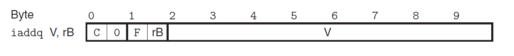
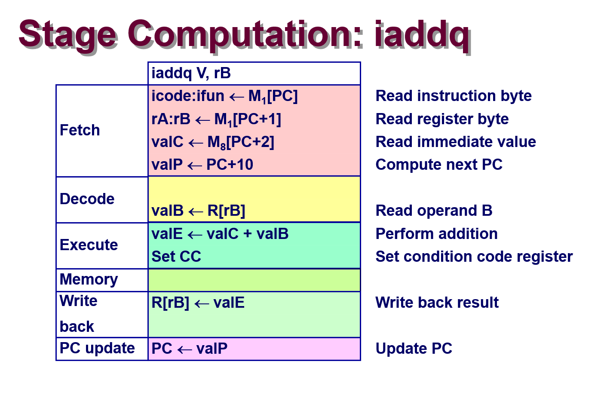
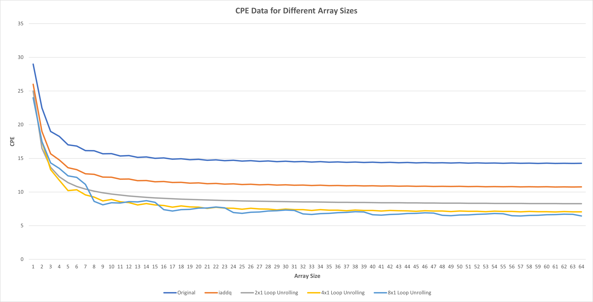

Lab 4: Architecture Lab
=======================

0x01. 实验介绍
--------------

在本实验中，我们将学习一个流水线化的Y86-64处理器的设计与实现，并设法优化此处理器和基准测试程序以最大化性能。
完成此实验后，我们将对软硬件之间的相互作用对程序性能的影响，有更加深刻的认识。

本实验分为三个部分。在Part A中，我们将通过写一些Y86-64的汇编程序，来熟悉相关的Y86-64工具。
在Part B中，我们将对Y86-64处理器的顺序实现（SEQ simulator）添加一条新指令。
基于以上两个实验，我们来到本实验的核心Part C，此部分我们将对Y86-64的基准程序和处理器设计进行优化。

总之，通过此实验，我们将了解CPU设计的基本流程和规范，同时也对如何能够写出高性能的优化代码有更深的理解。

0x02. 实验环境搭建
------------------

实验的源代码可通过以下命令下载解压：

.. code-block:: console

    $ wget http://csapp.cs.cmu.edu/3e/archlab-handout.tar
    $ tar xvf archlab-handout.tar

进入实验目录，再通过以下命令对 ``sim.tar`` 压缩包进行解压：

.. code-block:: console

    $ cd archlab-handout/
    $ tar xvf sim.tar

首先查看一下本实验包含的文件。
在 ``archlab-handout`` 目录下，有以下文件和目录：

* ``archlab.pdf`` 是本实验的实验要求。
* ``Makefile`` 用于实验代码提交，我们属于自学，当然就用不着了。
* ``README`` 是对实验顶级目录下各个文件或文件夹的说明。
* ``sim`` 是Y86-64的工具合集，也是我们实际编写代码，运行程序的地方。
* ``simguide.pdf`` 说明Y86-64中相关工具的使用。

进入到解压缩后的 ``sim`` 目录里，有以下文件和目录：

* ``Makefile`` 用来编译Y86-64工具链。
* ``README`` 是对此目录下各个文件或文件夹的说明。
* ``misc`` 包含Y86-64的汇编器yas，指令模拟器yis，ISA源文件以及hcl2c和hcl2v的源代码。
* ``seq`` 包含SEQ和SEQ+处理器的源代码。
* ``pipe`` 包含PIPE处理器的源代码。
* ``y86-code`` 包含书本中的 ``.ys`` 例子和相应处理器基准测试脚本。
* ``ptest`` 包含测试处理器设计的自动回归脚本。

理清了实验中包含的文件以及每个文件的用途，我们先编译实验，熟悉实验提供的工具：

.. code-block:: console

    $ cd sim/
    $ make
    (cd misc; make all)
    make[1]: Entering directory '/home/jiewan01/CS4_Challenge/csapp_lab/test/archlab-handout/sim/misc'
    gcc -Wall -O1 -g -c yis.c
    gcc -Wall -O1 -g -c isa.c
    gcc -Wall -O1 -g yis.o isa.o -o yis
    gcc -Wall -O1 -g -c yas.c
    gcc -O1 -c yas-grammar.c
    gcc -Wall -O1 -g yas-grammar.o yas.o isa.o -lfl -o yas
    gcc -O1 node.c lex.yy.c hcl.tab.c outgen.c -o hcl2c
    make[1]: Leaving directory '/home/jiewan01/CS4_Challenge/csapp_lab/test/archlab-handout/sim/misc'
    (cd pipe; make all GUIMODE= TKLIBS="-L/usr/lib -ltk -ltcl" TKINC="-isystem /usr/include/tcl8.5")
    make[1]: Entering directory '/home/jiewan01/CS4_Challenge/csapp_lab/test/archlab-handout/sim/pipe'
    # Building the pipe-std.hcl version of PIPE
    ../misc/hcl2c -n pipe-std.hcl < pipe-std.hcl > pipe-std.c
    gcc -Wall -O2 -isystem /usr/include/tcl8.5 -I../misc  -o psim psim.c pipe-std.c \
            ../misc/isa.c -L/usr/lib -ltk -ltcl -lm
    /usr/bin/ld: cannot find -ltk
    /usr/bin/ld: cannot find -ltcl
    collect2: error: ld returned 1 exit status
    Makefile:42: recipe for target 'psim' failed
    make[1]: *** [psim] Error 1
    make[1]: Leaving directory '/home/jiewan01/CS4_Challenge/csapp_lab/test/archlab-handout/sim/pipe'
    Makefile:26: recipe for target 'all' failed
    make: *** [all] Error 2

编译错误，原因是 ``ld`` 链接器找不到对应的 ``tk`` 和 ``tcl`` 库。
我使用的是Ubuntu 20.04系统，可通过 ``sudo apt-get install tk-dev tcl-dev`` 命令下载安装上述库。
然后修改 ``Makefile`` 文件，指定链接 ``tk`` 和 ``tck`` 头文件的版本为8.6。

.. code-block:: makefile

    TKINC=-system /usr/include/tcl8.6

再次敲入 ``make`` 命令编译实验，此时编译通过。
需要注意的是，Y86-64处理器模拟器有两种模式，分别是 ``TTY mode`` 和 ``GUI mode`` 。
``TTY mode`` 则是把所有的结果输出到终端上，而 ``GUI mode`` 则是有图形界面对运行结果进行可视化。
``GUI mode`` 需要安装Tcl/Tk库，同时要在 ``Makefile`` 打开开关 ``GUIMODE=-DHAS_GUI`` 。

因为本实验设计的时间有一定年限了，在编译 ``GUI mode`` 时，会遇到诸如 ``‘Tcl_Interp’ has no member named ‘result’`` 和 ``undefined reference to `matherr'`` 等错误，这是由于Tcl库版本兼容的问题导致的，可通过以下patch解决。

.. code-block:: console

    Author: Jieqiang Wang <wangjieqiang123@163.com>
    Date:   Tue Jul 11 10:15:20 2023 +0800

        archlab: fix build issues for GUI mode

    diff --git a/sim/Makefile b/sim/Makefile
    index 7fd8f06..887fe84 100644
    --- a/sim/Makefile
    +++ b/sim/Makefile
    @@ -1,19 +1,19 @@
    # Comment this out if you don't have Tcl/Tk on your system

    -#GUIMODE=-DHAS_GUI
    +GUIMODE=-DHAS_GUI

    # Modify the following line so that gcc can find the libtcl.so and
    # libtk.so libraries on your system. You may need to use the -L option
    # to tell gcc which directory to look in. Comment this out if you
    # don't have Tcl/Tk.

    -TKLIBS=-L/usr/lib -ltk -ltcl
    +TKLIBS=-L/usr/lib -ltk8.6 -ltcl8.6

    # Modify the following line so that gcc can find the tcl.h and tk.h
    # header files on your system. Comment this out if you don't have
    # Tcl/Tk.

    -TKINC=-isystem /usr/include/tcl8.5
    +TKINC=-isystem /usr/include/tcl8.6

    ##################################################
    # You shouldn't need to modify anything below here
    diff --git a/sim/pipe/Makefile b/sim/pipe/Makefile
    index ca4607e..81839fc 100644
    --- a/sim/pipe/Makefile
    +++ b/sim/pipe/Makefile
    @@ -17,7 +17,7 @@ TKLIBS=-L/usr/lib -ltk -ltcl
    # header files on your system. Comment this out if you don't have
    # Tcl/Tk.

    -TKINC=-isystem /usr/include/tcl8.5
    +TKINC=-isystem /usr/include/tcl8.6

    # Modify these two lines to choose your compiler and compile time
    # flags.
    @@ -25,6 +25,9 @@ TKINC=-isystem /usr/include/tcl8.5
    CC=gcc
    CFLAGS=-Wall -O2

    +# Add following flags to suppress building error due to tcl tools
    +CPPFLAGS=-DUSE_INTERP_RESULT
    +
    ##################################################
    # You shouldn't need to modify anything below here
    ##################################################
    @@ -41,7 +44,7 @@ all: psim drivers
    psim: psim.c sim.h pipe-$(VERSION).hcl $(MISCDIR)/isa.c $(MISCDIR)/isa.h
            # Building the pipe-$(VERSION).hcl version of PIPE
            $(HCL2C) -n pipe-$(VERSION).hcl < pipe-$(VERSION).hcl > pipe-$(VERSION).c
    -       $(CC) $(CFLAGS) $(INC) -o psim psim.c pipe-$(VERSION).c \
    +       $(CC) $(CPPFLAGS) $(CFLAGS) $(INC) -o psim psim.c pipe-$(VERSION).c \
                    $(MISCDIR)/isa.c $(LIBS)

    # This rule builds driver programs for Part C of the Architecture Lab
    diff --git a/sim/pipe/psim.c b/sim/pipe/psim.c
    index c08508e..28b9642 100644
    --- a/sim/pipe/psim.c
    +++ b/sim/pipe/psim.c
    @@ -803,9 +803,10 @@ void sim_log( const char *format, ... ) {
    **********************/

    /* Hack for SunOS */
    +/*
    extern int matherr();
    int *tclDummyMathPtr = (int *) matherr;
    -
    +*/
    static char tcl_msg[256];

    /* Keep track of the TCL Interpreter */
    diff --git a/sim/seq/Makefile b/sim/seq/Makefile
    index 0c71aae..9cbd4b9 100644
    --- a/sim/seq/Makefile
    +++ b/sim/seq/Makefile
    @@ -17,7 +17,7 @@ TKLIBS=-L/usr/lib -ltk -ltcl
    # header files on your system. Comment this out if you don't have
    # Tcl/Tk.

    -TKINC=-isystem /usr/include/tcl8.5
    +TKINC=-isystem /usr/include/tcl8.6

    # Modify these two lines to choose your compiler and compile time
    # flags.
    @@ -25,6 +25,7 @@ TKINC=-isystem /usr/include/tcl8.5
    CC=gcc
    CFLAGS=-Wall -O2

    +CPPFLAGS=-DUSE_INTERP_RESULT
    ##################################################
    # You shouldn't need to modify anything below here
    ##################################################
    @@ -41,14 +42,14 @@ all: ssim
    ssim: seq-$(VERSION).hcl ssim.c  sim.h $(MISCDIR)/isa.c $(MISCDIR)/isa.h
            # Building the seq-$(VERSION).hcl version of SEQ
            $(HCL2C) -n seq-$(VERSION).hcl <seq-$(VERSION).hcl >seq-$(VERSION).c
    -       $(CC) $(CFLAGS) $(INC) -o ssim \
    +       $(CC) $(CPPFLAGS) $(CFLAGS) $(INC) -o ssim \
                    seq-$(VERSION).c ssim.c $(MISCDIR)/isa.c $(LIBS)

    # This rule builds the SEQ+ simulator (ssim+)
    ssim+: seq+-std.hcl ssim.c sim.h $(MISCDIR)/isa.c $(MISCDIR)/isa.h
            # Building the seq+-std.hcl version of SEQ+
            $(HCL2C) -n seq+-std.hcl <seq+-std.hcl >seq+-std.c
    -       $(CC) $(CFLAGS) $(INC) -o ssim+ \
    +       $(CC) $(CPPFLAGS) $(CFLAGS) $(INC) -o ssim+ \
                    seq+-std.c ssim.c $(MISCDIR)/isa.c $(LIBS)

    # These are implicit rules for assembling .yo files from .ys files.
    diff --git a/sim/seq/ssim.c b/sim/seq/ssim.c
    index 4cae5a9..eecc07d 100644
    --- a/sim/seq/ssim.c
    +++ b/sim/seq/ssim.c
    @@ -841,9 +841,10 @@ void sim_log( const char *format, ... ) {
    **********************/

    /* Hack for SunOS */
    +/*
    extern int matherr();
    int *tclDummyMathPtr = (int *) matherr;
    -
    +*/
    static char tcl_msg[256];

    /* Keep track of the TCL Interpreter */

这个patch的核心修改就是通过添加 ``CPPFLAGS=-DUSE_INTERP_RESULT`` 来绕过因为Tcl库8.6版本问题导致的结构体 ``Tcl_Interp`` 无成员变量 ``result`` 的问题。
同时注释掉 ``matherr`` 函数的使用，这种用法已经过时了。
再次编译实验，这次对应 ``GUI mode`` 的实验代码即可编译成功。

我们可以运行 ``y86-code`` 里的一个例子，来验证实验编译成功。
``asum.yo`` 是由 ``asum.ys`` 源代码生成，取自于书中数组求和的例子。
可以看到，通过 ``yis`` Y86-64指令模拟器运行程序，各个寄存器和内存的变化，最终函数返回的结果存在寄存器 ``%rax`` 中。
其值为 ``0xabcdabcdabcd`` ，同预期一致。

.. code-block:: console

    $ cd y86-code
    $ ../misc/yis asum.yo
    Stopped in 34 steps at PC = 0x13.  Status 'HLT', CC Z=1 S=0 O=0
    Changes to registers:
    %rax:   0x0000000000000000      0x0000abcdabcdabcd
    %rsp:   0x0000000000000000      0x0000000000000200
    %rdi:   0x0000000000000000      0x0000000000000038
    %r8:    0x0000000000000000      0x0000000000000008
    %r9:    0x0000000000000000      0x0000000000000001
    %r10:   0x0000000000000000      0x0000a000a000a000

    Changes to memory:
    0x01f0: 0x0000000000000000      0x0000000000000055
    0x01f8: 0x0000000000000000      0x0000000000000013

至此，我们成功地编译了实验，并熟悉了该实验相关的工具链。接下来开始我们的实验部分内容。

0x03. 实验过程及思路说明
-----------------------

Part A
^^^^^^^^

本部分的实验都是在 ``sim/misc`` 目录下进行。
实验的主要任务是将 ``examples.c`` 里三个C函数通过Y86-64汇编代码实现。
然后用实验提供的 ``yas`` 汇编器生成Y86-64二进制代码，再使用 ``yis`` 指令模拟器运行生成的Y86-64程序。

sum.ys
''''''''

本实验是将 ``examples.c`` 中的 ``sum_list`` 函数通过Y86-64汇编语言实现。
首先看C代码的实现：

.. code-block:: c

    /* linked list element */
    typedef struct ELE {
        long val;
        struct ELE *next;
    } *list_ptr;

    /* sum_list - Sum the elements of a linked list */
    long sum_list(list_ptr ls)
    {
        long val = 0;
        while (ls) {
            val += ls->val;
            ls = ls->next;
        }
        return val;
    }

在将上述C代码转换成Y86-64汇编语言之前，我们可先将其转换成X86-64汇编语言。
`此网站 <https://godbolt.org/>`_ 可在线将C代码转换成X86-64汇编代码，如下所示：

.. code-block:: asm

    sum_list(ELE*):
        movl    $0, %eax
        jmp     .L2
    .L3:
        addq    (%rdi), %rax
        movq    8(%rdi), %rdi
    .L2:
        testq   %rdi, %rdi
        jne     .L3
        ret

基于此X86-64汇编代码，再结合 ``misc/asum.ys`` 例子，我们可完成 ``sum.ys`` 的实现。

.. code-block:: asm

    # Execution begins at address 0
        .pos 0
        irmovq stack, %rsp      # Set up stack pointer
        call main               # Execute main program
        halt                    # Terminate program

    # Sample linked list
    .align 8
    ele1:
            .quad 0x00a
            .quad ele2
    ele2:
            .quad 0x0b0
            .quad ele3
    ele3:
            .quad 0xc00
            .quad 0

    main:
            irmovq ele1,%rdi
            call sum_list        # sum_list(list_ptr ls)
            ret

    # long sum_list(list_ptr ls)
    # ls in %rdi
    sum_list:
            xorq %rax,%rax       # sum = 0
            jmp     test         # Goto test
    loop:
            mrmovq (%rdi),%r10   # Get ls->val
            addq %r10,%rax       # Add to sum
            mrmovq 8(%rdi),%rdi  # ls = ls->next
    test:
            andq %rdi,%rdi       # Is ls NULL?
            jne    loop          # Stop when 0
            ret                  # Return

    # Stack starts here and grows to lower addresses
            .pos 0x200
    stack:

再通过 ``yas`` 生成二进制程序， ``yis`` 运行程序。
程序最终返回 ``0xcba`` ，其结果保存在 ``%rax`` 寄存器中。
同原C函数的语义保持一致， ``sum.ys`` 完成。

.. code-block:: console

    $ ../misc/yas sum.ys # output sum.yo
    $ ../misc/yis sum.yo
    Stopped in 26 steps at PC = 0x13.  Status 'HLT', CC Z=1 S=0 O=0
    Changes to registers:
    %rax:   0x0000000000000000      0x0000000000000cba
    %rsp:   0x0000000000000000      0x0000000000000200
    %r10:   0x0000000000000000      0x0000000000000c00

    Changes to memory:
    0x01f0: 0x0000000000000000      0x000000000000005b
    0x01f8: 0x0000000000000000      0x0000000000000013

rsum.ys
''''''''

本实验的任务是将上述 ``sum.ys`` 遍历链表的方式，改用递归的方法实现。
先看C函数 ``rsum_list`` 的实现：

.. code-block:: c

    /* rsum_list - Recursive version of sum_list */
    long rsum_list(list_ptr ls)
    {
        if (!ls)
            return 0;
        else {
            long val = ls->val;
            long rest = rsum_list(ls->next);
            return val + rest;
        }
    }

同样的套路，我们先把上述C代码转换成X86-64的汇编代码：

.. code-block:: asm

    rsum_list(ELE*):
            testq   %rdi, %rdi
            je      .L3
            pushq   %rbx
            movq    (%rdi), %rbx
            movq    8(%rdi), %rdi
            call    rsum_list(ELE*)
            addq    %rbx, %rax
            popq    %rbx
            ret
    .L3:
            movl    $0, %eax
            ret

``rsum.ys`` 的实现的框架基本同 ``sum.ys`` 相同，只需将其中的 ``sum_list`` 替换成 ``rsum_list`` ，并作些许修改即可。

.. code-block:: asm

    # Execution begins at address 0
            .pos 0
            irmovq stack, %rsp      # Set up stack pointer
            call main               # Execute main program
            halt                    # Terminate program

    # Sample linked list
    .align 8
    ele1:
            .quad 0x00a
            .quad ele2
    ele2:
            .quad 0x0b0
            .quad ele3
    ele3:
            .quad 0xc00
            .quad 0

    main:
            irmovq ele1,%rdi
            call rsum_list       # rsum_list(list_ptr ls)
            ret

    # long rsum_list(list_ptr ls)
    # ls in %rdi
    rsum_list:
            andq %rdi,%rdi       # Is ls NULL?
            je return            # If ls is NULL, return 0
            pushq %rbx           # Save callee-saved register
            mrmovq (%rdi),%rbx   # Get ls->val
            mrmovq 8(%rdi),%rdi  # ls->next
            call rsum_list       # Call rsum_list recursively
            addq %rbx,%rax       # Add to sum
            popq %rbx            # Pop callee-saved register
            ret
    return:
            irmovq $0,%rax       # Set return val to 0
            ret                  # Return

    # Stack starts here and grows to lower addresses
            .pos 0x200
    stack:

``rsum.ys`` 的编译和运行结果如下所示：

.. code-block:: console

    $ ../misc/yas rsum.ys # output rsum.yo
    $ ../misc/yis rsum.yo
    Stopped in 37 steps at PC = 0x13.  Status 'HLT', CC Z=0 S=0 O=0
    Changes to registers:
    %rax:   0x0000000000000000      0x0000000000000cba
    %rsp:   0x0000000000000000      0x0000000000000200

    Changes to memory:
    0x01c0: 0x0000000000000000      0x0000000000000086
    0x01c8: 0x0000000000000000      0x00000000000000b0
    0x01d0: 0x0000000000000000      0x0000000000000086
    0x01d8: 0x0000000000000000      0x000000000000000a
    0x01e0: 0x0000000000000000      0x0000000000000086
    0x01f0: 0x0000000000000000      0x000000000000005b
    0x01f8: 0x0000000000000000      0x0000000000000013

可以看到，递归的实现方式最终的结果，也就是 ``%rax`` 值同遍历链表的方法得到的结果是一致的。
但是运行结果显示，递归需要与内存发生更多的交互，因为存在着递归函数出栈压栈的操作。

copy.ys
''''''''

本实验的任务是编写 ``copy.ys`` Y86-64汇编代码，实现将一个位置的内存块的内容，拷贝到另一个内存块位置，并计算出被拷贝的内存内容的校正码。
查看C函数 ``copy_block`` 的实现：

.. code-block:: c

    /* copy_block - Copy src to dest and return xor checksum of src */
    long copy_block(long *src, long *dest, long len)
    {
        long result = 0;
        while (len > 0) {
            long val = *src++;
            *dest++ = val;
            result ^= val;
            len--;
        }
        return result;
    }

先将上述C代码转换成X86-64汇编代码：

.. code-block:: asm

    copy_block(long*, long*, long):
            movl    $0, %ecx
            jmp     .L2
    .L3:
            movq    (%rdi), %rax
            movq    %rax, (%rsi)
            xorq    %rax, %rcx
            subq    $1, %rdx
            leaq    8(%rsi), %rsi
            leaq    8(%rdi), %rdi
    .L2:
            testq   %rdx, %rdx
            jg      .L3
            movq    %rcx, %rax
            ret

基于上述X86-64汇编代码，我们完成 ``copy.ys`` 的实现：

.. code-block:: asm

    # Execution begins at address 0
            .pos 0
            irmovq stack, %rsp      # Set up stack pointer
            call main               # Execute main program
            halt                    # Terminate program

    .align 8
    # Source block
    src:
            .quad 0x00a
            .quad 0x0b0
            .quad 0xc00

    # Destination block
    dest:
            .quad 0x111
            .quad 0x222
            .quad 0x333

    main:
            irmovq src,%rdi
            irmovq dest,%rsi
            irmovq $3,%rdx
            call copy_block      # copy_block(src, dest, len)
            ret

    # long copy_block(long *src, long *dest, long len)
    # src in %rdi, dest in %rsi, len in %rdx
    copy_block:
            irmovq $0, %rcx      # Init result
            irmovq $8, %r8       # Constant 8
            irmovq $1, %r9       # Constant 1
            jmp     test         # Goto test
    loop:
            mrmovq (%rdi),%rax   # Get *src
            rmmovq %rax,(%rsi)   # Set *dest
            xorq %rax, %rcx      # Compute checksum
            addq %r8, %rdi       # src++
            addq %r8, %rsi       # dest++
            subq %r9, %rdx       # len--
    test:
            andq %rdx,%rdx       # Is len > 0 ?
            jg    loop           # Stop when 0
            rrmovq %rcx, %rax    # Return checksum
            ret                  # Return

    # Stack starts here and grows to lower addresses
            .pos 0x200
    stack:

编译运行 ``copy.ys`` ：

.. code-block:: console

    $ ../misc/yas copy.ys # output copy.yo
    $ ../misc/yis copy.yo
    Stopped in 40 steps at PC = 0x13.  Status 'HLT', CC Z=1 S=0 O=0
    Changes to registers:
    %rax:   0x0000000000000000      0x0000000000000cba
    %rcx:   0x0000000000000000      0x0000000000000cba
    %rsp:   0x0000000000000000      0x0000000000000200
    %rsi:   0x0000000000000000      0x0000000000000048
    %rdi:   0x0000000000000000      0x0000000000000030
    %r8:    0x0000000000000000      0x0000000000000008
    %r9:    0x0000000000000000      0x0000000000000001

    Changes to memory:
    0x0030: 0x0000000000000111      0x000000000000000a
    0x0038: 0x0000000000000222      0x00000000000000b0
    0x0040: 0x0000000000000333      0x0000000000000c00
    0x01f0: 0x0000000000000000      0x000000000000006f
    0x01f8: 0x0000000000000000      0x0000000000000013
   
可以看到，原先位于 ``dest`` 的内存值，都被修改成 ``src`` 数组中的值。

Part B
^^^^^^^^

本部分的实验是在 ``sim/seq`` 目录下完成的。
实验的主要任务是根据课后习题4.51和4.52的要求，修改Y86-64处理器的顺序实现的HCL文件 ``seq-full.hcl`` ，添加一条新的指令 ``iaddq`` 。

修改 ``seq-full.hcl``
'''''''''''''''''''''

根据练习习题4.3的说明，指令 ``iaddq`` 的编码格式如下所示。

再仿照 ``OPq`` 和 ``irmovq`` 指令的计算步骤，我们可以写出新添加的指令 ``iaddq`` 的计算步骤。

明确了指令 ``iaddq`` 的在每一个阶段中的操作，我们就可以对文件 ``seq-full.hcl`` 进行相应的修改。

修改的patch如下所示。首先， ``seq-full.hcl`` 中已经为我们定义好了 ``iaddq`` 命令，但是并没有将其加入到 ``instr_valid`` 中。
所以我们首先需要把指令 ``iaddq`` 加入到其中。 
在取指阶段中， ``iaddq`` 指令既需要读取寄存器 ``rB`` 的值，也需要读取一个常量，所以同时需要 ``need_regids`` 和 ``need_valC`` 控制逻辑。
``iaddq`` 会将读取的寄存器 ``rB`` 的值存放在 ``srcB`` 中，并将计算过后的值存放在 ``dstE`` 中。
在执行阶段， ``iaddq`` 指令的两个输入 ``aluA`` 和 ``aluB`` 分别对应的是 ``valC`` 和 ``valB`` ， ``alufun`` 计算功能为默认加的操作。
同 ``addq`` 指令一样， ``iaddq`` 指令我们也需要根据指令的计算结果对条件码置位，即把 ``iaddq`` 添加到 ``set_cc`` 的控制逻辑里。

.. code-block:: console

        $ git diff seq/seq-full.hcl
        diff --git a/sim/seq/seq-full.hcl b/sim/seq/seq-full.hcl
        index 0c946dd..c71a82c 100644
        --- a/sim/seq/seq-full.hcl
        +++ b/sim/seq/seq-full.hcl
        @@ -106,16 +106,16 @@ word ifun = [

        bool instr_valid = icode in
                { INOP, IHALT, IRRMOVQ, IIRMOVQ, IRMMOVQ, IMRMOVQ,
        -              IOPQ, IJXX, ICALL, IRET, IPUSHQ, IPOPQ };
        +              IOPQ, IJXX, ICALL, IRET, IPUSHQ, IPOPQ, IIADDQ };

        # Does fetched instruction require a regid byte?
        bool need_regids =
                icode in { IRRMOVQ, IOPQ, IPUSHQ, IPOPQ,
        -                    IIRMOVQ, IRMMOVQ, IMRMOVQ };
        +                    IIRMOVQ, IRMMOVQ, IMRMOVQ, IIADDQ };

        # Does fetched instruction require a constant word?
        bool need_valC =
        -       icode in { IIRMOVQ, IRMMOVQ, IMRMOVQ, IJXX, ICALL };
        +       icode in { IIRMOVQ, IRMMOVQ, IMRMOVQ, IJXX, ICALL, IIADDQ };

        ################ Decode Stage    ###################################

        @@ -128,7 +128,7 @@ word srcA = [

        ## What register should be used as the B source?
        word srcB = [
        -       icode in { IOPQ, IRMMOVQ, IMRMOVQ  } : rB;
        +       icode in { IOPQ, IRMMOVQ, IMRMOVQ, IIADDQ  } : rB;
                icode in { IPUSHQ, IPOPQ, ICALL, IRET } : RRSP;
                1 : RNONE;  # Don't need register
        ];
        @@ -136,7 +136,7 @@ word srcB = [
        ## What register should be used as the E destination?
        word dstE = [
                icode in { IRRMOVQ } && Cnd : rB;
        -       icode in { IIRMOVQ, IOPQ} : rB;
        +       icode in { IIRMOVQ, IOPQ, IIADDQ} : rB;
                icode in { IPUSHQ, IPOPQ, ICALL, IRET } : RRSP;
                1 : RNONE;  # Don't write any register
        ];
        @@ -152,7 +152,7 @@ word dstM = [
        ## Select input A to ALU
        word aluA = [
                icode in { IRRMOVQ, IOPQ } : valA;
        -       icode in { IIRMOVQ, IRMMOVQ, IMRMOVQ } : valC;
        +       icode in { IIRMOVQ, IRMMOVQ, IMRMOVQ, IIADDQ } : valC;
                icode in { ICALL, IPUSHQ } : -8;
                icode in { IRET, IPOPQ } : 8;
                # Other instructions don't need ALU
        @@ -161,7 +161,7 @@ word aluA = [
        ## Select input B to ALU
        word aluB = [
                icode in { IRMMOVQ, IMRMOVQ, IOPQ, ICALL,
        -                     IPUSHQ, IRET, IPOPQ } : valB;
        +                     IPUSHQ, IRET, IPOPQ, IIADDQ } : valB;
                icode in { IRRMOVQ, IIRMOVQ } : 0;
                # Other instructions don't need ALU
        ];
        @@ -173,7 +173,7 @@ word alufun = [
        ];

        ## Should the condition codes be updated?
        -bool set_cc = icode in { IOPQ };
        +bool set_cc = icode in { IOPQ, IIADDQ };

        ################ Memory Stage    ###################################

完成对硬件描述文件 ``seq-full.hcl`` 的修改，我们可通过以下命令编译生成 ``seq-full`` 版本的Y86-64处理器。

.. code-block:: console

        $ make VERSION=full 

我们可用新生成的 ``ssim`` 测试一个包含 ``iaddq`` 指令的Y86-64小程序。可以看到，程序 ``asumi.yo`` 运行成功。

.. code-block:: console

        $ ./ssim -t ../y86-code/asumi.yo
        Y86-64 Processor: seq-full.hcl
        137 bytes of code read
        IF: Fetched irmovq at 0x0.  ra=----, rb=%rsp, valC = 0x100
        IF: Fetched call at 0xa.  ra=----, rb=----, valC = 0x38
        Wrote 0x13 to address 0xf8
        IF: Fetched irmovq at 0x38.  ra=----, rb=%rdi, valC = 0x18
        IF: Fetched irmovq at 0x42.  ra=----, rb=%rsi, valC = 0x4
        IF: Fetched call at 0x4c.  ra=----, rb=----, valC = 0x56
        Wrote 0x55 to address 0xf0
        IF: Fetched xorq at 0x56.  ra=%rax, rb=%rax, valC = 0x0
        IF: Fetched andq at 0x58.  ra=%rsi, rb=%rsi, valC = 0x0
        IF: Fetched jmp at 0x5a.  ra=----, rb=----, valC = 0x83
        IF: Fetched jne at 0x83.  ra=----, rb=----, valC = 0x63
        IF: Fetched mrmovq at 0x63.  ra=%r10, rb=%rdi, valC = 0x0
        IF: Fetched addq at 0x6d.  ra=%r10, rb=%rax, valC = 0x0
        IF: Fetched iaddq at 0x6f.  ra=----, rb=%rdi, valC = 0x8
        IF: Fetched iaddq at 0x79.  ra=----, rb=%rsi, valC = 0xffffffffffffffff
        IF: Fetched jne at 0x83.  ra=----, rb=----, valC = 0x63
        IF: Fetched mrmovq at 0x63.  ra=%r10, rb=%rdi, valC = 0x0
        IF: Fetched addq at 0x6d.  ra=%r10, rb=%rax, valC = 0x0
        IF: Fetched iaddq at 0x6f.  ra=----, rb=%rdi, valC = 0x8
        IF: Fetched iaddq at 0x79.  ra=----, rb=%rsi, valC = 0xffffffffffffffff
        IF: Fetched jne at 0x83.  ra=----, rb=----, valC = 0x63
        IF: Fetched mrmovq at 0x63.  ra=%r10, rb=%rdi, valC = 0x0
        IF: Fetched addq at 0x6d.  ra=%r10, rb=%rax, valC = 0x0
        IF: Fetched iaddq at 0x6f.  ra=----, rb=%rdi, valC = 0x8
        IF: Fetched iaddq at 0x79.  ra=----, rb=%rsi, valC = 0xffffffffffffffff
        IF: Fetched jne at 0x83.  ra=----, rb=----, valC = 0x63
        IF: Fetched mrmovq at 0x63.  ra=%r10, rb=%rdi, valC = 0x0
        IF: Fetched addq at 0x6d.  ra=%r10, rb=%rax, valC = 0x0
        IF: Fetched iaddq at 0x6f.  ra=----, rb=%rdi, valC = 0x8
        IF: Fetched iaddq at 0x79.  ra=----, rb=%rsi, valC = 0xffffffffffffffff
        IF: Fetched jne at 0x83.  ra=----, rb=----, valC = 0x63
        IF: Fetched ret at 0x8c.  ra=----, rb=----, valC = 0x0
        IF: Fetched ret at 0x55.  ra=----, rb=----, valC = 0x0
        IF: Fetched halt at 0x13.  ra=----, rb=----, valC = 0x0
        32 instructions executed
        Status = HLT
        Condition Codes: Z=1 S=0 O=0
        Changed Register State:
        %rax:   0x0000000000000000      0x0000abcdabcdabcd
        %rsp:   0x0000000000000000      0x0000000000000100
        %rdi:   0x0000000000000000      0x0000000000000038
        %r10:   0x0000000000000000      0x0000a000a000a000
        Changed Memory State:
        0x00f0: 0x0000000000000000      0x0000000000000055
        0x00f8: 0x0000000000000000      0x0000000000000013
        ISA Check Succeeds

我们再用 ``ssim`` 运行Y86-64的基准测试程序，来确保我们新添加的 ``iaddq`` 指令不引入任何错误。
可以看到，所有的Y86-64基准测试程序运行无误。

.. code-block:: console

        $ cd ../y86-code
        $ make testssim
        ../seq/ssim -t asum.yo > asum.seq
        ../seq/ssim -t asumr.yo > asumr.seq
        ../seq/ssim -t cjr.yo > cjr.seq
        ../seq/ssim -t j-cc.yo > j-cc.seq
        ../seq/ssim -t poptest.yo > poptest.seq
        ../seq/ssim -t pushquestion.yo > pushquestion.seq
        ../seq/ssim -t pushtest.yo > pushtest.seq
        ../seq/ssim -t prog1.yo > prog1.seq
        ../seq/ssim -t prog2.yo > prog2.seq
        ../seq/ssim -t prog3.yo > prog3.seq
        ../seq/ssim -t prog4.yo > prog4.seq
        ../seq/ssim -t prog5.yo > prog5.seq
        ../seq/ssim -t prog6.yo > prog6.seq
        ../seq/ssim -t prog7.yo > prog7.seq
        ../seq/ssim -t prog8.yo > prog8.seq
        ../seq/ssim -t ret-hazard.yo > ret-hazard.seq
        grep "ISA Check" *.seq
        asumr.seq:ISA Check Succeeds
        asum.seq:ISA Check Succeeds
        cjr.seq:ISA Check Succeeds
        j-cc.seq:ISA Check Succeeds
        poptest.seq:ISA Check Succeeds
        prog1.seq:ISA Check Succeeds
        prog2.seq:ISA Check Succeeds
        prog3.seq:ISA Check Succeeds
        prog4.seq:ISA Check Succeeds
        prog5.seq:ISA Check Succeeds
        prog6.seq:ISA Check Succeeds
        prog7.seq:ISA Check Succeeds
        prog8.seq:ISA Check Succeeds
        pushquestion.seq:ISA Check Succeeds
        pushtest.seq:ISA Check Succeeds
        ret-hazard.seq:ISA Check Succeeds
        rm asum.seq asumr.seq cjr.seq j-cc.seq poptest.seq pushquestion.seq pushtest.seq prog1.seq prog2.seq prog3.seq prog4.seq prog5.seq prog6.seq prog7.seq prog8.seq ret-hazard.seq

最后我们再进行回归测试，首先对除去 ``iaddq`` 指令的 ``ssim`` 进行测试。测试结果如下所示，600条ISA检查通过。

.. code-block:: console

        $ cd ../ptest
        $ make SIM=../seq/ssim
        ./optest.pl -s ../seq/ssim
        Simulating with ../seq/ssim
        All 49 ISA Checks Succeed
        ./jtest.pl -s ../seq/ssim
        Simulating with ../seq/ssim
        All 64 ISA Checks Succeed
        ./ctest.pl -s ../seq/ssim
        Simulating with ../seq/ssim
        All 22 ISA Checks Succeed
        ./htest.pl -s ../seq/ssim
        Simulating with ../seq/ssim
        All 600 ISA Checks Succeed

然后再单独对 ``iaddq`` 进行回归测试。测试结果如下所示，756条ISA检查通过。

.. code-block:: console

        $ cd ../ptest
        $ make SIM=../seq/ssim TFLAGS=-i
        ./optest.pl -s ../seq/ssim -i
        Simulating with ../seq/ssim
        All 58 ISA Checks Succeed
        ./jtest.pl -s ../seq/ssim -i
        Simulating with ../seq/ssim
        All 96 ISA Checks Succeed
        ./ctest.pl -s ../seq/ssim -i
        Simulating with ../seq/ssim
        All 22 ISA Checks Succeed
        ./htest.pl -s ../seq/ssim -i
        Simulating with ../seq/ssim
        All 756 ISA Checks Succeed

至此，Part B实验完成。

Part C
^^^^^^^^

本部分的实验是在 ``sim/pipe`` 目录下完成的。
本实验的任务是修改 ``ncopy.ys`` 和 ``pipe-full.hcl`` 文件，从而能够让 ``ncopy.ys`` 在自定义的流水线处理器跑得越快越好。

函数 ``ncopy`` 的定义在源文件 ``sim/pipe/ncopy.c`` ，C实现如下所示。其功能是将长度为 ``len`` 的数组 ``src`` 复制到非重叠的数组 ``dst`` 中，最终结果返回的是数组 ``src`` 中正整数的个数。

.. code-block:: c

        /*
        * ncopy - copy src to dst, returning number of positive ints
        * contained in src array.
        */
        word_t ncopy(word_t *src, word_t *dst, word_t len)
        {
            word_t count = 0;
            word_t val;

            while(len > 0) {
                val = *src++;
                *dst++ = val;
                if (val > 0)
                    count++;
                len--;
            }
            return count;
        }

实验还提供了一版基本的 ``ncopy.ys`` ，如下所示。

.. code-block:: asm

        ##################################################################
        # ncopy.ys - Copy a src block of len words to dst.
        # Return the number of positive words (>0) contained in src.
        #
        # Include your name and ID here.
        #
        # Describe how and why you modified the baseline code.
        #
        ##################################################################
        # Do not modify this portion
        # Function prologue.
        # %rdi = src, %rsi = dst, %rdx = len
        ncopy:

        ##################################################################
        # You can modify this portion
                # Loop header
                xorq %rax,%rax          # count = 0;
                andq %rdx,%rdx          # len <= 0?
                jle Done                # if so, goto Done:

        Loop:   mrmovq (%rdi), %r10     # read val from src...
                rmmovq %r10, (%rsi)     # ...and store it to dst
                andq %r10, %r10         # val <= 0?
                jle Npos                # if so, goto Npos:
                irmovq $1, %r10
                addq %r10, %rax         # count++
        Npos:   irmovq $1, %r10
                subq %r10, %rdx         # len--
                irmovq $8, %r10
                addq %r10, %rdi         # src++
                addq %r10, %rsi         # dst++
                andq %rdx,%rdx          # len > 0?
                jg Loop                 # if so, goto Loop:
        ##################################################################
        # Do not modify the following section of code
        # Function epilogue.
        Done:
                ret
        ##################################################################
        # Keep the following label at the end of your function
        End:

源文件 ``pipe-full.hcl`` 包含了 ``PIPE`` 流水线设计的HCL代码，其中有着关于指令 ``IIADDQ`` 的常量定义。

编程规则
''''''''''

在正式开始实验之前，我们需要了解一些Part C部分要求的编程规则。

* ``ncopy.ys`` 必须对任意长度的数组都有效。我们不可以通过将数组长度写死的方式来实现 ``ncopy.ys`` 。
* YIS运行的 ``ncopy.ys`` 必须工作正常。即函数能够正确地将数组 ``src`` 的内容拷贝到 ``dst`` 中，同时返回数组 ``src`` 正确数量的正整数个数。
* 生成的 ``ncopy`` 二进制文件的大小不能超过1000字节。
* ``pipe-full.hcl`` 的实现必须通过 ``../y86-64`` 和 ``../ptest`` 中的回归测试。 ``iaddq`` 指令的测试可以忽略。

在遵守上述规则的基础上，我们可以按照我们自己的想法去实现指令 ``iaddq`` ，或者是调整 ``ncopy.ys`` 里的指令顺序。
我们可以参考第五章里的循环展开的技巧，来让设计的流水线处理器更快地运行函数 ``ncopy`` 。

编译和运行程序
'''''''''''''''

为了测试我们修改后的程序和流水线处理器，实验提供了 ``gen-driver.pl`` 脚本，可以通过以下命令，生成针对任意长度的数组的测试驱动程序。

.. code-block:: console

        $ make drivers

上述命令可生成两个测试驱动用例：

* ``sdriver.yo`` 用4个元素的小数组测试函数 ``ncopy`` 。如果程序运行正确， ``%rax`` 返回2。
* ``ldriver.yo`` 用63个元素的大数组测试函数 ``ncopy`` 。如果程序运行正确， ``%rax`` 返回31(0x1f)。

我们可通过 ``./psim -g sdriver.yo`` 运行GUI模式来查看4个元素的小数组在流水线处理器的运行状态。
同理，也可通过 ``./psim -g ldriver.yo`` 查看63个元素的大数组在流水线处理器的运行状态。

每次修改 ``ncopy.ys`` 程序，都需要 ``make drivers`` 重新编译测试驱动程序。

每次修改流水线HCL文件 ``pipe-full.hcl`` ，都需要 ``make psim VERSION=full`` 重新编译模拟器。

如果向每次都重新编译模拟器和测试驱动程序，则敲入命令 ``make VERSION=full`` 即可。

一旦我们编译的模拟器和修改的 ``ncopy.ys`` 通过了上述两个两个数组长度的测试，我们可通过以下命令来测试程序的正确性和性能：

* 通过 ``../misc/yis sdriver.yo`` 测试驱动程序是否能够在ISA模拟器上正确运行。
* 通过 ``./correctness.pl`` 测试不同长度的数组是否能够在ISA模拟器上正确运行。
* 通过 ``(cd ../y86-code; make testpsim)`` 测试流水线处理器在基准测试程序上的性能。
* 通过 ``(cd ../ptest; make SIM=../pipe/psim TFLAG=-i)`` 运行包含 ``iaddq`` 指令的流水线处理器的回归测试。

程序性能评分标准
'''''''''''''''

实验用CPE(cycles per element)来评价函数 ``ncopy`` 执行的性能。
也就是说，如果函数需要C个时钟复制N个元素的数组，那么这个函数的CPE即为C/N。
流水线模拟器会展示程序所消耗的全部时钟数。
例如，当输入的数组长度为63时，实验代码里 ``ncopy`` 跑在基础版的流水线上需要消耗897个时钟数，对应的CPE是897/63=14.24。
实验会计算我们修改过后的流水线处理器和 ``ncopy`` 函数在数组长度为1到64的平均消耗的时钟数。我们可通过 ``./benchmark.pl`` 测试程序的性能。

此部分实验的得分公式如下图所示。若要得到满分60，则平均CPE要低于7.5。

实验思路及实现
'''''''''''''''

首先，我们按照实验步骤把实验提供的基准版流水线处理器的模拟器编译运行起来。

.. code-block:: console

        $ cd ../sim
        $ make all # build necessary files like YAS and YIS
        $ cd pipe/
        $ make VERSION=full # build unchanged pipe-full simulator
        $ ./correctness.pl # test function ncopy with yis
        $ ./benchmark.pl # benchmark function ncopy on pipe-full simulator
        ...
        Average CPE     15.18
        Score   0.0/60.0

可以看到，基准版的流水线运行原始版本的 ``ncopy`` 函数的平均CPE只有15.18，远远没有达到最极致的性能。
接下来，我们就通过修改流水线处理器和 ``ncopy`` 函数的汇编实现，来让函数 ``ncopy`` 的CPE降到尽可能的低。

添加 ``iaddq`` 指令
""""""""""""""""""

查看函数 ``ncopy.ys`` 的汇编实现。可以看到，对于变量值的增减，都是先通过 ``irmovq`` 指令将立即数放入指定寄存器中，再完成寄存器的加减操作。
同SEQ处理器实现一样，这里我们可以为PIPE处理器添加 ``iaddq`` 指令来减少指令数量。修改的 ``pipe-full.hcl`` 如下所示：

.. code-block:: console

        $ git diff pipe-full.hcl
        diff --git a/sim/pipe/pipe-full.hcl b/sim/pipe/pipe-full.hcl
        index 837eb49..c261173 100644
        --- a/sim/pipe/pipe-full.hcl
        +++ b/sim/pipe/pipe-full.hcl
        @@ -158,7 +158,7 @@ word f_ifun = [
        # Is instruction valid?
        bool instr_valid = f_icode in
                { INOP, IHALT, IRRMOVQ, IIRMOVQ, IRMMOVQ, IMRMOVQ,
        -         IOPQ, IJXX, ICALL, IRET, IPUSHQ, IPOPQ };
        +         IOPQ, IJXX, ICALL, IRET, IPUSHQ, IPOPQ, IIADDQ };

        # Determine status code for fetched instruction
        word f_stat = [
        @@ -171,11 +171,11 @@ word f_stat = [
        # Does fetched instruction require a regid byte?
        bool need_regids =
                f_icode in { IRRMOVQ, IOPQ, IPUSHQ, IPOPQ,
        -                    IIRMOVQ, IRMMOVQ, IMRMOVQ };
        +                    IIRMOVQ, IRMMOVQ, IMRMOVQ, IIADDQ };

        # Does fetched instruction require a constant word?
        bool need_valC =
        -       f_icode in { IIRMOVQ, IRMMOVQ, IMRMOVQ, IJXX, ICALL };
        +       f_icode in { IIRMOVQ, IRMMOVQ, IMRMOVQ, IJXX, ICALL, IIADDQ };

        # Predict next value of PC
        word f_predPC = [
        @@ -195,14 +195,14 @@ word d_srcA = [

        ## What register should be used as the B source?
        word d_srcB = [
        -       D_icode in { IOPQ, IRMMOVQ, IMRMOVQ  } : D_rB;
        +       D_icode in { IOPQ, IRMMOVQ, IMRMOVQ, IIADDQ  } : D_rB;
                D_icode in { IPUSHQ, IPOPQ, ICALL, IRET } : RRSP;
                1 : RNONE;  # Don't need register
        ];

        ## What register should be used as the E destination?
        word d_dstE = [
        -       D_icode in { IRRMOVQ, IIRMOVQ, IOPQ} : D_rB;
        +       D_icode in { IRRMOVQ, IIRMOVQ, IOPQ, IIADDQ} : D_rB;
                D_icode in { IPUSHQ, IPOPQ, ICALL, IRET } : RRSP;
                1 : RNONE;  # Don't write any register
        ];
        @@ -239,7 +239,7 @@ word d_valB = [
        ## Select input A to ALU
        word aluA = [
                E_icode in { IRRMOVQ, IOPQ } : E_valA;
        -       E_icode in { IIRMOVQ, IRMMOVQ, IMRMOVQ } : E_valC;
        +       E_icode in { IIRMOVQ, IRMMOVQ, IMRMOVQ, IIADDQ } : E_valC;
                E_icode in { ICALL, IPUSHQ } : -8;
                E_icode in { IRET, IPOPQ } : 8;
                # Other instructions don't need ALU
        @@ -248,7 +248,7 @@ word aluA = [
        ## Select input B to ALU
        word aluB = [
                E_icode in { IRMMOVQ, IMRMOVQ, IOPQ, ICALL,
        -                    IPUSHQ, IRET, IPOPQ } : E_valB;
        +                    IPUSHQ, IRET, IPOPQ, IIADDQ } : E_valB;
                E_icode in { IRRMOVQ, IIRMOVQ } : 0;
                # Other instructions don't need ALU
        ];
        @@ -260,7 +260,7 @@ word alufun = [
        ];

        ## Should the condition codes be updated?
        -bool set_cc = E_icode == IOPQ &&
        +bool set_cc = E_icode in { IOPQ, IIADDQ } &&
                # State changes only during normal operation
                !m_stat in { SADR, SINS, SHLT } && !W_stat in { SADR, SINS, SHLT };
       

对应的 ``ncopy.ys`` 也可将相应的 ``irmovq + rrmovq `` 指令对替换成 ``iaddq`` 指令。
同时，指令 ``mrmovq (%rdi), %r10`` 与指令 ``rmmovq %r10, (%rsi)`` 存在着明显的加载使用冲突，会浪费额外的一个时钟周期。
所以我们可以调整指令的顺序，把增加地址的指令放置于两条指令中，节省一个时钟周期。

.. code-block:: asm

        ncopy:

        ##################################################################
        # You can modify this portion
                # Loop header
                xorq %rax,%rax          # count = 0;
                andq %rdx,%rdx          # len <= 0?
                jle Done                # if so, goto Done:

        Loop:   mrmovq (%rdi), %r10     # read val from src...
                iaddq $8, %rdi          # src++
                rmmovq %r10, (%rsi)     # ...and store it to dst
                iaddq $8, %rsi          # dst++
                andq %r10, %r10         # val <= 0?
                jle Npos                # if so, goto Npos:
                iaddq $1, %rax          # count++
        Npos:   iaddq $-1, %rdx         # len--
                andq %rdx,%rdx          # len > 0?
                jg Loop                 # if so, goto Loop:
        ##################################################################
        # Do not modify the following section of code
        # Function epilogue.
        Done:
                ret

``make VERSION=full`` 重新编译流水线模拟器和测试驱动程序，运行 ``./correctness.pl`` 显示程序正确，再次运行 ``./benchmark.pl`` 显示如下：

.. code-block:: console

        $ ./benchmark.pl
        ...
        Average CPE     11.70
        Score   0.0/60.0

``ncopy.ys`` 中的指令替换成 ``iaddq`` 后，程序的平均CPE从15.18下降到11.70，有了不错的提高，但离及格分数线10.50还有不小的差距。

我们必须使用其它的技巧，来降低程序运行的平均CPE。

循环展开
"""""""""

根据提示，我们可采用5.8节中的循环展开（loop unrolling）进一步优化程序。

循环展开的本质是，通过增加每个循环中处理数据的数量，降低循环和条件分支的次数，并结合现代处理器中流水线多个硬件单元的并行处理能力，提升程序的运行速率。
当然，循环展开不是没有代价的。展开即意味者每个循环中的代码量的增加，从而生成的二进制文件的大小也会增加。

针对上述 ``ncopy.ys`` ，我们可进行两次循环展开，即在每个循环里处理两个元素，循环的步长调整为2。
同时也要对循环的剩余部分进行妥善的处理，即循环次数不被2整除时，我们要处理剩余的1个数组元素。

两次循环展开的汇编代码如下：

.. code-block:: asm

        ncopy:

        ##################################################################
        # You can modify this portion
                # Loop header
        Start:
                iaddq $-2, %rdx         # len >= 2?
                jge Loop1               # if len >= 2, goto Loop1
                jmp Tail                # if so, goto Tail

        Loop1:
                mrmovq (%rdi), %r10     # read val1 from src[0]
                mrmovq 8(%rdi), %r11    # read val2 from src[1]
                rmmovq %r10, (%rsi)     # store val1 to dst[0]
                andq %r10, %r10         # val1 <= 0?
                jle Loop2               # if so, goto Loop2
                iaddq $1, %rax          # count++
        Loop2:
                rmmovq %r11, 8(%rsi)    # store val2 to dst[1]
                andq %r11, %r11         # val2 <= 0?
                jle Loop                # if so, goto Loop
                iaddq $1, %rax          # count++
        Loop:
                iaddq $16, %rdi         # src+2
                iaddq $16, %rsi         # dst+2
                jmp  Start
        Tail:
                iaddq $1, %rdx          # len == 1?
                jl Done                 # len < 1, goto Done
                mrmovq (%rdi), %r10     # read val from src[0]
                iaddq $8, %rdi          # src++
                rmmovq %r10, (%rsi)     # store val to dst[0]
                iaddq $8, %rsi          # dst++
                andq %r10, %r10         # val <=0 ?
                jle Done
                iaddq $1, %rax          # count++
        ##################################################################
        # Do not modify the following section of code
        # Function epilogue.
        Done:
                ret

可以看到，相较于之前的 ``ncopy.ys`` ，两次循环展开的版本里包含两个循环 ``Loop1`` 和 ``Loop2`` ，我们可以在 ``Loop1`` 中完成两个数组元素的读取，
在 ``Loop2`` 中再处理第二个元素，这样就避免了加载使用冲突造成的1个时钟周期的浪费。
同时， ``iaddq`` 指令会根据执行结果设置条件码，所以无需后再接指令 ``andq`` 来读取条件码的值。

运行 ``make VERSION=full`` 重新编译流水线模拟器，运行 ``./correctness.pl`` 验证程序测试集通过，运行 ``./benchmark.pl`` 显示如下：

.. code-block:: console

        $ ./benchmark.pl
        ...
        Average CPE     9.26
        Score 24.8/60.0

可以看到，对 ``ncopy.ys`` 进行两次循环展开后，我们的平均CPE从11.70下降到9.26，得到了24.8分。 ``ncopy.yo`` 的大小也涨到了220字节。

我们可再进一步，对 ``ncopy.ys`` 进行四次循环展开，其汇编代码如下：

.. code-block:: asm

        ncopy:

        ##################################################################
        # You can modify this portion
                # Loop header
        Start:
                iaddq $-4, %rdx         # len >= 4?
                jge Loop1               # if len >= 4, goto Loop1
                jmp Tail                # if so, goto Tail

        Loop1:
                mrmovq (%rdi), %r10     # read val1 from src[0]
                mrmovq 8(%rdi), %r11    # read val2 from src[1]
                rmmovq %r10, (%rsi)     # store val1 to dst[0]
                andq %r10, %r10         # val1 <= 0?
                jle Loop2               # if so, goto Loop2
                iaddq $1, %rax          # count++
        Loop2:
                mrmovq 16(%rdi), %r10   # read val3 from src[2]
                rmmovq %r11, 8(%rsi)    # store val2 to dst[1]
                andq %r11, %r11         # val2 <= 0?
                jle Loop3               # if so, goto Loop3
                iaddq $1, %rax          # count++
        Loop3:
                mrmovq 24(%rdi), %r11   # read val4 from src[3]
                rmmovq %r10, 16(%rsi)   # store val3 to dst[2]
                andq %r10, %r10         # val3 <= 0?
                jle Loop4               # if so, goto Loop4
                iaddq $1, %rax          # count++
        Loop4:
                rmmovq %r11, 24(%rsi)   # store val4 to dst[3]
                andq %r11, %r11         # val4 <= 0?
                jle Loop                # if so, goto Loop
                iaddq $1, %rax          # count++
        Loop:
                iaddq $32, %rdi         # src+4
                iaddq $32, %rsi         # dst+4
                jmp  Start
        Tail:
                iaddq $4, %rdx          # restore %rdx
                jg Tail1                # if len > 0, goto Tail1
                jmp Done                # if len == 0, goto Done
        Tail1:
                mrmovq (%rdi), %r10     # read val1 from src[0]
                mrmovq 8(%rdi), %r11    # read val2 from src[1] -- potential overread
                rmmovq %r10, (%rsi)     # store val1 to dst[0]
                andq %r10, %r10         # val1 <= 0?
                jle Tail2               # if so, goto Tail2
                iaddq $1, %rax          # count++
        Tail2:
                iaddq $-1, %rdx         # len--
                jle Done                # if left len is 1, goto Done
                rmmovq %r11, 8(%rsi)    # store val2 to dst[1]
                mrmovq 16(%rdi), %r10   # read val3 from src[2] -- potential overread
                andq %r11, %r11         # val2 <= 0?
                jle Tail3               # if so, goto Tail3
                iaddq $1, %rax          # count++
        Tail3:
                iaddq $-1, %rdx         # len--
                jle Done                # if left len is 2, goto Done
                rmmovq %r10, 16(%rsi)   # store val3 to dst[2]
                andq %r10, %r10         # val3 <= 0?
                jle Done                # if so, goto Done
                iaddq $1, %rax          # count++
        ##################################################################
        # Do not modify the following section of code
        # Function epilogue.
        Done:
                ret

可以看到，四次循环展开的步长为4，所以对应寄存器 ``%rdi`` 和 ``%rsi`` 每次增加32。
在对四次循环的剩余元素处理的过程中，需注意我省略了数组指针的增加，其并不会影响程序的正确性。

进行四次循环展开后，程序的平均CPE从9.26下降到了8.18，得分为46.4。但程序大小从220字节涨到了411字节。

同样的套路，我们对 ``ncopy.ys`` 进行八次循环展开，程序的平均CPE从8.18下降到了7.98，得分为50.3，程序大小从411字节增长到815字节。
我们可继续对 ``ncopy.ys`` 进行十六次循环展开，但很显然程序的大小必然会超过规定的1000字节，并且我们的性能测试集的数组长度为0~64，当循环展开的次数过多时，对于小长度数组的CPE会增加，相对而言大长度数组收获的增益对于整体的CPE而言的边际效用就有限。

那么50.3分就是我们的极限了嘛？正如刚刚我们提到的， ``benchmark.pl`` 程序的测试集的数组长度为0~64。我们根据上述的各个测试结果绘制出以下不同优化场景下不同数组长度的CPE曲线图。

我们着重关注黄色和浅蓝色曲线。对应八次循环展开的浅蓝色曲线，在数组长度小于8时，其CPE的表现要比四次循环展开的黄色曲线差。
同时我们可以看到浅蓝色曲线呈现出一个以8为周期的，CPE区间内显著增长的趋势。比如说在数组长度9~15，17~23，25~31内，其CPE的值不断增长。
增长的原因也显而易见，我们在处理循环剩余部分时，采用的是线性递减的方式。即每次给剩余的数组长度减1，如果数组长度减为0，即返回。
这样，对于余数为7的数组而言，剩余部分要经过7次判断后才能处理完毕，并且每次都有条件跳转指令2个时钟周期的损耗。

那么我们可不可以这部分余数处理的代码做进一步优化？这里我参考了 `文章 <https://mcginn7.github.io/2020/02/21/CSAPP-archlab/>`_ 的做法，做了以下两点的优化。

* 消除原先每个余数处理过程中的长度减1和判断是否为0的操作，通过二分法的方法直接跳转到对应数组元素个数的代码块处理。
* 由于指令 ``mrmovq`` 和 ``rmmovq`` 并不会设置条件码的值，所以我们可将当前元素的条件跳转判断插入到下一元素的 ``mrmovq`` 和 ``rmmovq`` 指令中，消除掉其中的加载使用冲突。

对应的汇编代码如下所示：

.. code-block:: asm

        ##################################################################
        # Do not modify this portion
        # Function prologue.
        # %rdi = src, %rsi = dst, %rdx = len
        ncopy:

        ##################################################################
        # You can modify this portion
                # Loop header
        Start:
                iaddq $-8, %rdx         # len >= 8?
                jge Loop1               # if len >= 8, goto Loop1
                jmp Tail                # if so, goto Tail

        Loop1:
                mrmovq (%rdi), %r10     # read val1 from src[0]
                mrmovq 8(%rdi), %r11    # read val2 from src[1]
                rmmovq %r10, (%rsi)     # store val1 to dst[0]
                andq %r10, %r10         # val1 <= 0?
                jle Loop2               # if so, goto Loop2
                iaddq $1, %rax          # count++
        Loop2:
                mrmovq 16(%rdi), %r10   # read val3 from src[2]
                rmmovq %r11, 8(%rsi)    # store val2 to dst[1]
                andq %r11, %r11         # val2 <= 0?
                jle Loop3               # if so, goto Loop3
                iaddq $1, %rax          # count++
        Loop3:
                mrmovq 24(%rdi), %r11   # read val4 from src[3]
                rmmovq %r10, 16(%rsi)   # store val3 to dst[2]
                andq %r10, %r10         # val3 <= 0?
                jle Loop4               # if so, goto Loop4
                iaddq $1, %rax          # count++
        Loop4:
                mrmovq 32(%rdi), %r10   # read val5 from src[4]
                rmmovq %r11, 24(%rsi)   # store val4 to dst[3]
                andq %r11, %r11         # val4 <= 0?
                jle Loop5               # if so, goto Loop5
                iaddq $1, %rax          # count++
        Loop5:
                mrmovq 40(%rdi), %r11   # read val6 from src[5]
                rmmovq %r10, 32(%rsi)   # store val5 to dst[4]
                andq %r10, %r10         # val5 <= 0?
                jle Loop6               # if so, goto Loop6
                iaddq $1, %rax          # count++
        Loop6:
                mrmovq 48(%rdi), %r10   # read val7 from src[6]
                rmmovq %r11, 40(%rsi)   # store val6 to dst[5]
                andq %r11, %r11         # val6 <= 0?
                jle Loop7               # if so, goto Loop7
                iaddq $1, %rax          # count++
        Loop7:
                mrmovq 56(%rdi), %r11   # read val8 from src[7]
                rmmovq %r10, 48(%rsi)   # store val7 to dst[6]
                andq %r10, %r10         # val7 <= 0?
                jle Loop8               # if so, goto Loop8
                iaddq $1, %rax          # count++
        Loop8:
                rmmovq %r11, 56(%rsi)   # store val8 to dst[7]
                andq %r11, %r11         # val8 <= 0?
                jle Loop                # if so, goto Loop
                iaddq $1, %rax          # count++
        Loop:
                iaddq $64, %rdi         # src+8
                iaddq $64, %rsi         # dst+8
                jmp  Start
        Tail:
                iaddq $8, %rdx          # restore %rdx
                jg Tail_jump            # if len > 0, goto Tail_jump
                ret
        Tail_jump:
                iaddq $-4, %rdx
                jl Tail_left            # len < 4
                jg Tail_right           # len > 4
                jmp Tail4               # len == 4
        Tail_left:
                iaddq $2, %rdx
                jl Tail1                # len == 1
                jg Tail3                # len == 3, warning: cond codes will pass down
                jmp Tail2               # len == 2
        Tail_right:
                iaddq $-2, %rdx
                jl Tail5                # len == 5
                jg Tail7                # len == 7
                jmp Tail6               # len == 6
        Tail7:
                mrmovq 48(%rdi), %r9    # read val7 from src[6]
                rmmovq %r9, 48(%rsi)    # store val7 to dst[6]
                andq %r9, %r9
        Tail6:
                mrmovq 40(%rdi), %r9    # read val6 from src[5]
                jle Tail6_1             # val7 <= 0?
                iaddq $1, %rax          # count++
        Tail6_1:
                rmmovq %r9, 40(%rsi)    # store val6 to dst[5]
                andq %r9, %r9
        Tail5:
                mrmovq 32(%rdi), %r9    # read val5 from src[4]
                jle Tail5_1             # val6 <= 0?
                iaddq $1, %rax          # count++
        Tail5_1:
                rmmovq %r9, 32(%rsi)    # store val5 to dst[4]
                andq %r9, %r9
        Tail4:
                mrmovq 24(%rdi), %r9    # read val4 from src[3]
                jle Tail4_1             # val5 <= 0?
                iaddq $1, %rax          # count++
        Tail4_1:
                rmmovq %r9, 24(%rsi)    # store val4 to dst[3]
                andq %r9, %r9
        Tail3:
                andq %r9, %r9           # indispensable because cond code is set when jumping from Tail_left
                mrmovq 16(%rdi), %r9    # read val3 from src[2]
                jle Tail3_1             # val4 <= 0?
                iaddq $1, %rax          # count++
        Tail3_1:
                rmmovq %r9, 16(%rsi)    # store val3 to dst[2]
                andq %r9, %r9
        Tail2:
                mrmovq 8(%rdi), %r9     # read val2 from src[1]
                jle Tail2_1             # val3 <= 0?
                iaddq $1, %rax          # count++
        Tail2_1:
                rmmovq %r9, 8(%rsi)     # store val2 to dst[1]
                andq %r9, %r9
        Tail1:
                mrmovq (%rdi), %r9      # read val1 from src[0]
                jle Tail1_1             # val2 <= 0?
                iaddq $1, %rax
        Tail1_1:
                rmmovq %r9, (%rsi)      # store val1 to dst[0]
                andq %r9, %r9           # val1 <= 0?
                jle Done                # if so, goto Done
                iaddq $1, %rax          # count++
        ##################################################################
        # Do not modify the following section of code
        # Function epilogue.
        Done:
                ret
        ##################################################################
        # Keep the following label at the end of your function
        End:
        #/* $end ncopy-ys */

需要特别注意的是，上述代码中余数为3的情况。
在 ``Tail3`` 中我们额外添加了一条 ``andq %r9, %r9`` 语句，这并不多余，因为当余数为3时，程序在 ``Tail_jump`` 中设置了条件码，这个条件码会影响到 ``Tail3`` 中的 ``Tail3_1`` 条件跳转的判断，导致返回的正数值会额外加1。
同时，在余数阶段所有的变量值使用的寄存器为 ``%r9`` ，就是刻意与八次循环展开中使用的 ``%r10`` 和 ``%r11`` 区分开，避免在循环展开中计算的寄存器值影响到余数阶段的寄存器值。
如果不做上述两个调整， ``./correctness.pl`` 运行结果会显示余数为3的数组出现 ``Bad count`` 的错误。

进行上述优化后，程序的平均CPE从7.98下降到了7.82，得分为53.6。程序大小稍稍降低，为806字节。

那有没有可能把CPE优化到7.5以下呢？ 参照 `文章 <https://zhuanlan.zhihu.com/p/77072339>`_ 的做法，我们采用十次循环展开，并对余数部分使用三叉树进行搜索，其代码如下：

.. code-block:: asm

        ncopy:

        ##################################################################
        # You can modify this portion
                # Loop header
                iaddq $-10, %rdx        # len >= 10?
                jl Tail                 # if so, goto Tail

        Loop1:
                mrmovq (%rdi), %r10     # read val1 from src[0]
                mrmovq 8(%rdi), %r11    # read val2 from src[1]
                rmmovq %r10, (%rsi)     # store val1 to dst[0]
                andq %r10, %r10         # val1 <= 0?
                jle Loop2               # if so, goto Loop2
                iaddq $1, %rax          # count++
        Loop2:
                mrmovq 16(%rdi), %r10   # read val3 from src[2]
                rmmovq %r11, 8(%rsi)    # store val2 to dst[1]
                andq %r11, %r11         # val2 <= 0?
                jle Loop3               # if so, goto Loop3
                iaddq $1, %rax          # count++
        Loop3:
                mrmovq 24(%rdi), %r11   # read val4 from src[3]
                rmmovq %r10, 16(%rsi)   # store val3 to dst[2]
                andq %r10, %r10         # val3 <= 0?
                jle Loop4               # if so, goto Loop4
                iaddq $1, %rax          # count++
        Loop4:
                mrmovq 32(%rdi), %r10   # read val5 from src[4]
                rmmovq %r11, 24(%rsi)   # store val4 to dst[3]
                andq %r11, %r11         # val4 <= 0?
                jle Loop5               # if so, goto Loop5
                iaddq $1, %rax          # count++
        Loop5:
                mrmovq 40(%rdi), %r11   # read val6 from src[5]
                rmmovq %r10, 32(%rsi)   # store val5 to dst[4]
                andq %r10, %r10         # val5 <= 0?
                jle Loop6               # if so, goto Loop6
                iaddq $1, %rax          # count++
        Loop6:
                mrmovq 48(%rdi), %r10   # read val7 from src[6]
                rmmovq %r11, 40(%rsi)   # store val6 to dst[5]
                andq %r11, %r11         # val6 <= 0?
                jle Loop7               # if so, goto Loop7
                iaddq $1, %rax          # count++
        Loop7:
                mrmovq 56(%rdi), %r11   # read val8 from src[7]
                rmmovq %r10, 48(%rsi)   # store val7 to dst[6]
                andq %r10, %r10         # val7 <= 0?
                jle Loop8               # if so, goto Loop8
                iaddq $1, %rax          # count++
        Loop8:
                mrmovq 64(%rdi), %r10   # read val9 from src[8]
                rmmovq %r11, 56(%rsi)   # store val8 to dst[7]
                andq %r11, %r11         # val8 <= 0?
                jle Loop9               # if so, goto Loop9
                iaddq $1, %rax          # count++
        Loop9:
                mrmovq 72(%rdi), %r11   # read val10 from src[9]
                rmmovq %r10, 64(%rsi)   # store val9 to dst[8]
                andq %r10, %r10         # val9 <= 0?
                jle Loop10              # if so, goto Loop10
                iaddq $1, %rax          # count++
        Loop10:
                rmmovq %r11, 72(%rsi)   # store val10 to dst[9]
                andq %r11, %r11         # val10 <= 0?
                jle Loop                # if so, goto Loop
                iaddq $1, %rax          # count++
        Loop:
                iaddq $80, %rdi         # src+10
                iaddq $80, %rsi         # dst+10
                iaddq $-10, %rdx        # len = len -10
                jge Loop1               # goto Loop1
        Tail:
                iaddq $7, %rdx          # len <= 3
                jl Tail_left
                jg Tail_right
                jmp Tail3               # len == 3
        Tail_left:
                iaddq $2, %rdx
                je Tail1                # len == 1
                iaddq $-1, %rdx
                je Tail2                # len == 2
                ret                     # len == 0
        Tail_right:
                iaddq $-3, %rdx
                jg Tail_right2          # len > 6
                je Tail6                # len == 6
                iaddq $1, %rdx          # the left tree of right tree
                je Tail5                # len == 5
                jmp Tail4               # len == 4
        Tail_right2:
                iaddq $-2, %rdx
                jl Tail7                # len == 7
                je Tail8                # len == 8
        # len == 9
        Tail9:
                mrmovq 64(%rdi), %r9    # read val9 from src[8]
                rmmovq %r9, 64(%rsi)    # store val9 to dst[8]
                andq %r9, %r9
        Tail8:
                mrmovq 56(%rdi), %r9    # read val8 from src[7]
                jle Tail8_1             # val9 <= 0?
                iaddq $1, %rax          # count++
        Tail8_1:
                rmmovq %r9, 56(%rsi)    # store val8 to dst[7]
                andq %r9, %r9
        Tail7:
                mrmovq 48(%rdi), %r9    # read val7 from src[6]
                jle Tail7_1             # val8 <= 0?
                iaddq $1, %rax          # count++
        Tail7_1:
                rmmovq %r9, 48(%rsi)    # store val7 to dst[6]
                andq %r9, %r9
        Tail6:
                mrmovq 40(%rdi), %r9    # read val6 from src[5]
                jle Tail6_1             # val7 <= 0?
                iaddq $1, %rax          # count++
        Tail6_1:
                rmmovq %r9, 40(%rsi)    # store val6 to dst[5]
                andq %r9, %r9
        Tail5:
                mrmovq 32(%rdi), %r9    # read val5 from src[4]
                jle Tail5_1             # val6 <= 0?
                iaddq $1, %rax          # count++
        Tail5_1:
                rmmovq %r9, 32(%rsi)    # store val5 to dst[4]
                andq %r9, %r9
        Tail4:
                mrmovq 24(%rdi), %r9    # read val4 from src[3]
                jle Tail4_1             # val5 <= 0?
                iaddq $1, %rax          # count++
        Tail4_1:
                rmmovq %r9, 24(%rsi)    # store val4 to dst[3]
                andq %r9, %r9
        Tail3:
                mrmovq 16(%rdi), %r9    # read val3 from src[2]
                jle Tail3_1             # val4 <= 0?
                iaddq $1, %rax          # count++
        Tail3_1:
                rmmovq %r9, 16(%rsi)    # store val3 to dst[2]
                andq %r9, %r9
        Tail2:
                mrmovq 8(%rdi), %r9     # read val2 from src[1]
                jle Tail2_1             # val3 <= 0?
                iaddq $1, %rax          # count++
        Tail2_1:
                rmmovq %r9, 8(%rsi)     # store val2 to dst[1]
                andq %r9, %r9
        Tail1:
                mrmovq (%rdi), %r9      # read val1 from src[0]
                jle Tail1_1             # val2 <= 0?
                iaddq $1, %rax
        Tail1_1:
                rmmovq %r9, (%rsi)      # store val1 to dst[0]
                andq %r9, %r9           # val1 <= 0?
                jle Done                # if so, goto Done
                iaddq $1, %rax          # count++
        ##################################################################
        # Do not modify the following section of code
        # Function epilogue.
        Done:
                ret
        ##################################################################
        # Keep the following label at the end of your function
        End:
        #/* $end ncopy-ys */

进行上述优化后，程序的平均CPE从7.82下降到了7.49，``ncopy.yo`` 为998字节。我们最终在满足条件下获得了60分满分。

0x04. 总结和评价
----------------

这个实验对我来说非常有价值。毕竟在一家以CPU IP享誉业界的公司工作，虽然是做软件的，但我也不能不对CPU的底层架构有所了解。
可以说，这个实验可以说给了我一次刘姥姥进大观园的感受。其中Part C部分的循环展开的优化，让我终于理解了为什么VPP代码里的数据面的网络节点要针对报文数量进行不同次数的循环展开。
最后60分的内容参考了别人的实现，其中三叉树的部分感觉还是理解地不够深刻，希望日后对数据结构理解更为透彻后也能悟出其中的奥秘。

