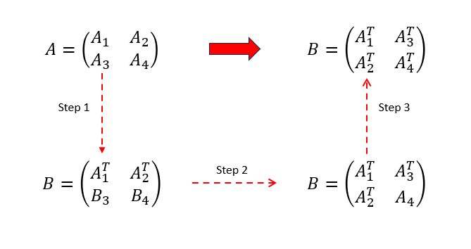

Lab 5: Cache Lab
=================

0x01. 实验介绍
------------------

本实验将帮助我们理解缓存系统对于C程序性能的影响。

本实验将分为两个部分。在Part A中，我们将要写一个200-300行的C程序，用来模拟缓存系统的工作流程。
在Part B中，我们将对一个矩阵转置函数进行优化，从而使其的缓存不命中的数目降到最低。

总之，通过此实验，我们将会加深对计算机缓存系统工作原理的理解，同时对缓存系统如何影响程序性能有更直观的认识。

0x02. 实验环境搭建
-------------------

.. code-block:: console

    $ wget http://csapp.cs.cmu.edu/3e/cachelab-handout.tar
    $ tar xvf cachelab-handout.tar

进入解压后的实验目录，对于Part A，我们只需要修改 ``csim.c`` 文件。
对于Part B，我们只需要修改 ``trans.c`` 文件。

可通过以下命令编译以上文件：

.. code-block:: console

    $ make clean
    $ make

实验目录里有一个 ``traces`` 子目录，包含着一组由 ``valgrind`` 生成的内存访问记录的文件。

.. code-block:: console

    $ valgrind --log-fd=1 --tool=lackey -v --trace-mem=yes ls -l

上述命令将会按顺序记录 ``ls -l`` 命令每次访存的信息，生成如下所示的内容：

.. code-block:: console

    I 0400d7d4,8
     M 0421c7f0,4
     L 04f6b868,8
     S 7ff0005c8,8

每行访存记录的格式为 ``[space]operation address,size`` 。
其中 ``operation`` 表明访存的类型： ``I`` 表示指令加载（instruction load）， ``L`` 表示数据加载（data load）， ``S`` 表示数据存储（data store）， ``M`` 表示数据修改（data modify），即一个数据存储后接一个数据加载。
``address`` 则表示的是访问的64位地址的十六进制数。
``size`` 访问的数据的大小。
需要注意的时，上述访存记录的格式中，除了指令加载 ``I`` 外，其它类型的开头都有一个空格。这个信息后续对我们实现缓存系统模拟器会有帮助。

0x03. 实验过程及思路说明
-----------------------------

Part A
^^^^^^^^^

实验描述及注意事项
''''''''''''''''''''

本实验中，我们将在 ``csim.c`` 里实现一个缓存模拟器，以 ``valgrind`` 生成的访存记录作为输入，模拟缓存命中或不命中的行为，最后输出总的缓存命中，缓存不命中以及缓存行驱逐的数目。

实验提供了一个名为 ``csim-ref`` 的参考版本的缓存模拟器。当出现缓存行驱逐的情况时，它采用的是LRU(Least-recently used)的策略。

``csim-ref`` 的使用如下所示：

.. code-block:: console

    Usage: ./csim-ref [-hv] -s <s> -E <E> -b <b> -t <tracefile>

* ``-h`` : helper参数，输出 ``csim-ref`` 的使用方法
* ``-v`` : verbose模式，输出每条访存的缓存行为
* ``-s <s>`` : 缓存组索引的比特数（ ``S = 2 ^ s`` 为缓存组数目）
* ``-E <E>`` : 每个缓存组中的 ``cacheline`` 数目
* ``-b <b>`` : cacheline中block的比特数（ ``B = 2 ^ b`` 为block的大小）
* ``-t <tracefile>`` : 输入的访存记录文件

我们可根据上述的描述，运行 ``csim-ref`` 来对其有个直观的感受：

.. code-block:: console

    $ ./csim-ref -s 4 -E 1 -b 4 -t traces/yi.trace
    hits:4 misses:5 evictions:3
    $ ./csim-ref -s 4 -E 1 -b 4 -t traces/yi.trace -v
    L 10,1 miss
    M 20,1 miss hit
    L 22,1 hit
    S 18,1 hit
    L 110,1 miss eviction
    L 210,1 miss eviction
    M 12,1 miss eviction hit
    hits:4 misses:5 evictions:3

上述 ``csim-ref`` 运行的结果，即是我们在 ``csim.c`` 所要实现的最终效果。

对于Part A，实验有一些前提和编程规则上的要求：

* 我们实现的缓存模拟器必须对任意的 ``s`` ， ``E`` 和 ``b`` 都适用，因此我们需用 ``malloc`` 函数来对相关数据结构的内存进行分配
* 本实验中我们只关心数据缓存的性能，所以对访存记录文件中的 ``I`` 指令访存记录不做处理
* ``main`` 函数最后必须调用函数 ``printSummary()`` 来输出缓存模拟器的命中，不命中和驱逐数目
* 实验中的访存记录中的内存地址都是对齐的，所以记录中的 ``size`` 可以在处理中被忽略

``csim`` 实现
''''''''''''''''

在实现 ``csim`` 之前，我们可在gdb中通过指令 ``disassemble main`` 来查看 ``csim-ref`` 中 ``main`` 函数中所调用的函数。
我们的 ``csim`` 缓存模拟器的设计，可从 ``csim-ref`` 中的 ``main`` 函数获取灵感。

.. code-block:: console

    $ gdb ./csim-ref
    (gdb) disassemble main
    ...
    call   0x400a90 <atoi@plt>
    ...
    call   0x401202 <printUsage>
    ...
    call   0x400a80 <getopt@plt>
    ...
    call   0x400be0 <initCache>
    ...
    call   0x40105c <replayTrace>
    ...
    call   0x400d81 <freeCache>
    ...
    call   0x401494 <printSummary>

上述已将不重要的二进制代码剔除，提取出 ``csim-ref`` 中 ``main`` 函数所调用的函数。
由此，我们可以对 ``csim-ref`` 中 ``main`` 函数做的事进行总结：

* 调用 ``getopt`` 函数对命令行参数进行解析
* 当命令行参数包含 ``-h`` 时，调用 ``printUsage`` 函数对用户进行提示
* 基于解析成功的缓存参数，调用 ``initCache`` 函数对缓存进行初始化
* 调用 ``replayTrace`` 函数，对每条valgrind的memory trace进行处理，判断其是缓存命中、不命中还是其它
* 调用 ``freeCache`` 释放创建缓存使用到的内存

实现命令行参数解析和 ``printUsage`` 函数
""""""""""""""""""""""""""""""""""""""""

首先用 ``getopt`` 函数对 ``csim`` 进行命令行参数解析。
需要对 ``Makefile`` 中的 ``CFLAGS`` 参数进行修改，将 ``-std=c99`` 替换成 ``-std=gnu99`` ，这样 ``getopt`` 函数才能从 ``unistd.h`` 中引入 ``getopt.h`` 头文件。
`stackoverflow <https://stackoverflow.com/questions/22575940/getopt-not-included-implicit-declaration-of-function-getopt>`_ 上有关于此问题的回答和介绍。

其次，我们也需要考虑 ``printUsage`` 函数的使用场景。应该包括两个场景：一是命令行中出现 ``-h`` 时，即用户显式地查询 ``csim`` 的使用规则。另一个是当用户输入的命令行参数缺失或者错误时，提示用户使用正确的参数。
我们可以定义一个结构体用来存放命令行参数解析的结果，结构体的定义如下所示：

.. code-block:: c

    typedef struct config{
        unsigned int log_set_num;
        unsigned int lines_per_set;
        unsigned int log_blk_off;
        int verbose;
        char *trace_file;
    } config_t;

在 ``main`` 函数中，我们可以通过调用 ``configInit`` 函数来完成对命令行参数的解析，再通过 ``configCheck`` 函数来检查用户输入的参数是否有效，无效时调用 ``printUsage`` 提示用户。
两个函数的具体实现如下：

.. code-block:: c

    /* parse the argument */
    int configInit(config_t *config, int argc, char *argv[])
    {
        char c = 0;
        while((c = getopt(argc, argv, "s:E:b:t:vh")) != -1)
        {
            switch(c)
            {
                case 's':
                    config->log_set_num = atoi(optarg);
                    break;
                case 'E':
                    config->lines_per_set = atoi(optarg);
                    break;
                case 'b':
                    config->log_blk_off = atoi(optarg);
                    break;
                case 't':
                    config->trace_file = optarg;
                    break;
                case 'v':
                    config->verbose = 1;
                    break;
                case 'h':
                    printUsage();
                    exit(EXIT_SUCCESS);
                default:
                    fprintf(stderr, "unknown options\n");
                    exit(EXIT_FAILURE);
            }
        }
        return 0;
    }

    /* check the mandatory arguments */
    void configCheck(config_t *config)
    {
        /* set number, lines per set, block offset and trace file */
        /* have to be assigned */
        if(config->log_set_num == 0 || 
            config->lines_per_set == 0 || 
            config->log_blk_off == 0 ||
            config->trace_file == NULL)
        {
            printf("./csim: Missing required command line argument\n");
            printUsage();
            exit(EXIT_FAILURE);
        }
    }

使用 ``malloc`` 初始化缓存
"""""""""""""""""""""""""""""

完成了命令行参数的解析后，我们需要根据解析的命令行参数初始化缓存。本质上，我们模拟的缓存是一个二维数组。第一维存放的是每个组（set）的指针，第二维则对应的是每个组的缓存行（cacheline）。
每个缓存行由有效位（valid bit）、标记位（tag bits）和缓存块（block）组成。
考虑到要根据 ``LRU`` （Least-recently used）的规则更新缓存，我们可通过比较缓存行访问的时间戳来实现。并且我们并不需要获取缓存块存储的数据，只是模拟缓存访存的行为，由此我们可将缓存行定义成如下结构体：

.. code-block:: c

    /* Cacheline structure */
    typedef struct cacheline{
        unsigned int valid_bit;
        unsigned long tag_bits;
        clock_t timestamp;
    } cacheline_t;

基于以上定义，我们可在 ``initCache`` 函数利用 ``malloc`` 分配二维数组缓存的内存：

.. code-block:: c

    /* initialize 2d cache memory */
    cacheline_t** initCache(config_t *config)
    {
        int set_num = pow(2, config->log_set_num);
        cacheline_t **cache = (cacheline_t **)malloc(sizeof(cacheline_t *) * set_num);
        for(int i = 0; i < set_num; i++)
        {
            cache[i] = (cacheline_t *)malloc(config->lines_per_set * sizeof(cacheline_t));
            /* zero the cacheline */
            memset(cache[i], 0, config->lines_per_set * sizeof(cacheline_t));
        }

        return cache;
    }

实现 ``replayTrace`` 模拟缓存行为
"""""""""""""""""""""""""""""""""""""""""

完成了命令行参数解析和缓存的创建，接下来便是此实验最为核心的部分，对valgrind生成的每条访存记录（memory trace）软件模拟访存行为。

访存最终有三种结果，缓存命中（cache hit）、缓存不命中（cache miss）和缓存行驱逐（eviction）。我们可将三种结果定义在如下结构体中：

.. code-block:: c

    typedef struct result{
        unsigned int hits;
        unsigned int misses;
        unsigned int evictions;
    } result_t;

在实现 ``replayTrace`` 函数之前，我们先用语言描述一下函数的流程：

1. 逐行读取文件中的访存记录，并对每条访存记录进行解析
2. 从访存记录的指令和地址解析得到访存指令、组索引和标记位
3. 忽略类型为 ``I`` 的指令，处理 ``L`` 、 ``S`` 和 ``M`` 指令
        3.1 遍历当前缓存组中的缓存行
            * 如果当前缓存行的有效位为1，且标记位与当前标记位一致，则缓存命中，同时更新当前缓存行的时间戳，函数返回
            * 如果当前缓存行的有效位为0，则需标记当前缓存组内有空闲缓存行，并且记录第一个空闲缓存行的索引
            * 以上不满足，查询当前缓存组的下一个缓存行
        3.2 如果解析得到的标记位与当前缓存组中的所有缓存行的标记位都不匹配
            * 如果缓存组内有空闲缓存行，则缓存不命中，更新当前缓存行的有效位、标记位和时间戳
            * 如果没有空闲缓存行，则缓存不命中并且要进行缓存行驱逐
                * 遍历组内缓存行，根据LRU找到对应缓存行的时间戳
                * 再次遍历组内缓存行，找到以上时间戳的缓存行，更新其标记位和时间戳

指令 ``L`` 和 ``S`` 的处理逻辑基本一致，指令 ``M`` 等同于指令 ``L`` 和 ``S`` 的组合。
接下来就是用代码来实现我们上述语言表述的逻辑。为了方便，我们定义了以下结构体来表示解析得到的访存记录的信息：

.. code-block:: c

    typedef struct mem_trace{
        char op;
        unsigned long addr;
        unsigned int blk_off;
    } mem_trace_t;

函数 ``replayTrace`` 的实现如下：

.. code-block:: c

    /* implement the cache simulator */
    void replayTrace(config_t *config, cacheline_t **cache, result_t *result)
    {
        mem_trace_t mem_trace = { 0 };
        mem_trace_t *ptrace = &mem_trace;

        char *line = NULL;
        size_t len = 0;
        ssize_t nread = 0;

        unsigned int ci = 0;
        unsigned int ct = 0;

        /* open the trace file */
        FILE *fp = fopen(config->trace_file, "r");
        if(!fp)
        {
            fprintf(stderr, "unable to open trace file!\n");
            exit(EXIT_FAILURE);
        }

        /* read each line and parse it */
        while((nread = getline(&line, &len, fp)) != -1)
        {
            /* skip instruction load operation */
            if(line[0] == 'I')
                continue;

            /* parse the memory trace */
            sscanf(line, " %c %lx,%u", &ptrace->op, &ptrace->addr, &ptrace->blk_off);
            /* calculate cache set index and cache tag bits */
            ci = (ptrace->addr >> config->log_blk_off) & ((1 << config->log_set_num) - 1);
            ct = ptrace->addr >> (config->log_blk_off + config->log_set_num);
            if(ptrace->op == 'L' || ptrace->op == 'S')
            {
                /* do actual work in handleOperation */
                handleOperation(config, cache, ptrace, ci, ct, result);
            }
            else
            {
                /* if op is 'M', it is load + store */
                handleOperation(config, cache, ptrace, ci, ct, result);
                handleOperation(config, cache, ptrace, ci, ct, result);
            }
        }

        free(line);
        fclose(fp);
    }

    /* cache behavior simulation */
    void handleOperation(config_t *config, cacheline_t **cache, mem_trace_t *trace, unsigned int ci, unsigned int ct, result_t *result)
    {
        int empty = 0;
        int empty_index = 0;
        for(int i = 0; i < config->lines_per_set; i++)
        {
            /* cache hit */
            if(cache[ci][i].valid_bit == 1 && cache[ci][i].tag_bits == ct)
            {
                result->hits += 1;
                /* remember to update the timestamp */
                cache[ci][i].timestamp = clock();
                if(config->verbose)
                    printf("%c %lx,%u hit\n", trace->op, trace->addr, trace->blk_off);
                return;
            }
            /* cache miss but empty cachelines are available */
            else if(cache[ci][i].valid_bit == 0)
            {
                /* if empty flag is set, no need to do it again */
                if(empty == 0)
                {
                    empty = 1;
                    empty_index = i;
                }
            }
            else
                continue;
        }

        /* cache miss */
        if(empty)
        {
            cache[ci][empty_index].valid_bit = 1;
            cache[ci][empty_index].tag_bits = ct;
            cache[ci][empty_index].timestamp = clock();
            if(config->verbose)
                printf("%c %lx,%u miss\n", trace->op, trace->addr, trace->blk_off);
            result->misses += 1;
        }
        /* cache miss and eviction */
        else
        {
            /* find the LRU cacheline */
            clock_t t0 = cache[ci][0].timestamp;
            for(int i = 0; i < config->lines_per_set; i++)
            {
                if(cache[ci][i].timestamp != 0 && t0 >= cache[ci][i].timestamp)
                    t0 = cache[ci][i].timestamp;
            }
            /* evict the victim */
            for(int i = 0; i < config->lines_per_set; i++)
            {
                if(cache[ci][i].timestamp == t0)
                {
                    /* update cacheline tag bits and timestamp */
                    cache[ci][i].tag_bits = ct;
                    cache[ci][i].timestamp = clock();
                }
            }
            if(config->verbose)
                printf("%c %lx, %u miss eviction\n", trace->op, trace->addr, trace->blk_off);
            result->misses += 1;
            result->evictions += 1;
        }
    }

释放内存
"""""""""""""""

程序的最后我们需通过 ``free`` 函数对分配的二维数组缓存的内存进行释放：

.. code-block:: c

    /* free 2d cache memory */
    void freeCache(config_t *config, cacheline_t **cache)
    {
        int set_num = pow(2, config->log_set_num);
        /* free each cachelines in the set */
        for(int i = 0; i < set_num; i++)
            free(cache[i]);
        
        /* free the cache */
        free(cache)
    }

最终的 ``main`` 函数的执行流程如下所示：

.. code-block:: c

    int main(int argc, char *argv[])
    {
        config_t config = { 0 };
        result_t result = { 0 };

        /* init configuration */
        configInit(&config, argc, argv);

        /* check mandatory arguments */
        configCheck(&config);

        /* init the cache */
        cacheline_t **cache = initCache(&config);

        /* cache simulator */
        replayTrace(&config, cache, &result);

        /* print the result */
        printSummary(result.hits, result.misses, result.evictions);

        /* free the cache */
        freeCache(&config, cache);

        return 0;
    }

程序运行结果
"""""""""""""

``make csim`` 编译自定义的缓存模拟器，运行 ``./test-csim`` 查看运行结果：

.. code-block:: console

    $ ./test-csim
                            Your simulator     Reference simulator
    Points (s,E,b)    Hits  Misses  Evicts    Hits  Misses  Evicts
        3 (1,1,1)       9       8       6       9       8       6  traces/yi2.trace
        3 (4,2,4)       4       5       2       4       5       2  traces/yi.trace
        3 (2,1,4)       2       3       1       2       3       1  traces/dave.trace
        3 (2,1,3)     167      71      67     167      71      67  traces/trans.trace
        3 (2,2,3)     201      37      29     201      37      29  traces/trans.trace
        3 (2,4,3)     212      26      10     212      26      10  traces/trans.trace
        3 (5,1,5)     231       7       0     231       7       0  traces/trans.trace
        6 (5,1,5)  265189   21775   21743  265189   21775   21743  traces/long.trace
        27

TEST_CSIM_RESULTS=27

至此，Part A部分顺利完成！

实验后续
"""""""""""""""
关于 ``LRU`` 策略的实现，时间戳的方案并不具有可移植性，因为不同系统的时间戳的实现可能会有差异，简单地比较时间戳大小存在潜在的问题。
更简单的方式是通过设置一个全局变量，每当有缓存行被访问时，全局变量自增，自增后的值再赋予给缓存行用来标记LRU的变量。
当缓存行驱逐的情况发生时，只需找到对应缓存组里LRU最小的那个缓存行，将其替换成新的缓存行数据，并将标记LRU变量的值更新即可。
代码实现的逻辑基本与时间戳相同，只是多了一个全局变量，用来更新每次缓存行的LRU值。

Part B
^^^^^^^^^

实验描述及注意事项
''''''''''''''''''''

在本实验中，我们将在 ``trans.c`` 里实现一个缓存不命中最少的矩阵转置函数。

实验会在三个不同大小的矩阵上去验证我们实现的 ``transpose_submit`` 函数的正确性和性能：

* 32 x 32 (M = 32, N = 32)
* 64 x 64 (M = 64, N = 64)
* 61 x 67 (M = 61, N = 67)

对于每一个矩阵，实验通过 ``valgrind`` 来生成转置矩阵函数访存的地址条目，然后在参数为（s = 5, E = 1, b = 5）上的缓存模拟器上运行生成的地址条目。

每个矩阵的得分与缓存不命中的数目 ``m`` 线性相关：

* 32 x 32: 如果 ``m`` 小于300得满分8分， ``m`` 大于600得0分
* 64 x 64: 如果 ``m`` 小于1300得满分8分， ``m`` 大于2000得0分
* 61 x 67: 如果 ``m`` 小于2000得满分10分， ``m`` 大于3000得0分

对于Part B，实验有一些规则需要注意：

* 禁止修改 ``transpose_submit`` 函数的描述字符串 ``Transpose submission`` ，自动评分程序会通过此字符串来给我们实现的转置函数打分
* 每个转置函数最多只可定义12个 ``int`` 类型的局部变量
* 不能通过定义 ``long`` 类型的变量来绕过上述的规则
* 如果转置函数调用子函数，对应某一时间点上栈上的所有函数的局部变量的总和也不能超过12个
* 矩阵函数不可以修改矩阵A，但是可以随意修改矩阵B
* 代码不允许使用 ``malloc`` 及任何其变种函数

``32 x 32`` 矩阵转置函数实现
'''''''''''''''''''''''''''''''''

在实现32x32矩阵函数之前，我们先了解一下可以用于优化矩阵转置函数的技巧。

书中的旁注给了关于如何使用分块（blocking）来提升循环的时间局部性的文章链接。
简单来说，分块是将应用程序的数据切成块，对应的数据块可直接加载到L1缓存中。在完成对此数据块的读写后，丢弃此数据块，重新加载新的数据块，依次类推。
文章以矩阵乘法为例，通过对矩阵B的分块，把矩阵B分块后的数据加载到L1缓存中，使得矩阵A分块的数据能够与矩阵B分块的数据进行相乘，极大地降低了缓存不命中的数目，从而提升了矩阵相乘的性能。

再来看一下给定的高速缓存的设置。对于参数为（s = 5, E = 1, b = 5）的高速缓存，对应有32个高速缓存组，且因为E为1，为直接映射高速缓存。
b为5则表明每个缓存行的数据大小为32字节，整个缓存的容量为1024字节，即1K字节。而对于32x32的整型数组而言，其大小为4K字节。
所以高速缓存每次最多只能加载32x32数组的四分之一数据，即A[0][x],A[8][x],A[16][x]和A[24][x]都位于一个高速缓存组内。
同理，数组B的缓存组位置与数组A一致，即读取A[0][0] ~ A[0][7]和B[0][0] ~ B[0][7]的值时，数据都会放在高速缓存数组set 0。

我们先查看原始版本的 ``transpose_submit`` 实现的缓存不命中数：

.. code-block:: c

    void transpose_submit(int M, int N, A[N][M], int B[M][N])
    {
        int i, j, tmp;

        for (i = 0; i < N; i++) {
            for (j = 0; j < M; j++) {
                tmp = A[i][j];
                B[j][i] = tmp;
            }
        }
    }

对应的缓存不命中数为1184次，远远大于我们能够得分的数目。

.. code-block:: console

    $ ./test-trans -M 32 -N 32
    Function 0 (2 total)
    Step 1: Validating and generating memory traces
    Step 2: Evaluating performance (s=5, E=1, b=5)
    func 0 (Transpose submission): hits:869, misses:1184, evictions:1152

根据我们所理解的分块技术，我们可以一次从A数组里读取8个元素，填满一个缓存组。然后将8个元素赋值给局部变量，再读取要写入的8个B数组元素，将局部变量的值赋值给B数组的8个元素。
这样对于每次加载A数组的8个元素，只有一次不命中（cold miss）。第一次读取B数组的8个元素，虽然都会产生缓存不命中，但后续的写入将会都是缓存命中。

举个例子来详细说明。转置函数第一次加载A[0][0] ~ A[0][7]8个元素到set 0中，产生一次缓存不命中。
读取B[0][0] ~ B[7][0]8个元素时，产生8次缓存不命中，分别位于set 0,4,8,12,16,20,24,28。
写入完成后再次读取A[1][0] ~ A[1][7]8个元素到set 4，依旧只有一次缓存不命中，但读取B[0][1]，B[1][1],..., B[7][1]时，除了B[1][1]因为与之前的A[1][x]冲突，缓存不命中需重新加载，剩下的7个元素都在高速缓存中。
由此大大地减少了缓存不命中的数目。

上述的32x32矩阵转置函数的代码实现如下所示：

.. code-block:: c

    if (M == 32 && N == 32)
    {
        for (j = 0; j < 32; j+=8)
        {
            for (i = 0; i < 32; i++)
                {
                    tmp0 = A[i][j];
                    tmp1 = A[i][j+1];
                    tmp2 = A[i][j+2];
                    tmp3 = A[i][j+3];
                    tmp4 = A[i][j+4];
                    tmp5 = A[i][j+5];
                    tmp6 = A[i][j+6];
                    tmp7 = A[i][j+7];
                    B[j][i] = tmp0;
                    B[j+1][i] = tmp1;
                    B[j+2][i] = tmp2;
                    B[j+3][i] = tmp3;
                    B[j+4][i] = tmp4;
                    B[j+5][i] = tmp5;
                    B[j+6][i] = tmp6;
                    B[j+7][i] = tmp7;
                }
            }
    }

查看上述的性能得分，只有288次缓存不命中，达到了满分的要求。

.. code-block:: console

    Part B: Testing transpose function
    Running ./test-trans -M 32 -N 32
    Running ./test-trans -M 64 -N 64
    Running ./test-trans -M 61 -N 67

    Cache Lab summary:
                            Points   Max pts      Misses
    Csim correctness           1.0        27
    Trans perf 32x32           8.0         8         288
    Trans perf 64x64           0.0         8        4724
    Trans perf 61x67           0.0        10        4424
              Total points     9.0        53

``64 x 64`` 矩阵转置函数实现
'''''''''''''''''''''''''''''''''

64x64的整型数组的大小是16K字节，所以高速缓存最多一次只能加载1/16的数据。
如下图所示，将32个缓存组标记为不同的颜色，我们可以得到64x64矩阵的元素在缓存中的分布。

.. image:: ./../_images/csapp/cachelab_64x64.png

由图可知，我们不能采用32x32矩阵的8x1的分块方法来优化64x64矩阵，因为B[j][i]与B[j+4][i]在同一个缓存组内，一次循环内会有四次缓存不命中导致的缓存行驱逐。
为了避免此现象，我们可以采用4x2的分块方法，对应一次读取矩阵A中两个缓存组中的4个元素。虽然每次浪费了缓存组里的4个矩阵A的元素，但是对应转置矩阵B中不再会出现缓存行驱逐的现象。具体的代码实现如下所示：

.. code-block:: c

    void trans_64x64(int A[64][64], int B[64][64])
    {
        int i, j;
        int tmp00, tmp01, tmp02, tmp03;
        int tmp10, tmp11, tmp12, tmp13;

        for (j = 0; j < 64; j+=4) {
            for (i = 0; i < 64; i+=2) {
                tmp00 = A[i][j];
                tmp01 = A[i][j+1];
                tmp02 = A[i][j+2];
                tmp03 = A[i][j+3];
                tmp10 = A[i+1][j];
                tmp11 = A[i+1][j+1];
                tmp12 = A[i+1][j+2];
                tmp13 = A[i+1][j+3];
                B[j][i] = tmp00;
                B[j+1][i] = tmp01;
                B[j+2][i] = tmp02;
                B[j+3][i] = tmp03;
                B[j][i+1] = tmp10;
                B[j+1][i+1] = tmp11;
                B[j+2][i+1] = tmp12;
                B[j+3][i+1] = tmp13;
            }
        }
    }

重新编译实验，运行评分程序，发现上述转置函数实现的缓存不命中降到了1636，但还没有达到满分。

.. code-block:: console

    Cache Lab summary:
                            Points   Max pts      Misses
    Csim correctness          27.0        27
    Trans perf 32x32           8.0         8         288
    Trans perf 64x64           4.2         8        1636
    Trans perf 61x67           0.0        10        4424

能不能进一步优化？到这里我已经黔驴技穷了。参照了网上的资料，很多人提到利用矩阵转置的特性，将64x64矩阵进行8x8分块，每个8x8分块再分成4个4x4处理。
因为题目只要求不修改矩阵A内容，矩阵B我们可以随意修改。这里我们可以利用矩阵转置的特性，将64x64矩阵的转置函数的不命中数进一步降低。

下图可以更加清晰地解释上述地思路。对应的分块A就是一个8x8分块，分块中对应的是4x4小分块。分块B就是分块A最终的转置的效果。

按照图中的步骤，具体的实现是：

* 读取分块A左上角和右上角分块，转置后存入分块B
  * 一次读取分块A一行数据，保存到8个临时变量，其中4个临时变量写入分块B左上角对应列，剩余4个临时变量写入分块B右上角对应列
* 读取分块A左下角和分块B右上角，交换两个4x4分块
  * 读取分块B右上角一列存入4个临时变量，读取A左下角一列存入4个临时变量，前面的临时变量写入分块B左下角一行，后面的临时变量写入分块右上角的一列
* 读取分块A右下角，转置后写入分块B右下角

按照上述的步骤，代码的具体试下如下：

.. code-block:: c

    void trans_64x64_v1(int A[64][64], int B[64][64])
    {
        int i, j, k;
        int t0, t1, t2, t3;
        int t4, t5, t6, t7;

        for (i = 0; i < 64; i += 8) {
            for (j = 0; j < 64; j += 8) {
                // Step 1. deal with A top left and B top right
                for (k = i; k < i + 4; k++) {
                    t0 = A[k][j];
                    t1 = A[k][j+1];
                    t2 = A[k][j+2];
                    t3 = A[k][j+3];
                    t4 = A[k][j+4];
                    t5 = A[k][j+5];
                    t6 = A[k][j+6];
                    t7 = A[k][j+7];
                    B[j][k] = t0;
                    B[j+1][k] = t1;
                    B[j+2][k] = t2;
                    B[j+3][k] = t3;
                    B[j][k+4] = t4;
                    B[j+1][k+4] = t5;
                    B[j+2][k+4] = t6;
                    B[j+3][k+4] = t7;
                }
                // Step 2. exchange value between B top right and bottom left
                for (k = j; k < j + 4; k++) {
                    // read one row from B top right
                    t0 = B[k][i+4];
                    t1 = B[k][i+5];
                    t2 = B[k][i+6];
                    t3 = B[k][i+7];
                    // read one column from A bottom left
                    t4 = A[i+4][k];
                    t5 = A[i+5][k];
                    t6 = A[i+6][k];
                    t7 = A[i+7][k];
                    // write to B top right
                    B[k][i+4] = t4;
                    B[k][i+5] = t5;
                    B[k][i+6] = t6;
                    B[k][i+7] = t7;
                    // write to B bottom left
                    B[k+4][i] = t0;
                    B[k+4][i+1] = t1;
                    B[k+4][i+2] = t2;
                    B[k+4][i+3] = t3;
                }
                // Step 3. deal with B bottom right
                for (k = i + 4; k < i + 8; k++) {
                    t0 = A[k][j+4];
                    t1 = A[k][j+5];
                    t2 = A[k][j+6];
                    t3 = A[k][j+7];
                    B[j+4][k] = t0;
                    B[j+5][k] = t1;
                    B[j+6][k] = t2;
                    B[j+7][k] = t3;
                }
            }
        }
    }

重新编译实验，运行评分程序，发现上述64x64转置函数实现达到满分要求。

.. code-block:: console

    Cache Lab summary:
                            Points   Max pts      Misses
    Csim correctness          27.0        27
    Trans perf 32x32           8.0         8         288
    Trans perf 64x64           8.0         8        1228
    Trans perf 61x67           0.0        10        4424

``67 x 61`` 矩阵转置函数实现
'''''''''''''''''''''''''''''''''

此时的矩阵不再是规整的2的次幂。对应元素在缓存内的分布也不再像32x32矩阵或者是64x64矩阵那样规律。
但我们依旧可以采用分块的方法去处理对应矩阵56x56的部分，从而降低缓存不命中的数目。剩下无法进行分块的部分，再做额外的处理。

具体的代码实现如下所示：

.. code-block:: c

    void trans_67x61(int A[67][61], int B[61][67])
    {
        int i, j;
        int t0, t1, t2, t3, t4, t5, t6, t7;

        // 8x1 blocking
        for (j = 0; j < 56; j+=8) {
            for (i = 0; i < 56; i++) {
                t0 = A[i][j];
                t1 = A[i][j+1];
                t2 = A[i][j+2];
                t3 = A[i][j+3];
                t4 = A[i][j+4];
                t5 = A[i][j+5];
                t6 = A[i][j+6];
                t7 = A[i][j+7];

                B[j][i] = t0;
                B[j+1][i] = t1;
                B[j+2][i] = t2;
                B[j+3][i] = t3;
                B[j+4][i] = t4;
                B[j+5][i] = t5;
                B[j+6][i] = t6;
                B[j+7][i] = t7;
            }
        }

        // deal with the left A top right part
        for (j = 56; j < 61; j++) {
            for (i = 0; i < 56; i++) {
                B[j][i] = A[i][j];
            }
        }

        // deal with the left A bottom left part
        for (j = 0; j < 56; j++) {
            for (i = 56; i < 67; i++) {
                B[j][i] = A[i][j];
            }
        }

        // deal with the left A bottom right part
        for (j = 56; j < 61; j++) {
            for (i = 56; i < 67; i++) {
                B[j][i] = A[i][j];
            }
        }
    }

重新编译实验，运行评分程序，上述67x61转置函数实现达到满分要求。

.. code-block:: console

    Cache Lab summary:
                            Points   Max pts      Misses
    Csim correctness          27.0        27
    Trans perf 32x32           8.0         8         288
    Trans perf 64x64           8.0         8        1228
    Trans perf 61x67          10.0        10        1963

至此，Part B部分顺利完成！

0x04. 总结和评价
----------------

这个实验的完成的时间跨度还是蛮大的。Part A部分是在23年11月份准备雅思时完成的。
当时的感觉是第一次没有参考网上代码的情况下完成，还是很开心的。
Part B部分，尤其是64x64矩阵部分的优化思路确实比较困难，参考了网上的实现后自己也能摸索着写出来。
但是也看到有人从理论角度去解释每个矩阵可以实现的最低缓存不命中数目，感受到自己还有不少的差距。