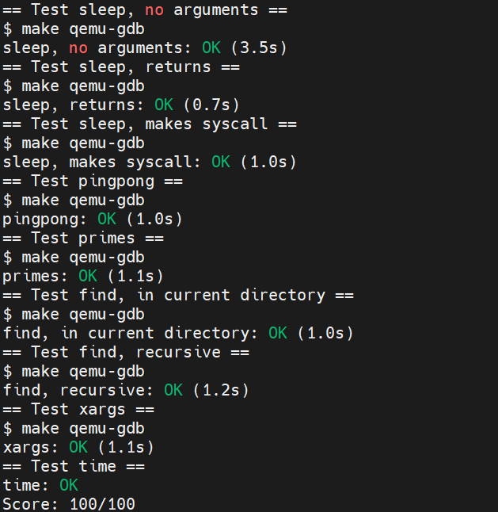

Lab 1: Xv6 and Unix Utilities
=============================

1. 实验介绍
------------

在这个实验中，我们会写5个xv6的用户态的小工具程序。在这个过程中，可以学习到如何运行使用xv6，并对xv6的系统调用的用法有初步的了解。

2. 实验代码实现
----------------

sleep
^^^^^

实现xv6版本的UNIX程序 ``sleep`` 。

**代码实现：**

.. code-block:: c

    #include "kernel/types.h"
    #include "kernel/stat.h"
    #include "user/user.h"

    int
    main(int argc, char *argv[])
    {
        if(argc != 2)
        {
            fprintf(2, "Usage: sleep [n_ticks]...\n");
            exit(1);
        }

        if(sleep(atoi(argv[1])) < 0)
        {
            fprintf(2, "Running sleep fails!\n");
            exit(1);
        }
        exit(0);
    }

``sleep`` 实现主要帮助我们熟悉xv6的系统调用流程，实现起来较为简单。

pingpong
^^^^^^^^

通过UNIX系统调用实现两个进程间通过管道相互传送一个字节。

**代码实现：**

.. code-block:: c

    #include "kernel/types.h"
    #include "kernel/stat.h"
    #include "user/user.h"

    int
    main(int argc, char *argv[])
    {
        // create a pair of pipes
        int p[2];
        pipe(p);

        // some random character
        char c = 'a';

        // child process
        if(fork() == 0)
        {
            read(p[0], &c, sizeof(c));
            printf("%d: received ping\n", getpid());
            write(p[1], &c, sizeof(c));
            close(p[0]);
            close(p[1]);
            exit(0);
        }
        else // parent process
        {
            write(p[1], &c, sizeof(c));
            wait(0);
            read(p[0], &c, sizeof(c));
            printf("%d: received pong\n", getpid());
            close(p[0]);
            close(p[1]);
        }
        exit(0);
    }

``pingpong`` 主要我们熟悉 ``xv6`` 中 ``pipe/fork/read/write`` 等系统调用的使用，以及进程间如何通过管道进行通信，实现较为容易。

primes
^^^^^^

通过管道实现一个并发版本的素数筛。

**错误的代码实现：**

.. code-block:: c

    #include "kernel/types.h"
    #include "kernel/stat.h"
    #include "user/user.h"

    int
    pipeline(int fd_read, int num)
    {
        int pd[2];
        pipe(pd);
        int i;

        // child process write to new pipe
        if(fork() == 0)
        {
            while(read(fd_read, &i, sizeof(i)))
            {
                if(i % num != 0)
                    write(pd[1], &i, sizeof(i));
            }
            close(pd[0]);
            close(pd[1]);
            exit(0);
        }
        // parent process waits for child
        wait((int *)0);
        close(pd[1]);
        return pd[0];
    }

    int
    main(int argc, char *argv[])
    {
        int p[2];
        pipe(p);
        int prime;
        int fd_read = p[0];

        // main process feeds number 2-35
        for(int i = 2; i <= 35; i++)
            write(p[1], &i, sizeof(i));
        
        close(p[1]);

        while(read(fd_read, &prime, sizeof(prime)))
        {
            printf("prime %d\n", prime);
            fd_read = pipeline(fd_read, prime);
        }

        exit(0);
    }

这里的 **错误** 的含义不是说代码运行的结果不符合预期，而是指实现的方式并非是并发的方式。并发的方式是指进程读取左邻进程的管道，然后写入右邻进程的管道，两者之间是并发进行的。
而上述的实现是筛选完左邻进程管道的数后，再由右邻，也就是新进程读取管道的值，不符合[0]中伪代码及图所描述的情况。
在参考[1]中第2页的代码实现后，完成以下并发代码的实现。

**正确的代码实现：**

.. code-block:: c

    #include "kernel/types.h"
    #include "kernel/stat.h"
    #include "user/user.h"

    void
    pipeline(int *p)
    {
        int pchild[2];
        int prime;

        close(p[1]);      // close parent pipe write fd

        // if process reads no more data from pipe, just exits
        if(read(p[0], &prime, sizeof(prime)) == 0)
            exit(0);

        pipe(pchild);
        if(fork()) // main process filters the primes
        {
            int n;
            printf("prime %d\n", prime);
            while(read(p[0], &n, sizeof(n)))
            {
                if(n % prime != 0)
                    write(pchild[1], &n, sizeof(n));
            }
            close(p[0]);      // close parent pipe read fd
            close(pchild[1]); // close child pipe write fd
            close(pchild[0]); // close child pipe read fd
            wait((int *)0);
            exit(0);
        }
        else // spawn child process to read from filtered prime numbers
        {
            pipeline(pchild);
        }
    }

    int
    main(int argc, char *argv[])
    {
        int p[2];
        pipe(p);

        // main process feeds number 2-35
        if(fork())
        {
            for(int i = 2; i <= 35; i++)
            {
                write(p[1], &i, sizeof(int));
            }
            close(p[0]);
            close(p[1]);
            wait((int *)0);
        }
        else // child process starts the pipeline
        {
            pipeline(p);
        }

        exit(0);
    }

**正确** 的实现逻辑是在流水线里每次 ``fork`` 一个子进程，父进程将筛选后的数写入管道，等待子进程结束。子进程读取管道，再 ``fork`` 自己的子进程，重复其过程。
这种方式就不必等待父进程筛选结束后再执行下一流程，从而实现了真正的并发。
另外，在实现过程中，一定要注意及时关闭不再使用的文件描述符。如在 ``pipeline`` 函数 ``fork`` 子进程前，关闭父进程的管道读文件描述符。否则在 ``fork`` 执行后的父进程中再去关闭，就会有文件描述符不够引发错误的风险。

``primes`` 的实现难度在于理解材料中的并发模型，并且在实现中要考虑到诸多细节（文件描述符及时关闭）。

find
^^^^

实现一个简易版本的UNIX ``find`` 程序。

**代码实现：**

.. code-block:: c

    #include "kernel/types.h"
    #include "kernel/stat.h"
    #include "user/user.h"
    #include "kernel/fs.h"

    void
    find(char *dirname, char *filename)
    {
        char buf[512], *p;
        int fd;
        struct dirent de;
        struct stat st;

    if((fd = open(dirname, 0)) < 0){
        fprintf(2, "find: cannot open %s\n", dirname);
        return;
    }

    if(fstat(fd, &st) < 0){
        fprintf(2, "ls: cannot stat %s\n", dirname);
        close(fd);
        return;
    }

    switch(st.type){
        case T_DEVICE:
        case T_FILE:
            break;

        case T_DIR:
            strcpy(buf, dirname);
            p = buf+strlen(buf);
            *p++ = '/';
            while(read(fd, &de, sizeof(de)) == sizeof(de)){
                if(de.inum == 0)
                    continue;
            // ignore "." and ".."
            if(!strcmp(de.name, "."))
                continue;
            if(!strcmp(de.name, ".."))
                continue;

            memmove(p, de.name, DIRSIZ);
            p[DIRSIZ] = 0;

            if(stat(buf, &st) < 0){
                printf("find: cannot stat %s\n", buf);
                continue;
            }
            if(st.type != T_DIR){
                if(!strcmp(de.name, filename)) // compare name strings
                    printf("%s\n", buf);
                }else{
                    find(buf, filename); // recursively find files in sub-directory
                }
            }
            break;
    }
  close(fd);
    }
    int
    main(int argc, char *argv[])
    {
        char *dirname;
        char *filename;

        // check CLI paramenters
        if(argc != 3){
            fprintf(2, "usage: find [directory] [file]\n");
            exit(1);
        }

        dirname = argv[1];
        filename = argv[2];

        // call find to find wanted file
        find(dirname, filename);

        exit(0);
    }

``find`` 需在理解 ``ls`` 如何读取目录文件的基础上，添加递归代码实现子目录内容的读写。

xargs
^^^^^

实现一个简易版本的UNIX ``xargs`` 程序，但对于从标准输入读入的内容，``xargs`` 会单独执行每行内容。

**代码实现：**

.. code-block:: c

    #include "kernel/types.h"
    #include "kernel/stat.h"
    #include "kernel/param.h"
    #include "user/user.h"

    int
    my_readline(int fd, char *buf)
    {
        char ch;
        int count = 0;
        while(read(fd, &ch, sizeof(ch)))
        {
            if(ch == '\n')
                break;
            buf[count++] = ch;
        }
        buf[count] = '\0';
        return count;
    }

    int
    main(int argc, char *argv[])
    {
        char *cmd;
        char *my_argv[MAXARG];
        char buf[512];

        if(argc < 2)
        {
            fprintf(2, "Usage: xargs needs one more parameter\n");
            exit(1);
        }

        // parse argument follow by xargs
        cmd = argv[1];
        for(int i = 1; i < argc; i++)
            my_argv[i-1] = argv[i];
        
        // read from stdin and add result to argv list
        while(my_readline(0, buf))
        {
            my_argv[argc-1] = buf;
            if(fork() == 0)
                exec(cmd, my_argv);
            else
                wait((int *)0);
            // remember to zero buf
            memset(buf, 0, sizeof(buf));
        }
        exit(0);
    }

``xargs`` 的难点在于如何处理 ``stdin`` 的每行数据（即如何用 ``read`` 实现一个简单的 ``readline`` 函数），针对每行数据使用 ``fork`` + ``exec`` 处理。
另外要注意的是 ``xv6`` 中的 ``exec`` 参数的使用，第二个参数的 ``char *argv[]`` 应包含命令本身，即代码中的 ``for`` 循环中 ``i`` 是从1开始，而不是2。

实验最终结果
^^^^^^^^^^^^^

实验最后还需要添加 ``time.txt`` 文件记录实验所花费的时间。敲入 ``make grade`` 命令，可看到实验得分满分。

3. 实验总结
-----------

虽然在5月份的封锁在家的时候lab1和lab2完成了，但重新做了一遍lab1的内容才发现很多概念当时理解的并不正确，尤其是实现 ``primes`` 过程中对并发的理解。
实验大概断断续续花了一周的时间，估计有15h左右。除 ``primes`` 外，其余皆是独立完成，比当时写不出来就去找代码还是有些进步的。

4. 参考链接
-----------

[0]. https://swtch.com/~rsc/thread/

[1]. https://www.cs.dartmouth.edu/~doug/sieve/sieve.pdf