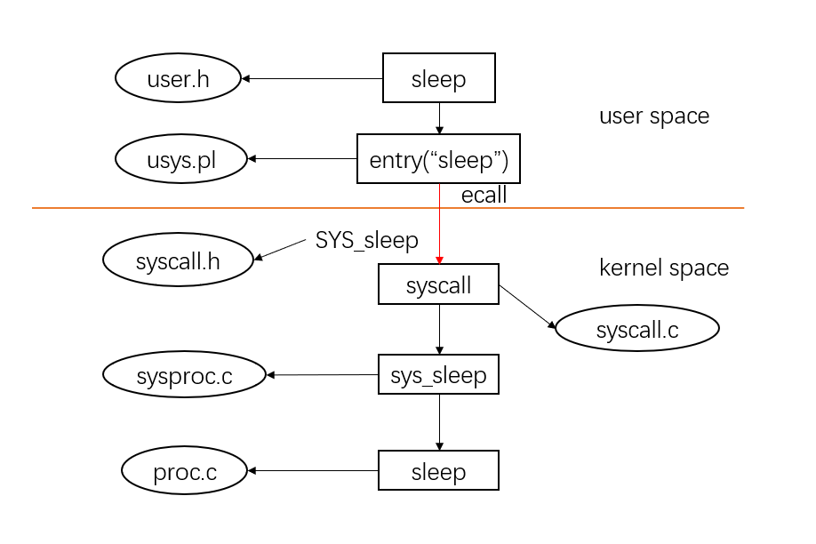

Lab 2: system calls
===================

1. 实验介绍
-----------

在上一个实验中，我们通过系统调用实现用户态的程序。本实验中，我们将在xv6中添加新的系统调用。
在这个过程中，我们可以加深对系统调用的理解，同时开始接触xv6内核代码的实现。

2. 代码实现及思路
----------------

system call tracing
^^^^^^^^^^^^^^^^^^^

本实验实现 ``trace`` 系统调用，打印出如下所示的进程所使用的系统调用的信息。

.. code-block:: console

    $ trace 32 grep hello README
    3: syscall read -> 1023
    3: syscall read -> 966
    3: syscall read -> 70
    3: syscall read -> 0
    $
    $ trace 2147483647 grep hello README
    4: syscall trace -> 0
    4: syscall exec -> 3
    4: syscall open -> 3
    4: syscall read -> 1023
    4: syscall read -> 966
    4: syscall read -> 70
    4: syscall read -> 0
    4: syscall close -> 0
    $
    $ grep hello README
    $
    $ trace 2 usertests forkforkfork
    usertests starting
    test forkforkfork: 407: syscall fork -> 408
    408: syscall fork -> 409
    409: syscall fork -> 410
    410: syscall fork -> 411
    409: syscall fork -> 412
    410: syscall fork -> 413
    409: syscall fork -> 414
    411: syscall fork -> 415
    ...
    $

xv6提供了用户态的 ``trace`` 程序（位于 ``user/trace.c`` ），如下所示。

.. code-block:: c

    #include "kernel/param.h"
    #include "kernel/types.h"
    #include "kernel/stat.h"
    #include "user/user.h"

    int
    main(int argc, char *argv[])
    {
        int i;
        char *nargv[MAXARG];

        if(argc < 3 || (argv[1][0] < '0' || argv[1][0] > '9')){
            fprintf(2, "Usage: %s mask command\n", argv[0]);
            exit(1);
        }

        if (trace(atoi(argv[1])) < 0) {
            fprintf(2, "%s: trace failed\n", argv[0]);
            exit(1);
        }
  
        for(i = 2; i < argc && i < MAXARG; i++){
            nargv[i-2] = argv[i];
        }
        exec(nargv[0], nargv);
        exit(0);
    }

可以看到， ``trace.c`` 里调用了 ``trace`` 函数，我们所要做的就是实现 ``trace`` 函数的系统调用，以及用户态程序和系统调用的交互。
回顾lab1中 ``sleep`` 函数从用户态到内核态的调用过程，总结如下图所示。

用户态的 ``sleep`` 函数在 ``user/user.h`` 中声明，其定义是 ``user/usys.pl`` perl脚本生成的 ``user/usys.S`` 里的汇编代码，如下所示。

.. code-block:: asm

    sleep:
        li a7, SYS_sleep
        ecall
        ret

通过 ``li a7, SYS_sleep`` 将系统调用号传入寄存器中，再调用 ``ecall`` 指令，程序转入内核态执行。
内核态的 ``syscall`` 函数定义在 ``kernel/syscall.c`` 中，是一个函数指针数组，数组的索引对应的是系统调用号，索引对应的值即为内核的系统调用函数。
可以看到，对应 ``SYS_sleep`` 定义在 ``kernel/syscall.h`` 中，值为13，其系统调用函数为 ``sys_sleep``， 具体实现如下所示。

.. code-block:: c
    
    uint64
    sys_sleep(void)
    {
        int n;
        uint ticks0;

        if(argint(0, &n) < 0)
            return -1;
        acquire(&tickslock);
        ticks0 = ticks;
        while(ticks - ticks0 < n){
            if(myproc()->killed){
                release(&tickslock);
                return -1;
            }
            sleep(&ticks, &tickslock);
        }
        release(&tickslock);
    return 0;
    }

``sys_sleep`` 最后调用定义在 ``kernel/proc.c`` 里的 ``sleep`` 函数，完成对应的功能。
理清楚了 ``sleep`` 的系统调用的流程，我们就不难实现 ``trace`` 系统调用。

首先，在用户态添加 ``trace`` 的声明和定义。
在 ``user/user.h`` 里添加 ``int trace(int);`` 。
在 ``user/usys.pl`` 里添加 ``entry("trace");`` 。

然后，在内核态 ``kernel/syscall.h`` 里添加 ``trace`` 的系统调用号 ``#define SYS_trace 22`` 。
在 ``kernel/sysproc.c`` 里完成函数 ``sys_trace`` 的实现。
``sys_trace`` 的实现需要在进程结构体 ``struct proc`` 添加一个新的成员变量 ``trace`` 用作系统调用号的掩码，同时在 ``fork`` 中要将父进程的trace信息复制给子进程 ``np->trace = p ->trace;`` 。
对应的 ``sys_trace`` 的实现如下所示。

.. code-block:: c
    uint64
    sys_trace(void)
    {
        int num;
        if(argint(0, &num) < 0)
            return -1;
        myproc()->trace = num;
        return 0;
    }

最后，实现一个系统调用名字符串数组 ``static char* syscall_names[]`` ，同时在 ``syscall`` 执行中加入进程的 ``trace`` 是否置位的判断。
最后的最后，需要在进程销毁函数 ``freeproc`` 中把销毁的进程的trace掩码置为0。

代码的具体实现可参考此 `链接 <https://github.com/Snowball-Wang/MIT_6S081_Operating_System_Engineering/commit/b8c37f4a4eadba73e1861d943f7c629799190770>`_ 。

sysinfo
^^^^^^^

本实验实现 ``sysinfo`` 系统调用， ``sysinfo`` 将会把空闲内存的信息和当前不是 ``UNUSED`` 状态的进程数记录在结构体 ``struct sysinfo`` 中。

``sysinfo`` 的实现同 ``trace`` 系统调用的实现步骤基本一致，包括添加用户态的声明和定义、内核态的系统调用号和 ``sys_sysinfo`` 的实现。
不同之处在于我们需要分别实现空余内存的计算以及非 ``UNUSED`` 状态进程数量的统计。
先看如何实现空余内存的计算。 在 ``kernel/kalloc.c`` 中， 定义了一个全局变量 ``kmem`` 用链表数据结构记录空余内存。
``kfree`` 函数释放的 ``PGSIZE`` 大小的内存被添加到链表的头部，然后将链表的头指针指向新添加的节点。
由此，我们只需遍历 ``kmem`` 中空余内存的链表，即可获得系统剩余的内存大小。

.. code-block:: c
    
    // count free memory
    uint64
    kcount_mem(void)
    {
        struct run *r;
        uint64 total_bytes = 0;

        r = kmem.freelist;
        while(r){
            total_bytes += PGSIZE;
            r = r->next;
        }

        return total_bytes;
    }

再看如何统计系统中非 ``UNUSED`` 状态的进程数量。在 ``kernel/proc.c`` 中定义了一个全局变量 ``struct proc proc[NPROC]`` 。
``NPROC`` 是定义在 ``kernel/param.h`` 的宏，值为64，说明xv6系统最大只支持64个进程。
那统计非 ``UNUSED`` 状态的进程数，只需要遍历这64个进程，筛除 ``UNUSED`` 状态的进程即可。

.. code-block:: c

    // count numbers of process whose
    // state is not UNUSED
    int
    count_proc(void)
    {
        struct proc *p;
        int count = 0;

        for(p = proc; p < &proc[NPROC]; p++){
            if(p->state != UNUSED)
                count++;
        }
        return count;
    }

完成了以上两个函数的实现，我们再参照 ``sys_fstat()`` 和 ``filestat()`` 的代码实现 ``sys_sysinfo`` 。

.. code-block:: c

    uint64
    sys_sysinfo(void)
    {
        uint64 sinfo_addr; // user pointer to struct sysinfo
        struct sysinfo sinfo;
        struct proc *p = myproc();

        // the first argument for argaddr is the index
        // for the first parameter passed to syscall
        if(argaddr(0, &sinfo_addr) < 0)
            return -1;

        // write system info to struct sysinfo
        sinfo.freemem = kcount_mem();
        sinfo.nproc = count_proc();

        // copy from kernel to user space
        if(copyout(p->pagetable, sinfo_addr, (char *)&sinfo, sizeof(sinfo)) < 0)
            return -1;
        
        return 0;
    }

详细的代码实现可参照 `链接 <https://github.com/Snowball-Wang/MIT_6S081_Operating_System_Engineering/commit/8be566725b95fdd99fe3ae8d10155eda4dbc1a16>`_ 。

实验最终结果
^^^^^^^^^^^

实验最后还需要添加 ``time.txt`` 文件记录实验所花费的时间。敲入 ``make grade`` 命令，可看到实验得分满分。

1. 实验总结
-----------

本次实验的难度一般，但在实现过程中还是有一些细节需要注意。

比如说在 ``trace`` 系统调用的实现中，一定要在进程销毁函数 ``freeproc`` 中将销毁的进程的trace掩码置为0。
否则在xv6的shell中使用过 ``trace`` 后，再敲入 ``grep hello README`` 依然可能会跟踪系统调用，打印出相应的信息。

再比如说在 ``sysinfo`` 系统调用的实现中，因为是直接拷贝 ``sys_fstat`` 的实现，对应调用 ``argaddr()`` 函数的第一个参数错误地设置为了1，实际情况应该为0，导致 ``sysinfotest`` 可以运行，但总是失败。
在 ``debug`` 模式下调试了很久也没有找出问题所在。最后才在对比其它系统调用的实现后找出了问题所在。

所以在xv6的实验过程，对于每个使用的函数，都要明确其传入参数、返回值的具体含义，不当的使用很有可能造成程序难以调试的错误。
