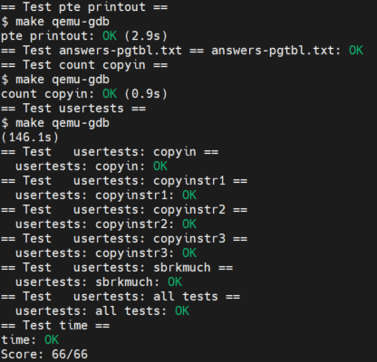

Lab 3: page tables
===================

1. 实验介绍
-----------

在上一个实验中，我们通过实现 ``trace`` 和 ``sysinfo`` 两个系统调用，从代码角度加深了对xv6系统调用的理解。
在这个实验中，我们将探索xv6页表的实现，以及基于我们对xv6页表的修改，简化我们从用户态拷贝数据到内核态的相关函数。

2. 代码实现及思路
----------------

Print a page table
^^^^^^^^^^^^^^^^^^^

本实验实现 ``vmprint`` 函数，用来打印第一个进程的页表。
实验最终的效果是，启动xv6时有如下输出：

.. code-block:: console

    page table 0x0000000087f6e000
    ..0: pte 0x0000000021fda801 pa 0x0000000087f6a000
    .. ..0: pte 0x0000000021fda401 pa 0x0000000087f69000
    .. .. ..0: pte 0x0000000021fdac1f pa 0x0000000087f6b000
    .. .. ..1: pte 0x0000000021fda00f pa 0x0000000087f68000
    .. .. ..2: pte 0x0000000021fd9c1f pa 0x0000000087f67000
    ..255: pte 0x0000000021fdb401 pa 0x0000000087f6d000
    .. ..511: pte 0x0000000021fdb001 pa 0x0000000087f6c000
    .. .. ..510: pte 0x0000000021fdd807 pa 0x0000000087f76000
    .. .. ..511: pte 0x0000000020001c0b pa 0x0000000080007000

可以看到第一行打印的是根页表所在的物理地址，即写入到 ``satp`` 寄存器的值。
接下来的每一行首先根据页表的层级，或者说页表的深度来决定 ``..`` 的打印个数。
然后打印每行的PTE的索引，对应的值，以及其对应下一层级页表的物理地址。

首先根据题目提示在 ``kernel/exec.c`` 的 ``return argc`` 前添加 ``vmprint`` 的调用代码。

.. code-block:: c

    p->trapframe->sp = sp; // initial stack pointer
    proc_freepagetable(oldpagetable, oldsz);

    if(p->pid == 1)
        vmprint(p->pagetable);

    return argc; // this ends up in a0, the first argument to main(argc, argv)

然后在 ``kernel/defs.h`` 里添加 ``vmprint`` 函数的声明，再在 ``kernel/vm.c`` 里先写好 ``vmprint`` 函数的定义框架。

根据题目提示，我们先看一下 ``freewalk`` 的实现。

.. code-block:: c

    // Recursively free page-table pages.
    // All leaf mappings must already have been removed.
    void freewalk(pagetable_t pagetable)
    {
        // there are 2^9 = 512 PTEs in a page table.
        for(int i = 0; i < 512; i++){
            pte_t pte = pagetable[i];
            if((pte & PTE_V) && (pte & (PTE_R|PTE_W|PTE_X)) == 0){
                // this PTE points to a lower-level page table.
                uint64 child = PTE2PA(pte);
                freewalk((pagetable_t)child);
                pagetable[i] = 0;
            } else if(pte & PTE_V){
                panic("freewalk: leaf");
            }
        }
        kfree((void *)pagetable);
    }

``freewalk`` 用递归的方式，遍历每个层级页表的每条PTE。每层页表一共有512个PTE。
对于根页表和中间页表来说，如果PTE中只有 ``PTE_V`` 位被置位，则提取PTE里的物理地址，递归进入下一级页表。
需要注意的是，在调用 ``freewalk`` 函数之前，需要确保第三层级页表的映射关系已经被删除，也就是对应的第三层级页表中的PTE都为0。
否则如果第三层级页表中PTE的 ``PTE_V`` 依旧有效，则证明 ``freewalk`` 的先决条件没有满足，系统直接 ``panic`` 。
``freewalk`` 递归调用，第三层级的页表最先被 ``kfree`` 释放物理内存。然后返回到中间页表，将其PTE置为0，最后通过 ``kree`` 释放页表映射的物理内存。
根页表以此类推。

仿照 ``freewalk`` 函数， 我们也通过递归的方法实现 ``vmprint`` 。
不过考虑到需根据页表层级打印内容，我们可将 ``vmprint`` 看作一层封装，调用 ``vmprint_lv`` 函数。
``vmprint_lv`` 除 ``pagetable`` 参数外，还有页表层级 ``level`` 来确定打印 ``..`` 的个数。
其代码实现如下：

.. code-block:: c

    // print a page table
    void vmprint(pagetable_t pagetable)
    {
        int level = 0;
        printf("page table %p\n", pagetable);
        vmprint_lv(pagetable, level);
    }

    // print pte based on level
    void vmprint_lv(pagetable_t pagetable, int level)
    {
        int lv = level + 1;
        for(int i = 0; i < 512; i++){
            pte_t pte = pagetable[i];
            if((pte & PTE_V) && (pte & (PTE_R|PTE_W|PTE_X)) == 0){
                // this pte points to a lower-level page table
                // print ".." based on the level of page table
                if(lv == 1)
                    printf("..");
                else
                    printf(".. ..");
                printf("%d: pte %p pa %p\n", i, pte, PTE2PA(pte));
                uint64 child = PTE2PA(pte);
                vmprint_lv((pagetable_t)child, lv);
            }else if(pte & PTE_V){
                printf(".. .. ..");
                printf("%d: pte %p pa %p\n", i, pte, PTE2PA(pte));
            }
        } 
    }

敲入命令 ``./grade-lab-pgtbl pte printout`` ，可以看到本部分实验已通过。

代码的具体实现可参考此 `链接 <https://github.com/Snowball-Wang/MIT_6S081_Operating_System_Engineering/commit/d6a8570b5b8937a9c781bb81cd6493c01556b202>`_ 。

A kernel page table per process
^^^^^^^^^^^^^^^^^^^^^^^^^^^^^^^^

xv6有一个全局的内核页表 ``kernel_pagetable`` ，此内核页表被所有进程共享。
本实验即实现每个进程独有的内核页表，并通过 ``usertests`` 中的所有的测试用例。

根据题目第一条提示，首先在 ``kernel/proc.h`` 中对进程结构体 ``struct proc`` 添加内核页表的成员变量。

.. code-block:: c
    // Per-process state
    struct proc {
        struct spinlock lock;

        // ... other variables
        pagetable_t pagetable;  // User page table
        pagetable_t kpagetable; // Process's kernel page table
        // ... other variables
    }

根据题目第二条提示，模仿函数 ``kvminit`` ，实现进程内核页表初始化函数 ``ukvminit`` 。
因为 ``kvminit`` 中调用函数 ``kvmmap`` ， 其调用函数 ``mappages`` 默认传入的参数是全局的 ``kernel_pagetable`` 。
所以我们再参照 ``kvmmap`` ， 实现函数 ``ukvmmap`` 供 ``ukvminit`` 函数调用。

.. code-block:: c

    /*
    * create a kernel page table for the newly created process.
    */
    pagetable_t ukvminit(void)
    {
        pagetable_t pagetable = (pagetable_t) kalloc();
        memset(pagetable, 0, PGSIZE);

        // uart registers
        ukvmmap(pagetable, UART0, UART0, PGSIZE, PTE_R | PTE_W);

        // virtio mmio disk interface
        ukvmmap(pagetable, VIRTIO0, VIRTIO0, PGSIZE, PTE_R | PTE_W);

        // CLINT
        ukvmmap(pagetable, CLINT, CLINT, 0x10000, PTE_R | PTE_W);

        // PLIC
        ukvmmap(pagetable, PLIC, PLIC, 0x400000, PTE_R | PTE_W);

        // map kernel text executable and read-only.
        ukvmmap(pagetable, KERNBASE, KERNBASE, (uint64)etext-KERNBASE, PTE_R | PTE_X);

        // map kernel data and the physical RAM we'll make use of.
        ukvmmap(pagetable, (uint64)etext, (uint64)etext, PHYSTOP-(uint64)etext, PTE_R | PTE_W);

        // map the trampoline for trap entry/exit to
        // the highest virtual address in the kernel.
        ukvmmap(pagetable, TRAMPOLINE, (uint64)trampoline, PGSIZE, PTE_R | PTE_X);

        return pagetable;
    }

    // add a mapping to process's kernel page table.
    void ukvmmap(pagetable_t pagetable, uint64 va, uint64 pa, uint64 sz, int perm)
    {
        if(mappages(pagetable, va, sz, pa, perm) != 0)
            panic("ukvmmap");
    }

然后在 ``kernel/proc.c`` 中的 ``allocproc`` 函数调用 ``ukvminit`` 创建进程的内核页表。

.. code-block:: c

    static struct proc * allocproc(void)
    {
        //...

        // An empty user page table.
        p->pagetable = proc_pagetable(p);
        if(p->pagetable == 0){
            freeproc(p);
            release(&p->lock);
            return 0;
        }

        // Create kernel page table for the process
        p->kpagetable = ukvminit();
        if(p->kpagetable == 0){
            freeproc(p);
            release(&p->lock);
            return 0;
        }
        //...
    }

根据题目第三条提示，我们需要将函数 ``procinit`` 对内核栈初始化的功能移植到函数 ``allocproc`` 中。
我们先将 ``procinit`` 的内核初始化代码注释掉，注释的代码拷贝到 ``allocproc`` ，如下所示：

.. code-block:: c

    void procinit(void)
    {
        struct proc *p;
        
        initlock(&pid_lock, "nextpid");
        for(p = proc; p < &proc[NPROC]; p++) {
            initlock(&p->lock, "proc");
    // Comment this code and move the functionality to allocproc
    #if 0
            // Allocate a page for the process's kernel stack.
            // Map it high in memory, followed by an invalid
            // guard page.
            char *pa = kalloc();
            if(pa == 0)
                panic("kalloc");
            uint64 va = KSTACK((int) (p - proc));
            kvmmap(va, (uint64)pa, PGSIZE, PTE_R | PTE_W);
            p->kstack = va;
    #endif
        }
        kvminithart();
    }

    static struct proc * allocproc(void)
    {
        //...

        // Create kernel page table for the process
        p->kpagetable = ukvminit();
        if(p->kpagetable == 0){
            freeproc(p);
            release(&p->lock);
            return 0;
        }
        
        // Create kernel stack
        char *pa = kalloc();
        if(pa == 0)
            panic("kalloc");
        uint64 va = KSTACK((int) (p - proc));
        ukvmmap(p->kpagetable, va, (uint64)pa, PGSIZE, PTE_R | PTE_W);
        p->kstack = va;
    }

根据题目第四条提示，我们要在函数 ``scheduler`` 里将每个进程的内核页表加载到 ``satp`` 寄存器中。
在没有进程执行时，默认加载全局内核页表 ``kernel_pagetable`` 。

.. code-block:: c

    void scheduler(void)
    {
        // ...
        for(p = proc; p < &proc[NPROC]; p++) {
            acquire(&p->lock);
            if(p->state == RUNNABLE) {
                // Switch to chosen process. It is the process's job
                // to release its lock and then reacquire it before
                // jumping back to us.
                p->state = RUNNING;
                c->proc = p;

                // Load the process's kernel page table.
                w_satp(MAKE_SATP(p->kpagetable));
                sfence_vma();

                swtch(&c->context, &p->context);

                // Process is done running for now.
                // It should have changed its p->state before coming back.
                c->proc = 0;

                // Use the global kernel page when no process is running.
                kvminithart();

                found = 1;
            }
            // ...
        }
    }

至此，我们除了在函数 ``freeproc`` 里没有释放每个进程的内核页表外，内核页表的创建及调度流程的修改都已完成。
我们先敲入 ``make qemu`` 启动xv6，但却遇到一下错误：

.. code-block:: console

    xv6 kernel is booting
    hart 2 starting
    hart 1 starting
    panic: kvmpa

xv6启动出现panic，且引发的函数为 ``kvmpa`` 。查看函数 ``kvmpa`` 的实现，其功能是翻译内核栈上的虚拟地址成对应实际的物理地址。
在xv6中，函数 ``virtio_disk_rw`` 调用了函数 ``kvmpa`` 。
而在 ``kvmpa`` 里，其使用的内核页表为全局内核页表 ``kernel_pagetable`` ，而不是对应当前进程的内核页表 ``p->kpagetable`` 。
所以我们对函数 ``kvmpa`` 进行以下修改：

.. code-block:: c

    // Add header file for struct proc
    #include "spinlock.h"
    #include "proc.h"

    //...
    uint64 kvmpa(uint64)
    {
        struct proc *p = myproc();
        uint64 off = va % PGSIZE;
        pte_t *pte;
        uint64 pa;

        pte = walk(p->kpagetable, va, 0);
        if(pte == 0)
            panic("kvmpa");
        if((*pte & PTE_V) == 0)
            panic("kvmpa");
        pa = PTE2PA(*pte);
        return pa+off;
    }

再次启动xv6， ``panic: kvmpa`` 的问题消失。
最后，我们在函数 ``freeproc`` 里对进程的内核页表进行释放。
根据题目第七条提示，我们对于内核页表直接映射的物理内存不应释放，但内核栈所占用的物理内存应被释放。
仿照用户页表释放函数 ``proc_freepagetable`` ，我们创建函数 ``proc_freekpagetable`` 用来释放内核页表。

.. code-block:: c

    // Free a process's kernel page table.
    void proc_freekpagetable(pagetable_t pagetable)
    {
        // unmap the direct-mapped page tables without
        // freeing physical pages.
        uvmunmap(pagetable, UART0, 1, 0);
        uvmunmap(pagetable, VIRTIO0, 1, 0);
        uvmunmap(pagetable, CLINT, 0x10000 / PGSIZE, 0);
        uvmunmap(pagetable, PLIC, 0x400000 / PGSIZE, 0);
        uvmunmap(pagetable, KERNBASE, ((uint64)etext-KERNBASE) / PGSIZE, 0);
        uvmunmap(pagetable, (uint64)etext, (PHYSTOP-(uint64)etext) / PGSIZE, 0);
        uvmunmap(pagetable, TRAMPOLINE, 1, 0);

        // unmap the kernel stack and free its physical page
        uvmunmap(pagetable, myproc()->kstack, 1, 1);

        // free pages
        uvmfree(pagetable, 0);
    }

    // free a proc structure and the data hanging from it,
    // including user pages,
    // p->lock must be held.
    static void freeproc(struct proc *p)
    {
        // ...
        if(p->pagetable)
            proc_freepagetable(p->pagetable, p->sz);
        if(p->kpagetable)
            proc_freekpagetable(p->kpagetable);
        // ...
    }

再次运行xv6，发现在命令行中敲入 ``ls`` 命令会出现以下错误：

.. code-block:: console

    $ ls
    .              1 1 1024
    ..             1 1 1024
    README         2 2 2059
    cat            2 3 25536
    echo           2 4 24360
    forktest       2 5 13192
    grep           2 6 28888
    init           2 7 25536
    kill           2 8 24336
    ln             2 9 24280
    ls             2 10 27768
    mkdir          2 11 24440
    rm             2 12 24424
    sh             2 13 43312
    stressfs       2 14 25440
    usertests      2 15 149080
    grind          2 16 39552
    wc             2 17 26672
    zombie         2 18 23824
    stats          2 19 24296
    console        3 20 0
    statistics     3 21 0
    panic: uvmunmap: not mapped

更加奇怪的是，如果我将内核栈的初始化代码中的 ``uint64 va = KSTACK((int)(p - proc));`` 改为 ``uint64 va = KSTACK((int)0);`` ， 问题就会消失。
经过调试发现，我们在xv6的命令行敲入 ``ls`` 命令时，xv6的shell会fork一个子进程，在此子进程中执行 ``ls`` 命令。
``ls`` 命令执行完成后，进入 ``freeproc`` 时对应的应为子进程，而我在 ``proc_freekpagetable`` 里调用 ``myproc`` 访问的进程为父进程。
这样对应内核栈的释放的对象就是父进程的内核栈，而不是子进程的。但如果我们在内核栈初始化时，使用的虚拟地址是固定的，即 ``KSTACK((int)0)`` 。
那么虽然此时使用的是子进程的虚拟地址释放内核栈，但其地址和父进程的虚拟地址是相同的，这个问题就误打误撞地绕了过去。
但如果每个内核栈初始化对应的虚拟地址不同，如 ``KSTACK((int)(p - proc))`` ，则上述问题一定会出现。

我们将每个进程的内核栈的虚拟地址设置为固定值 ``KSTACK((int)0)`` ，同时修改函数 ``proc_freekpagetable`` 的实现如下：

.. code-block:: c

    // Free a process's kernel page table.
    void proc_freekpagetable(struct proc* p)
    {
        // unmap the direct-mapped page tables without
        // freeing physical pages.
        uvmunmap(p->kpagetable, UART0, 1, 0);
        uvmunmap(p->kpagetable, VIRTIO0, 1, 0);
        uvmunmap(p->kpagetable, CLINT, 0x10000 / PGSIZE, 0);
        uvmunmap(p->kpagetable, PLIC, 0x400000 / PGSIZE, 0);
        uvmunmap(p->kpagetable, KERNBASE, ((uint64)etext-KERNBASE) / PGSIZE, 0);
        uvmunmap(p->kpagetable, (uint64)etext, (PHYSTOP-(uint64)etext) / PGSIZE, 0);
        uvmunmap(p->kpagetable, TRAMPOLINE, 1, 0);

        // unmap the kernel stack and free its physical page
        uvmunmap(p->kpagetable, p->kstack, 1, 1);

        // free pages
        uvmfree(p->kpagetable, 0);
    }

    // free a proc structure and the data hanging from it,
    // including user pages,
    // p->lock must be held.
    static void freeproc(struct proc *p)
    {
        // ...
        if(p->pagetable)
            proc_freepagetable(p->pagetable, p->sz);
        if(p->kpagetable)
            proc_freekpagetable(p);
        // ...
    }

再次运行xv6，敲入 ``ls`` 命令对应之前的错误消失。
敲入命令 ``./grade-lab-pgtbl usertests`` ，可以看到 ``usertests`` 中的所有测试用例都通过，本实验完成。

代码的具体实现可参考此 `链接 <https://github.com/Snowball-Wang/MIT_6S081_Operating_System_Engineering/commit/adf1a8da15f8ca8afeff798ea344853ac705ee1d>`_ 。

Simplify copyin/copyinstr
^^^^^^^^^^^^^^^^^^^^^^^^^

本实验在上个实验的基础上，对原先的 ``copyin`` 和 ``copyinstr`` 函数用 ``copyin_new`` 和 ``copyinstr_new`` 函数替代。
这样的好处是不必要再将用户态程序的指针翻译成物理地址后，才能把参数数据从用户态拷贝到内核态。
在这个实验中，我们需将用户态的页表映射关系添加到内核页表中，这样我们可以再内核页表中直接对用户态的指针进行解引用。

根据题目第一条提示，首先用 ``copyin_new`` 和 ``copyinstr_new`` 函数替代 ``copyin`` 和 ``copyinstr`` 函数。

.. code-block:: c

    int copyin(pagetable_t pagetable, char *dst, uint64 srcva, uint64 len)
    {
        return copyin_new(pagetable, dst, srcva, len);
    }

    int copyinstr(pagetable_t pagetable, char *dst, uint64 srcva, uint64 max)
    {
        return copyinstr_new(pagetable, dst, srcva, max);
    }

若要在 ``kernel/vm.c`` 使用 ``copyin_new`` 和 ``copyinstr_new``函数，则需在 ``kernel/defs.h`` 里对其进行声明。

.. code-block:: c

    // Added for pgtbl lab.
    #ifdef LAB_PGTBL
    // vmcopyin.c
    int copyin_new(pagetable_t, char *, uint64, uint64);
    int copyinstr_new(pagetable_t, char *, uint64, uint64);
    #endif

完成了函数的替代，接下来我们需要考虑如何将进程的用户态页表映射关系添加到内核页表中。
参照 ``uvmcopy`` 函数的实现逻辑，我们构造 ``u2kvmcopy`` 函数。
根据题目第四条提示，我们对添加到内核页表的PTE中的flag需做修改，将 ``PTE_U`` 设置为0。

.. code-block:: c

    int u2kvmcopy(pagetable_t upagetable, pagetable_t kpagetable, uint64 start, uint64 sz)
    {
        pte_t *pte;
        uint64 pa, i;
        uint flags;

        start = PGROUNDUP(start);

        for(i = start; i < start + sz; i += PGSIZE){
            if((pte = walk(upagetable, i, 0)) == 0)
                panic("u2kvmcopy: pte should exist");
            if((*pte & PTE_V) == 0)
                panic("u2kvmcopy: page not present");
            pa = PTE2PA(*pte);
            flags = PTE_FLAGS(*pte);
            // Set PTE_U to zero
            flags &= ~PTE_U;
            if(mappages(kpagetable, i, PGSIZE, (uint64)pa, flags) != 0){
                goto err;
            }
        }
        return 0;

    err:
        uvmunmap(kpagetable, PGROUNDUP(start), (i - PGROUNDUP(start)) / PGSIZE, 0);
        return -1;
}

对应 ``u2kvmcopy`` 函数，我们还应实现一个函数，用来释放内核页表中添加的用户态页表映射关系。
参考 ``uvmdealloc`` 函数，我们构造 ``kuvmdealloc`` 函数。

.. code-block:: c

    void kuvmdealloc(pagetable_t pagetable, uint64 oldsz, uint64 newsz)
    {
        if(newsz >= oldsz)
            return;

        if(PGROUNDUP(newsz) < PGROUNDUP(oldsz)){
            int npages = (PGROUNDUP(oldsz) - PGROUNDUP(newsz)) / PGSIZE;
            uvmunmap(pagetable, PGROUNDUP(newsz), npages, 0);
        }
    }

完成以上两个函数的实现，根据题目的第二和第三条的提示，在用户态页表发生变动的地方，相应的内核页表中包含的用户态映射关系也要伴随其变动。

.. code-block:: c

    /* kernel/exec.c */
    if(*s == '/')
      last = s+1;
    safestrcpy(p->name, last, sizeof(p->name));

    // Deallocate old user page mappings in kernel page table.
    kuvmdealloc(p->kpagetable, oldsz, 0);

    // Add new user mappings to kernel page table.
    if(u2kvmcopy(pagetable, p->kpagetable, 0, sz) < 0)
        panic("u2kvmcopy in exec");

    // Commit to the user image.
    oldpagetable = p->pagetable;
    p->pagetable = pagetable;

    /* kernel/proc.c */
    uvminit(p->pagetable, initcode, sizeof(initcode));
    p->sz = PGSIZE;

    // userinit
    // Add user mappings to process's kernel page table.
    if(u2kvmcopy(p->pagetable, p->kpagetable, 0, p->sz) < 0)
        panic("u2kvmcopy in userinit");

    // prepare for the very first "return" from kernel to user.
    p->trapframe->epc = 0;      // user program counter
    p->trapframe->sp = PGSIZE;  // user stack pointer

    // growproc
    // user size needs to be less than PLIC
    if(sz + n >= PLIC)
        return -1;

    if(n > 0){
        if((sz = uvmalloc(p->pagetable, sz, sz + n)) == 0) {
        return -1;
        }
        // Add user mappings to process's kernel page table.
        if(u2kvmcopy(p->pagetable, p->kpagetable, p->sz, n) < 0)
        panic("u2kvmcopy in sbrk");
    } else if(n < 0){
        sz = uvmdealloc(p->pagetable, sz, sz + n);
        // remove deallocated user's mappings in kernel page table.
        kuvmdealloc(p->kpagetable, p->sz, p->sz + n);
    }

    // fork
    // Add child's user mappings to its kernel page table.
    if(u2kvmcopy(np->pagetable, np->kpagetable, 0, np->sz) < 0)
    {
        freeproc(np);
        release(&np->lock);
        return -1;
    }

在添加上述逻辑时，我们还需注意题目提示五给的 ``PLIC`` 的要求，所以我们需要将内核页表创建和销毁过程中的关于 ``PLIC`` 的代码注释掉。
同时，在释放内核页表时，我们也需要对内核页表中添加的用户态映射关机进行释放。这个细节不能够遗忘。

上述代码的具体实现可参考此 `链接 <https://github.com/Snowball-Wang/MIT_6S081_Operating_System_Engineering/commit/b254de6b7be136e128185714c52219a5ce570054>`_ 。

运行 ``usertests`` 程序，发现 ``sbrkbasic`` 和 ``sbrkbugs`` 两个测试用例出错。
进一步调试，发现错误定位在 ``sbrkbasic`` 调用 ``sbrk(1)`` 处，错误显示 ``test sbrkbasic: panic: u2kvmcopy: page not present`` 。
再回顾 ``u2kvmcopy`` 函数，对应 ``start`` 传入的值并不一定是页表对齐的。
当增长的值很小，比如说为1时，我们不应该首先对 ``start`` 进行页表对齐，否则 ``for`` 循环中第二个判断的条件 ``start + sz`` 中的 ``start`` 也是对齐后的值。
调整一下，将 ``for`` 循环的初始条件改为 ``i = PGROUNDUP(start)`` ， 原先的 ``start = PGROUNDUP(start)`` 删除，则此测试用例通过。
同理， ``sbrkbugs`` 的错误显示为 ``panic: freewalk: leaf`` ，表明我们在释放页表的过程中，有映射关系没有清理干净。
有理由怀疑是我们添加到内核页表里的用户态映射关系导致的，再结合 ``sbrkbasic`` 的经验，我们将原先的 ``uvmunmap(p->kpagetable, 0, p->sz / PGSIZE, 0);`` 修改为 ``uvmunmap(p->kpagetable, 0, PGROUNDUP(p->sz) / PGSIZE, 0);`` ， 从而避免了由于用户态页表不是页表对齐导致的释放不干净的情况。

再次运行 ``usertests`` 程序，发现所有测试用例通过，实验完成。

上述代码的具体实现可参考此 `链接 <https://github.com/Snowball-Wang/MIT_6S081_Operating_System_Engineering/commit/65291a4893e32d058b0bae8999cde64bda79b125>`_ 。

实验最终结果
^^^^^^^^^^^

实验最后还需要添加 ``time.txt`` 文件记录实验所花费的时间，以及 ``answers-pgtbl.txt`` 回答实验中的问题。敲入 ``make grade`` 命令，可看到实验得分满分。

3. 实验总结
-----------

本次实验巨难，难度不是实现，而是实现后可能出现的各种奇怪的bug。这个实现让我深刻地体会到了什么叫做**魔鬼在细节**。
总计，2022年4月份就是因为这个实验做不了而搁置了这门课程的学习。现在是2023年1月底，总算过了这道坎。
