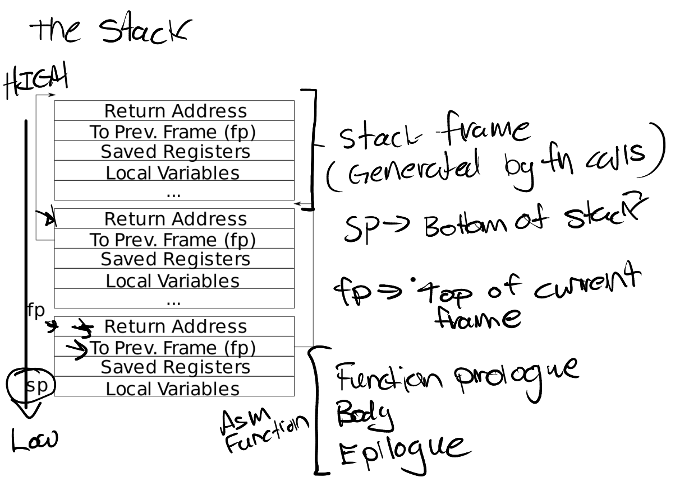

Lab 4: Traps
===================

1. 实验介绍
-----------

系统调用本质上是属于 ``trap`` 机制的一种。在此实验中，我们将深入到xv6 ``trap`` 的具体实现，完成一个用户态 ``trap`` 处理的设计与实现。

2. 代码实现及思路
------------------

RISC-V assembly
^^^^^^^^^^^^^^^^^

本实验通过几个问题，来帮助我们理解RISC-V汇编语言。

根据提示，我们首先看一下 ``user/call.asm`` 里包含的函数 ``g`` ， ``f`` 以及 ``main`` 的汇编代码。

函数 ``g`` 的汇编代码：

.. code-block:: console

    0000000000000000 <g>:
    int g(int x) {
    0:	1141                	addi    sp,sp,-16
    2:	e422                	sd      s0,8(sp)
    4:	0800                	addi    s0,sp,16
    return x+3;
    }
    6:	250d                	addiw   a0,a0,3
    8:	6422                	ld      s0,8(sp)
    a:	0141                	addi    sp,sp,16
    c:	8082                	ret

函数 ``f`` 的汇编代码：

.. code-block:: console

    000000000000000e <f>:
    int f(int x) {
    e:	1141                	addi    sp,sp,-16
    10:	e422                	sd      s0,8(sp)
    12:	0800                	addi    s0,sp,16
    return g(x);
    }
    14:	250d                	addiw   a0,a0,3
    16:	6422                	ld      s0,8(sp)
    18:	0141                	addi    sp,sp,16
    1a:	8082                	ret

函数 ``main`` 的汇编代码：

.. code-block:: console

    void main(void) {
    1c:	1141                	addi    sp,sp,-16
    1e:	e406                	sd      ra,8(sp)
    20:	e022                	sd      s0,0(sp)
    22:	0800                	addi    s0,sp,16
    printf("%d %d\n", f(8)+1, 13);
    24:	4635                	li      a2,13
    26:	45b1                	li      a1,12
    28:	00000517                auipc   a0,0x0
    2c:	7b050513                addi    a0,a0,1968 # 7d8 <malloc+0xea>
    30:	00000097                auipc   ra,0x0
    34:	600080e7                jalr    1536(ra) # 630 <printf>
    exit(0);
    38:	4501                	li      a0,0
    3a:	00000097                auipc   ra,0x0
    3e:	27e080e7                jalr    638(ra) # 2b8 <exit>

问题1：哪些寄存器包含函数的参数？例如，main函数中调用 ``printf`` ，哪个寄存器存有13的值？

寄存器a0 - a7包含函数的参数。 查看main函数汇编，可看到0x26处汇编指令 ``li a2, 13`` 。 所以是寄存器a2存放13的值。

问题2： main的汇编代码里何处调用了函数f和g？

函数f和g都被编译器内联优化了。0x26处即是编译器优化后的函数f的代码，直接得出值而非调用函数f或g，减少函数调用的开销。

问题3：函数printf的地址在哪里？

函数printf的地址是根据0x30和0x34处的汇编代码得出的。 汇编代码 ``auipc ra,0x0`` 的效果是 ``ra = 0x30 + 0x0 << 12`` 。
汇编代码 ``jalr 1536(ra)`` 的效果是跳转到 ``ra + 1536`` 的位置，即函数printf的地址。所以函数printf的地址是 0x30 + 1536 = 1584, 即0x630。

问题4：jalr指令执行跳转到函数printf后，寄存器ra的值是多少？

jalr指令执行后，寄存器ra的值会被设置为下一条指令的地址，即 0x34 + 4 = 0x38。

问题5：执行以下代码，此段代码的输出是什么？如果RISC-V是大端的话，i的值要怎么设置才能有同样的输出？57616的值需要更改嘛？

此段代码的输出是 ``He110 World`` 。如果RISC-V是大端系统的话，根据ASCII表，i值应该设置为0x726c6400。
57616不需要更改，因为它是作为数值被整体读取，而不是像字符串单个字符逐步读取。

问题6：代码 ``printf("x=%d y=%d", 3)`` 中 ``y=`` 会输出什么值？为什么会出现这种现象？

``y=`` 输出的值应为寄存器a2中的值，但这个值由于我们没有显式地赋值，所以会是个不确定的值。

Backtrace
^^^^^^^^^^

本实验通过实现 ``backtrace`` 函数，来打印程序运行时的函数调用栈。
``backtrace`` 的函数实现放在 ``kernel/printf.c`` 中。在 ``sys_sleep`` 中插入 ``backtrace`` 函数，然后运行 ``bttest`` ， ``bttest`` 会调用 ``sys_sleep`` 函数，打印出如下信息。

.. code-block:: console

    backtrace:
    0x0000000080002cda
    0x0000000080002bb6
    0x0000000080002898

执行完 ``bttest`` 指令后推出qemu， 运行 ``riscv64-unknown-elf-addr2line -e kernel/kernel`` 命令，将上述地址复制到终端中，可显示如下信息：

.. code-block:: console

    $ addr2line -e kernel/kernel
    0x0000000080002de2
    0x0000000080002f4a
    0x0000000080002bfc
    kernel/sysproc.c:74
    kernel/syscall.c:224
    kernel/trap.c:85

首先根据第一条提示，把函数 ``backtrace`` 的声明添加到 ``kernel/defs.h`` 中。
再根据第二条提示，把读取当前帧指针的内联函数添加到 ``kernel/riscv.h`` 中。

.. code-block:: c

    static inline uint64
    r_fp()
    {
       uint64 x;
       asm volatile("mv %0, s0" : "=r" (x));
       return x;
    }

根据第三条提示中如下图所示的栈帧的布局，我们可以看到当前栈帧的返回地址与帧指针有一个-8的固定偏移量。
调用函数的栈指针被保存在当前栈帧上，与指向当前帧指针的偏移量为-16。

第四条提示中表明xv6分配每个内核栈时，地址都是页对齐的。我们可知当前栈的顶端地址为 ``PGROUNDDOWN(fp)`` ，末端地址为 ``PGROUNDUP(fp)`` （栈的地址是自顶向下增长的）。
结合以上信息，我们在 ``backtrace`` 函数中可利用存放在寄存器s0中当前帧指针的值，遍历栈上的函数栈。

.. code-block:: c

    void backtrace(void)
    {
        // Get current frame pointer from reg s0
        uint64 fp = r_fp();
        uint64 i = fp;

        // Get the ret addr and do loops based on prev fp
        printf("backtrace:\n");
        while(i < PGROUNDUP(fp))
        {
            printf("%p\n", *(uint64 *)(i - 8));
            i = *(uint64 *)(i - 16);
        }
    }

最后在 ``panic`` 函数中添加对 ``backtrace`` 的调用，这样我们就能够在内核panic时看到函数的调用过程。

启动qemu，运行 ``bttest`` ，然后将生成的地址再粘贴到 ``riscv64-unknown-elf-addr2line -e kernel/kernel`` 命令行中，得到以下输出：

.. code-block:: console

    $ bttest
    backtrace:
    0x0000000080002dba
    0x0000000080002c2c
    0x00000000800028cc
    $ riscv64-unknown-elf-addr2line -e kernel/kernel
    0x0000000080002dba
    0x0000000080002c2c
    0x00000000800028cc
    /home/jiewan01/CS4_Challenge/xv6-labs-2020/kernel/sysproc.c:73
    /home/jiewan01/CS4_Challenge/xv6-labs-2020/kernel/syscall.c:144
    /home/jiewan01/CS4_Challenge/xv6-labs-2020/kernel/trap.c:76

代码的具体实现可参考 `链接1 <https://github.com/Snowball-Wang/MIT_6S081_Operating_System_Engineering/commit/ee5737b1f2a0e206d6ba2efd54e57866ad098c7e>`_ 。

Alarm
^^^^^^^

本实验将给xv6添加一个新的功能，用来周期性地提示一个进程所使用的CPU时间。
我们需要添加一个新的系统调用函数 ``sigalarm(interval, handler)`` ，当应用程序调用 ``sigalarm(n, fn)`` 时，每消耗n个ticks的时钟，内核都会调用执行一次函数fn。
当函数fn执行完成返回后，程序将继续执行上次停留的地方。当应用程序调用 ``sigalarm(0, 0)`` 时，内核将不再周期性地生成提示。
``alarmtest`` 中调用 ``sigalarm(2, periodic)`` 来请求内核每2个ticks执行一次 ``periodic`` 函数。
本实验地最终效果如下所示：

.. code-block:: console

    $ alarmtest
    test0 start
    ........alarm!
    test0 passed
    test1 start
    ...alarm!
    ..alarm!
    ...alarm!
    ..alarm!
    ...alarm!
    ..alarm!
    ...alarm!
    ..alarm!
    ...alarm!
    ..alarm!
    test1 passed
    test2 start
    ................alarm!
    test2 passed
    $ usertests
    ...
    ALL TESTS PASSED
    $

test 0: invoke handler
'''''''''''''''''''''''

本部分先完成对 ``sigalarm`` 和 ``sigreturn`` 的基本实现，通过 ``alarmtest`` 中的 ``test0`` 。

根据题目前四条提示，我们按照以前添加系统调用的流程，对 ``sigalarm`` 和 ``sigreturn`` 进行声明和定义。

.. code-block:: c

    // user/user.h
    int sigalarm(int ticks, void (*handler)());
    int sigreturn(void);

    // user/usys.pl
    entry("sigalarm");
    entry("sigreturn");

    // kernel/syscall.h
    #define SYS_sigalarm 22
    #define SYS_sigreturn 23

    // kernel/syscall.c
    extern uint64 sys_sigalarm(void);
    extern uint64 sys_sigreturn(void);

    static uint64 (*syscalls[])(void) = {
        [SYS_fork]    sys_fork,
        ...
        [SYS_sigalarm] sys_sigalarm,
        [SYS_sigreturn] sys_sigreturn
    };

    // kernel/sysproc.c
    uint64
    sys_sigalarm(void)
    {
        //TODO
        return 0;
    }

    uint64
    sys_sigreturn(void)
    {
        return 0;
    }

根据第五、六条提示，我们需在 ``struct proc`` 里添加新的成员变量，用来保存记录以下信息。

- 中断区间，即系统调用 ``sigalarm(n, fn)`` 中n的值。
- 处理函数的地址，即系统调用 ``sigalarm(n, fn)`` 中函数fn的地址。
- 执行完上次fn后进程消耗的ticks数目。

所以在 ``proc`` 结构体中，我们新添以上三个成员变量，并在 ``sigalarm`` 的定义中对其值进行赋值。

.. code-block:: c

    // kernel/proc.h
    struct proc {
        ...
        int alarm_interval;          // alarm interval
        uint64 alarm_handler;        // alarm handler function
        int elapse_ticks;            // ticks passed since last call
    };

    // kernel/sysproc.c
    uint64
    sys_sigalarm(void)
    {
        int n; // alarm interval
        uint64 p; // pointer to handler function

        if(argint(0, &n) < 0 || argaddr(1, &p) < 0)
            return -1;

        myproc()->alarm_interval = n;
        myproc()->alarm_handler = p;
        return 0;
    }

到此步为止，系统调用的实现已基本完成。接下来就是如何在定时器中断中判断程序消耗的ticks是否超出设定值，超出后如何执行指定的用户态函数。
根据提示，我们知道定时器中断的处理函数在 ``usertrap`` 中，且原始的定时器中断的执行代码是 ``yield`` 函数，让CPU调度新的进程执行。

.. code-block:: c

    // kernel/trap.c
    void usertrap
    {
        ...
        if(which_dev == 2)
        {
            yield();
        }
    }

所以，我们对当前进程消耗的ticks判断逻辑的代码，应放在上述 ``if(which_dev == 2)`` 条件语句中。
但如何让满足条件（消耗的ticks等于设定值）的进程，执行定时器中断完成后，跳转到执行用户态函数 ``periodic`` ？
参考 ``usertrap`` 中处理系统调用的逻辑，即进程在系统调用完成后，将用户态的下一条执行指令设置为 ``p->trapframe->epc += 4;`` 。
那对于此实验来说，我们应将寄存器 ``sepc`` 的值设置为函数 ``periodic`` 的地址。

.. code-block:: c

    // kernel/traps.h
    void usertrap
    {
        if(which_dev == 2)
        {
            // add one tick to current process's ticks
            p->elapse_ticks += 1;
            // see if process's alarm interval expires
            if(p->elapse_ticks == p->alarm_interval)
            {
                // set the sepc to the addr of alarm handler
                p->trapframe->epc = p->alarm_handler;
                p->elapse_ticks = 0;
            }
            yield();
        }
    }

我们可以先将 ``alarmtest.c`` 中 ``main`` 函数里的 ``test1`` 和 ``test2`` 注释掉，只运行 ``test0`` 。
可以看到，``alarmtest`` 运行通过。

test0的具体实现代码可参考 `链接2 <https://github.com/Snowball-Wang/MIT_6S081_Operating_System_Engineering/commit/28efd26752c346dacf1c629fa4c7c297a0091a01>`_ 。

test1/test2(): resume interrupted code
'''''''''''''''''''''''''''''''''''''''

上述test0的实现，对于 ``alarmtest`` 中的test1是有缺陷的，如下所示：

.. code-block:: console

    $ alarmtest
    test0 start
    ........alarm!
    test0 passed
    test1 start
    ..alarm!
    ..alarm!
    ..alarm!
    ..alarm!
    ..alarm!
    ..alarm!
    .alarm!
    .alarm!
    ..alarm!
    ..alarm!

    test1 failed: foo() executed fewer times than it was called
    usertrap(): unexpected scause 0x000000000000000c pid=4
                sepc=0xfffffffffffffac8 stval=0xfffffffffffffac8

查看 ``user/alarmtest.c`` 中 ``test1`` 的实现：

.. code-block:: c

    // tests that the kernel calls the handler multiple times.
    //
    // tests that, when the handler returns, it returns to
    // the point in the program where the timer interrupt
    // occurred, with all registers holding the same values they
    // held when the interrupt occurred.
    //
    void
    test1()
    {
        int i;
        int j;

        printf("test1 start\n");
        count = 0;
        j = 0;
        sigalarm(2, periodic);
        for(i = 0; i < 500000000; i++){
            if(count >= 10)
            break;
            foo(i, &j);
        }
        if(count < 10){
            printf("\ntest1 failed: too few calls to the handler\n");
        } else if(i != j){
            // the loop should have called foo() i times, and foo() should
            // have incremented j once per call, so j should equal i.
            // once possible source of errors is that the handler may
            // return somewhere other than where the timer interrupt
            // occurred; another is that that registers may not be
            // restored correctly, causing i or j or the address ofj
            // to get an incorrect value.
            printf("\ntest1 failed: foo() executed fewer times than it was called\n");
        } else {
            printf("test1 passed\n");
        }
    }

根据 ``test1`` 的错误信息，我们可以看到 ``alarmtest`` 在 ``test1`` 函数执行错误的原因是因为 ``i`` 和 ``j`` 的值不等。
注释里说明了两者不等的可能原因有二：一是中断处理函数的返回地址出错，另一个是寄存器的值没有得到恰当的保护。
我们则需要将 ``usertrap`` 和 ``sigreturn`` 结合起来，让用户态程序在处理完alarm中断后，继续正常执行。
要达到此功能，我们需要注意以下事项：

- 在执行中断相应函数前后，寄存器的值应得到恰当的保存和复原。
- 在 ``usertrap`` 中应保存当前进程的信息，以便 ``sigreturn`` 能够正确返回到被中断的用户态程序。
- 中断处理函数不能被重复调用，即如果一个中断处理函数正在被执行，则内核不能再重复调用。

在选择哪些寄存器应该被保存和复原时，我纠结了很久。当然， ``sepc`` 的值肯定要保存，这样子我们才能返回到被中断的用户态程序。
但是其它寄存器该如何选择呢？后来参考了别的实现后，才发现最简单的方式，是把当前进程的 ``trapframe`` 整体保存下来，即在 ``proc`` 结构体里添加一个新的成员变量，用来保存和复原进程的寄存器内容。

.. code-block:: c

    // kernel/proc.h
    struct proc {
        ...
        struct trapframe intr_trap;     // trapframe saved for interrupt
    }

有个这个，我们就可以在 ``usertrap`` 执行中断处理函数之前，将当前进程的 ``trapframe`` 保存到 ``intr_trap`` 中。
然后我们可以在 ``sys_sigreturn`` 中复原，即把 ``intr_trap`` 保存的寄存器的值再赋值给进程的 ``trapframe`` ，这样进程在执行完中断函数返回时，使用的寄存器的值是中断之前的值。
同时，为了避免中断处理函数在执行过程中再次被内核调用，我们可以在 ``proc`` 结构体新添一个 ``intr_is_running`` 的成员变量，用来判断当前进程是否再执行中断处理函数。

.. code-block:: c

    if(which_dev == 2)
    {
        // sigalarm(0, 0) is not called and re-entrant calls is not allowed
        if(!(p->alarm_interval == 0 && p->alarm_handler == 0) && !(p->intr_is_running))
        {

            // add one tick to current process's ticks
            p->elapse_ticks += 1;
            // see if process's alarm interval expires
            if(p->elapse_ticks >= p->alarm_interval)
            {
                // save the current trapframe
                memmove(&(p->intr_trap), p->trapframe, sizeof(struct trapframe));
                // set the sepc to the addr of alarm handler
                p->trapframe->epc = p->alarm_handler;
                p->elapse_ticks = 0;
                // set running flag
                p->intr_is_running = 1;
            }
        }
        yield();
    }

运行 ``alarmtest`` ，可以看到此次所有test通过。

test1/test2的具体实现代码可参考 `链接3 <https://github.com/Snowball-Wang/MIT_6S081_Operating_System_Engineering/commit/baf21e160119e5623b7913eda0eb1d95b874bd06>`_ 。

实验最终结果
^^^^^^^^^^^^^^

实验最后还需要添加 ``time.txt`` 文件记录实验所花费的时间，以及 ``answers-traps.txt`` 回答实验中的问题。敲入 ``make grade`` 命令，可看到实验得分满分。

3. 实验总结
-----------

本次实验难度一般，主要的困难点在 ``alarm`` 实验中的 ``test1/test2`` ，如何保存和复原被中断进程的寄存器值。
一开始没有想到可以把 ``trapframe`` 整体保存下来，试了不同寄存器的组合，结果程序都会出错。一旦想到此点，问题就迎刃而解了。
