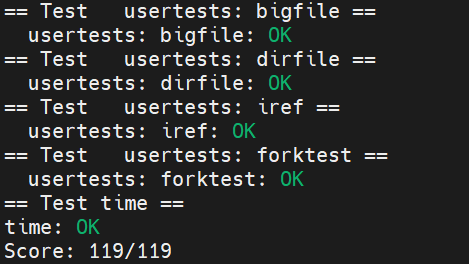

Lab 5: Xv6 Lazy Page Allocation
==================================

1. 实验介绍
-----------

操作系统通过页表可以实现很多有趣的功能，其中一个便是对用户空间堆内存的延迟分配。用户态程序通过 ``sbrk`` 系统调用来请求堆内存。
在原始版本的xv6内核中， ``sbrk`` 会直接分配物理内存并将其映射到当前进程的虚拟地址空间。要知道，对于一个大内存的请求，物理内存和分配和映射是相当耗时的。
所以，为了让 ``sbrk`` 能够更快地完成堆内存的请求，我们将在此实验中，实现xv6 ``page fault`` 的特性，从而达到xv6堆内存延迟分配的功能。

2. 代码实现及思路
------------------

Eliminate allocation from sbrk()
^^^^^^^^^^^^^^^^^^^^^^^^^^^^^^^^^

原始的 ``sbrk`` 的实现如下代码所示：

.. code-block:: c

    uint64 sys_sbrk(void)
    {
        int addr;
        int n;

        if(argint(0, &n) < 0)
            return -1;
        addr = myproc()->sz;
        if(growproc(n) < 0)
            return -1;
        return addr;
    }

可以看到，在 ``sys_sbrk`` 中调用了 ``growproc`` 来增加或缩减堆内存， ``growproc`` 的实现如下：

.. code-block:: c

    int growproc(int n)
    {
        uint sz;
        struct proc *p = myproc();

        sz = p->sz;
        if(n > 0){
            if((sz = uvmalloc(p->pagetable, sz, sz + n)) == 0){
                return -1;
            }
        } else if(n < 0){
            sz = uvmdealloc(p->pagetable, sz, sz + n);
        }
        p->sz = sz;
        return 0;
    }

在 ``growproc`` 中，根据堆内存是要增加还是缩减，分别调用 ``uvmalloc`` 和 ``uvmdealloc`` 来实现物理内存的分配或销毁，然后更新页表。
在此实验中，我们只考虑堆内存增加的情况，只增加进程的内存大小，不再调用 ``growproc`` 来进行实际的物理内存分配和映射，来观察xv6的运行状态。
由此，我们把 ``sys_sbrk`` 中对 ``growproc`` 的调用注释掉，直接增加进程的内存空间。

.. code-block:: c

    uint64 sys_sbrk(void)
    {
        int addr;
        int n;

        if(argint(0, &n) < 0)
            return -1;
        addr = myproc()->sz;
        myproc()->sz = addr + n;
        //if(growproc(n) < 0)
        //    return -1;
        return addr;
    }

运行xv6，敲入 ``echo hi`` , 出现以下错误：

.. code-block:: console

    $ echo hi
    usertrap(): unexpected scause 0x000000000000000f pid=3
            sepc=0x00000000000012ac stval=0x0000000000004008
    panic: uvmunmap: not mapped

由上述的错误信息可以看到， ``scause`` 寄存器的值为 ``0xf`` ，查询 `riscv手册 <https://five-embeddev.com/riscv-isa-manual/latest/supervisor.html#sec:scause>`_ 可以看到其对应的是 ``store page fault`` 。
``pid=3`` 意味着发生错误的进程号为3。 ``sepc`` 对应的是产生错误的执行代码的内存地址，查看 ``user/sh.asm`` 可以看到， 在 ``0x12ac`` 处的汇编代码是 ``sw s6,8(a0)`` ，确实是一个store命令。
``stval`` 则对应的是访存错误的虚拟内存地址， ``0x4008`` 即对应着此处的内存访问触发了 ``store page fault`` 的错误。

Lazy allocation
^^^^^^^^^^^^^^^^

在上个实验中，我们仅仅只是在 ``sys_sbrk`` 里改变了进程的内存大小，并没有对出现缺页错误进行处理。
在本实验中，我们将在 ``usertrap`` 里针对缺页错误的内存地址分配物理内存，并添加映射关系，从而让程序能够继续正常地运行。

根据前两条提示，我们需在 ``usertrap`` 里对 ``r_scause()`` 添加新的判断条件，即当其为13 ``load page fault`` 和15 ``store page fault`` 时，我们进行缺页处理。
在缺页处理中，我们参考 ``uvmalloc`` 函数，为发生缺页错误的虚拟地址分配 ``PGSIZE`` 的物理内存，并将新分配的物理内存地址与虚拟内存地址进行映射。
代码的实现如下：

.. code-block:: c

    void usertrap(void)
    {
        // omit the unimportant code
        if(r_scause() == 8){
            //...
        } else if((which_dev = devintr()) != 0){
            // ok
        } else if(r_scause() == 13 || r_scause() == 15){
            // code to handle load/store page fault
            uint64 va = r_stval();
            printf("faulting va addr: %p\n", va);
            // allocate one physical page
            char *mem = kalloc();
            if(mem == 0)
                panic("usertrap: no more physical mem!");
            // zero the physical page
            memset(mem, 0, PGSIZE);
            // add the mappings
            if(mappages(p->pagetable, va, PGSIZE, (uint64)mem, PTE_W|PTE_R|PTE_U) != 0){
		        kfree(mem);
		        p->killed = 1;
	        }
            
        }else {
            printf("usertrap(): unexpected scause %p pid=%d\n", r_scause(), p->pid);
            printf("            sepc=%p stval=%p\n", r_sepc(), r_stval());
            p->killed = 1;
        }
    }

再次运行xv6，敲入 ``echo hi`` ， 出现以下错误：

.. code-block:: console

    $ echo hi
    faulting va addr: 0x0000000000004008
    faulting va addr: 0x0000000000013f48
    panic: uvmunmap: not mapped

可以看到，程序打印出了对应发生缺页错误的虚拟地址，但是出现了 ``uvmunmap: not mapped`` 的错误。在 ``kernel/vm.c`` 里查看 ``uvmunmap`` 的定义，我们可以看到，函数会释放 ``p->sz`` 中所有的页表及物理内存。
所以当我们使用延迟堆内存分配的策略时，对应必然会有在 ``p->sz`` 虚拟地址空间内的虚拟地址没有与物理内存映射的情况。在 ``uvmunmap`` 中，我们只需忽略上述情形即可。修改后的 ``uvmunmap`` 如下所示：

.. code-block:: c

    void uvmunmap(pagetable_t pagetable, uint64 va, uint64 npages, int do_free)
    {
        uint64 a;
        pte_t *pte;

        if((va % PGSIZE) != 0)
            panic("uvmunmap: not aligned");

        for(a = va; a < va + npages*PGSIZE; a += PGSIZE){
            if((pte = walk(pagetable, a, 0)) == 0)
                panic("uvmunmap: walk");
            if((*pte & PTE_V) == 0)
                continue;
            if(PTE_FLAGS(*PTE) == PTE_V)
                panic("uvmunmap: not a leaf");
            if(do_free){
                uint64 pa = PTE2PA(*pte);
                kfree((void*)pa);
            }
            *pte = 0;
        }
    }

再次运行xv6， 敲入 ``echo hi`` 命令，却得到以下错误：

.. code-block:: console

    $ echo hi
    faulting va addr: 0x0000000000004008
    faulting va addr: 0x0000000000013f48
    panic: freewalk: leaf

检查代码逻辑，没有发现问题。看到实验中的第四条提示，恍然大悟，发生缺页错误的虚拟地址需要在映射前向下圆整，所以 ``mappages`` 里的va应该替换成 ``PGROUNDDOWN(va)`` 。
再次运行xv6，显示 ``echo hi`` 运行正确。

.. code-block:: console

    $ echo hi
    faulting va addr: 0x0000000000004008
    faulting va addr: 0x0000000000013f48
    hi

具体实现代码可参考 `链接1 <https://github.com/Snowball-Wang/MIT_6S081_Operating_System_Engineering/commit/1db690524ed0c391158e39671a59e540611c3d0b>`_ 。

最后，我们可以添加 ``page table`` 实验中的 ``vmprint`` 函数，来对比缺页错误处理前后进程的页表状况。

.. code-block:: console

    $ echo hi
    page table 0x0000000087f75000
    ..0: pte 0x0000000021fdc801 pa 0x0000000087f72000
    .. ..0: pte 0x0000000021fd9401 pa 0x0000000087f65000
    .. .. ..0: pte 0x0000000021fdc05f pa 0x0000000087f70000
    .. .. ..1: pte 0x0000000021fd98df pa 0x0000000087f66000
    .. .. ..2: pte 0x0000000021fdc40f pa 0x0000000087f71000
    .. .. ..3: pte 0x0000000021fd68df pa 0x0000000087f5a000
    ..255: pte 0x0000000021fdd001 pa 0x0000000087f74000
    .. ..511: pte 0x0000000021fdcc01 pa 0x0000000087f73000
    .. .. ..510: pte 0x0000000021fd90c7 pa 0x0000000087f64000
    .. .. ..511: pte 0x0000000020001c4b pa 0x0000000080007000
    page fault: 0x0000000000004008
    page table 0x0000000087f75000
    ..0: pte 0x0000000021fdc801 pa 0x0000000087f72000
    .. ..0: pte 0x0000000021fd9401 pa 0x0000000087f65000
    .. .. ..0: pte 0x0000000021fdc05f pa 0x0000000087f70000
    .. .. ..1: pte 0x0000000021fd98df pa 0x0000000087f66000
    .. .. ..2: pte 0x0000000021fdc40f pa 0x0000000087f71000
    .. .. ..3: pte 0x0000000021fd68df pa 0x0000000087f5a000
    .. .. ..4: pte 0x0000000021fd6417 pa 0x0000000087f59000
    ..255: pte 0x0000000021fdd001 pa 0x0000000087f74000
    .. ..511: pte 0x0000000021fdcc01 pa 0x0000000087f73000
    .. .. ..510: pte 0x0000000021fd90c7 pa 0x0000000087f64000
    .. .. ..511: pte 0x0000000020001c4b pa 0x0000000080007000
    page table 0x0000000087f75000
    ..0: pte 0x0000000021fdc801 pa 0x0000000087f72000
    .. ..0: pte 0x0000000021fd9401 pa 0x0000000087f65000
    .. .. ..0: pte 0x0000000021fdc05f pa 0x0000000087f70000
    .. .. ..1: pte 0x0000000021fd98df pa 0x0000000087f66000
    .. .. ..2: pte 0x0000000021fdc40f pa 0x0000000087f71000
    .. .. ..3: pte 0x0000000021fd68df pa 0x0000000087f5a000
    .. .. ..4: pte 0x0000000021fd64d7 pa 0x0000000087f59000
    ..255: pte 0x0000000021fdd001 pa 0x0000000087f74000
    .. ..511: pte 0x0000000021fdcc01 pa 0x0000000087f73000
    .. .. ..510: pte 0x0000000021fd90c7 pa 0x0000000087f64000
    .. .. ..511: pte 0x0000000020001c4b pa 0x0000000080007000
    page fault: 0x0000000000013f48
    page table 0x0000000087f75000
    ..0: pte 0x0000000021fdc801 pa 0x0000000087f72000
    .. ..0: pte 0x0000000021fd9401 pa 0x0000000087f65000
    .. .. ..0: pte 0x0000000021fdc05f pa 0x0000000087f70000
    .. .. ..1: pte 0x0000000021fd98df pa 0x0000000087f66000
    .. .. ..2: pte 0x0000000021fdc40f pa 0x0000000087f71000
    .. .. ..3: pte 0x0000000021fd68df pa 0x0000000087f5a000
    .. .. ..4: pte 0x0000000021fd64d7 pa 0x0000000087f59000
    .. .. ..19: pte 0x0000000021fd6017 pa 0x0000000087f58000
    ..255: pte 0x0000000021fdd001 pa 0x0000000087f74000
    .. ..511: pte 0x0000000021fdcc01 pa 0x0000000087f73000
    .. .. ..510: pte 0x0000000021fd90c7 pa 0x0000000087f64000
    .. .. ..511: pte 0x0000000020001c4b pa 0x0000000080007000
    hi

可以看到，对于 ``0x4008`` 虚拟地址的缺页错误处理后，进程的页表多了一条条目 ``4: pte 0x0000000021fd6417 pa 0x0000000087f59000`` 。
对于 ``0x13f48`` 虚拟地址的缺页错误处理后，进程的页表多了一条条目 ``19: pte 0x0000000021fd6017 pa 0x0000000087f58000`` 。

Lazytests and Usertests
^^^^^^^^^^^^^^^^^^^^^^^

在本实验中，我们将进一步地完善缺页错误处理的代码，从而能够通过 ``lazytests`` 和 ``usertests`` 测试。

根据第一条提示，我们首先处理 ``sbrk()`` 传入负数参数的情况。
对于 ``sbrk`` 参数n大于0的情况，我们可以采用 ``lazy allocation`` 的策略。
但对于n是负数，即缩减堆内存的情况，如果我们采用 ``lazy deallocation`` 的策略，可能意味着进程执行过程中访问已经不再是进程 ``p->sz`` 的堆内存，但也不会报错。
所以，针对n是负数的情况，我们还是采取原先的策略。 ``sys_sbrk`` 的实现如下所示：

.. code-block::  c

    uint64 sys_sbrk(void)
    {
        int addr;
        int n;
        struct proc *p = myproc();

        if(argint(0, &n) < 0)
            return -1;
        addr = p->sz;
        // if n >= 0, do lazy allocation.
        // if n < 0, do eager deallocation.
        if(n >= 0){
            p->sz = addr + n;
        } else {
            if(growproc(n) < 0)
                return -1;
        }
        return addr;
    }

查看 ``user/lazytests.c`` ，发现其有三个测试用例：

- sparse_memory
- sparse_memory_unmap
- oom

三个用例可根据xv6命令行参数单独执行，但是每个用例的描述字符串中间有空格，做以下修改：

.. code-block:: c

    struct test{
        void (*f)(char *);
        char *s;
    } tests[] = {
        { sparse_memory, "lazy_alloc"},
        { sparse_memory_unmap, "lazy_unmap"},
        { oom, "out_of_memory"},
        {0, 0},
    };

这样，就可以在xv6里敲入 ``lazytests lazy_alloc`` 单独执行第一个测试用例了。

.. code-block:: console

    $ lazytests lazy_alloc
    lazytests starting
    running test lazy_alloc
    panic: uvmunmap: walk

执行结果如上，出现 ``panic: uvmunmap: walk`` 错误。查看 ``uvmunmap`` 的定义，使用 ``walk`` 来查询va对应的pte。
但如果我们采用堆内存延迟分配的策略，对应进程里的虚拟地址空间就会出现pte为0的正常情况，此时我们只需忽略此错误，继续遍历虚拟地址即可。

再次执行 ``lazytests lazy_alloc`` ，此测试用例通过。

.. code-block:: console

    $ lazytests lazy_alloc
    lazytests starting
    running test lazy_alloc
    test lazy_alloc: OK
    ALL TESTS PASSED

继续执行第二个测试用例， ``lazytests lazy_unmap`` ，出现以下错误：

.. code-block:: console

    $ lazytests lazy_unmap
    lazytests starting
    running test lazy_unmap
    panic: uvmcopy: page not present

根据第三条提示，我们可以初步判断问题出现在 ``fork`` 中父子进程间的内存拷贝。
查看 ``uvmcopy`` ，同理，对应 ``panic`` 的部分全部改为 ``continue`` ，再次运行测试用例，出现以下错误：

.. code-block:: console

    $ lazytests lazy_unmap
    lazytests starting
    running test lazy_unmap
    panic: freewalk: leaf

用gdb调试xv6，并将断点设置在 ``freewalk`` 函数的 ``panic`` 处，运行测试用例，敲入 ``bt`` 查看函数调用栈。

.. code-block:: console

    (gdb) bt
    #0  freewalk (pagetable=0x87ecc000) at kernel/vm.c:286
    #1  0x0000000080001536 in freewalk (pagetable=0x87ecd000) at kernel/vm.c:283
    #2  0x0000000080001536 in freewalk (pagetable=pagetable@entry=0x87ed1000) at kernel/vm.c:283
    #3  0x0000000080001590 in uvmfree (pagetable=pagetable@entry=0x87ed1000, sz=sz@entry=12288) at kernel/vm.c:299
    #4  0x0000000080001c60 in proc_freepagetable (pagetable=0x87ed1000, sz=12288) at kernel/proc.c:195
    #5  0x0000000080001c96 in freeproc (p=p@entry=0x80012308 <proc+1440>) at kernel/proc.c:143
    #6  0x00000000800023ba in wait (addr=12012) at kernel/proc.c:429
    #7  0x0000000080002d4e in sys_wait () at kernel/sysproc.c:38
    #8  0x0000000080002c90 in syscall () at kernel/syscall.c:140
    #9  0x0000000080002918 in usertrap () at kernel/trap.c:67
    #10 0x00000000000000d6 in ?? ()

可以看到上述错误发生在销毁子进程，释放子进程内存空间的过程中。
再次查看 ``lazytests.c`` 中第二个测试用例函数 ``sparse_memory_unmap`` ，函数在父进程通过 ``sbrk`` 增加了 ``REGION_SZ`` 的堆内存。
然后基于 ``PGSIZE * PGSIZE`` 的步长利用缺页错误对延迟分配的部分堆内存进行赋值和添加映射。
完成上述步骤后，再基于上述步长每次 ``fork`` 一个子进程，缩减子进程 ``REGION_SZ`` 的堆内存空间，然后再访问子进程从父进程拷贝过来的 ``REGION_SZ`` 中之前赋值的堆内存地址。

但因为我们对 ``sbrk`` 传入的参数为负数的情况，采取的是 ``eager deallocation`` 的策略，所以函数 ``sparse_memory_unmap`` 的子进程执行 ``*(char **)i = i`` 应该在 ``usertrap`` 中做错误处理。
根据第三和第六条提示，我们对函数 ``usertrap`` 进行以下修改：

.. code-block:: c

    void usertrap(void){
        //...
        else if(r_scause() == 13 || r_scause() == 15){
            uint64 va = r_stval();

            // if va > p->sz or va < user stack,
            // kill the process
            if(va > p->sz || va < 0x3000){
            p->killed = 1;
            goto killed;
        
        //... 
        killed:
            if(p->killed)
                exit(-1);
        }
    }

再次执行 ``lazytests lazy_unmap`` ，此测试用例通过。

.. code-block:: console

    $ lazytests lazy_unmap
    lazytests starting
    running test lazy_unmap
    test lazy_unmap: OK
    ALL TESTS PASSED

此时我们已经通过 ``lazytests`` 中的前两个测试用例。回头看代码实现，我觉得 ``usertrap`` 里关于缺页错误的处理可以单独设计一套API，这样逻辑也会更加清晰。

.. code-block::  c

    int is_lazyaddr(uint64 va)
    {
        struct proc *p = myproc();
        // va should lower than p->sz but higher than user stack
        if(va < p->sz && va >= p->trapframe->sp)
            return 1;
        else
            return 0;
    }

    int lazyalloc(struct proc *p, uint64 va)
    {
        uint64 ka = (uint64)kalloc();
        if(ka == 0){
            return 0;
        } else {
            memset((void *)ka, 0, PGSIZE);
            if(mappages(p->pagetable, PGROUNDDOWN(va), PGSIZE, ka, PTE_W|PTE_R|PTE_U) != 0){
            kfree((void *)ka);
            return 0;
            }
        }
        return 1;
    }

这样，我们在 ``usertrap`` 里处理缺页错误就可以调用上述两个函数实现。

.. code-block:: c

    void usertrap(void)
    {
        //...
        } else if(r_scause() == 13 || r_scause() == 15){
            uint64 va = r_stval();

            if(is_lazyaddr(va) == 1){
                if(lazyalloc(p, va) == 0)
                    p->killed = 1;
            } else {
                p->killed = 1;
            }
    }

执行 ``lazytests out_of_memory`` ，出现以下错误：

.. code-block:: console

    $ lazytests out_of_memory
    lazytests starting
    running test out_of_memory
    panic: walk

``panic: walk`` 出现的地方是在 ``walk`` 函数中，当va的地址大于 ``MAXVA`` 时。我们在 ``panic`` 前加一行打印信息，打印出错误的va值。

.. code-block:: console

    $ lazytests out_of_memory
    lazytests starting
    running test out_of_memory
    va: 0xffffffff80003000
    panic: walk

可以看到错误的va的值为 ``0xffffffff80003000`` ，猜测肯定是地址计算时值出现了溢出错误。
再理解以下 ``lazytests.c`` 中的 ``oom`` 函数，发现其调用定义在 ``user/umalloc.c`` 中的 ``malloc`` 函数来分配堆内存。而 ``malloc`` 最终调用的还是 ``sbrk`` 系统调用。
``oom`` 函数里通过 ``while((m2 = malloc(4096*4096)) != 0)`` 不断扩展堆内存，并将前一次的地址赋值给新一次分配的堆内存上。子进程理应在某次访问中出现错误，所以永远不会执行 ``exit(0)`` 。
这样父进程捕捉到子进程的退出码不为0，即父进程退出码 ``exit(xstatus == 0)`` 也不为0。

理解了 ``oom`` 函数的执行逻辑，再结合前面猜测的溢出错误，我们回到 ``sys_sbrk`` 中，加入 ``addr`` 和 ``addr + n`` 的打印信息。

.. code-block:: c

    $ lazytests out_of_memory
    lazytests starting
    running test out_of_memory
    addr: 0x000000007f0037f0
    addr + n: 0xffffffff80003800
    addr: 0xffffffff80003800
    addr + n: 0xffffffff81003810
    va: 0xffffffff80003000
    panic: walk

可以看到， ``addr`` 值为 ``0x7f0037f0`` 时，加上 ``n`` 的值就发生了溢出。这是因为对应 ``addr`` 和 ``n`` 的值都是 ``int`` 类型， 而我们的 ``p->sz`` 和 ``va`` 都是 ``uint64`` 类型。
所以我们需对 ``addr + n`` 出现溢出的情况进行处理，即返回原始的 ``addr`` 的值即可。对应va大于 ``p->sz`` 的情况就会在 ``is_lazyaddr`` 中得到相应的处理。

.. code-block:: c

    uint64 sys_sbrk(void)
    {
        //...
        // addr + n might overflow.
        // when it happens, just return the original addr.
        if((addr + n) < 0){
            return addr;
        }
        //...
    }

再次执行 ``lazytests out_of_memory`` ，此测试用例通过。

.. code-block:: console

    $ lazytests out_of_memory
    lazytests starting
    running test out_of_memory
    test out_of_memory: OK
    ALL TESTS PASSED

再运行 ``usertests`` ，发现 ``usertests`` 中的 ``sbrkarg`` 出现错误：

.. code-block:: console

    $ usertests sbrkarg
    usertests starting
    test sbrkarg: sbrkarg: write sbrk failed
    FAILED
    SOME TESTS FAILED

结合题目第四条提示，我们需对 ``walkaddr`` 做相应的修改。

.. code-block:: c

    uint64 walkaddr(pagetable_t pagetable, uint64 va)
    {
        pte_t *pte;
        uint64 pa;

        if(va >= MAXVA)
            return 0;

        // lazy allocation
        if(is_lazyaddr(va)){
            if(lazyalloc(va) == 0)
                return 0;
        }

        pte = walk(pagetable, va, 0);
        if(pte == 0)
            return 0;
        if((*pte & PTE_V) == 0)
            return 0;
        if((*pte & PTE_U) == 0)
            return 0;
        pa = PTE2PA(*pte);
        return pa;    
    }

同时，对于 ``is_lazyaddr`` 函数，我们还需增加va是否会 ``remap`` 的判断。

再次运行 ``usertests`` ，测试用例全部通过。

具体实现代码可参考此 `链接2 <https://github.com/Snowball-Wang/MIT_6S081_Operating_System_Engineering/commit/ffa11184a22bba200de6a88a2438a783ef6919b2>`_ 。

实验最终结果
^^^^^^^^^^^^^

实验最后还需要添加 ``time.txt`` 文件记录实验所花费的时间。另外 ``lazytests.c`` 中的三个用例的描述需改回同原来一样，评分的脚本是通过字符匹配来确定测试用例通过。

敲入 ``make grade`` 命令，可看到实验得分满分。

3. 实验总结
-----------

本次实验卡在了两个问题，一个是 ``oom`` 实验中出现的虚拟地址溢出的问题，一个是 ``usertests`` 中 ``sbrkarg`` 出错的问题。
其中第三部分的第四条提示也让我纠结理解了很久。

    Handle the case in which a process passes a valid address from sbrk() to a system call such as read or write, but the memory for that address has not yet been allocated.

这次实验看上去很简单，但实际做起来还是有很多坑，而且最可怕的是调试了半天发现是自己写的坑。还是那句话，魔鬼在细节！
